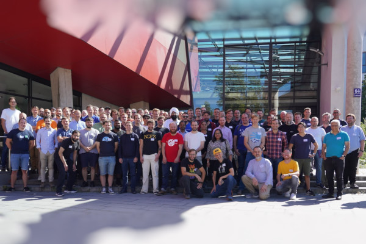
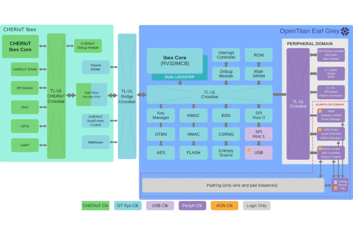
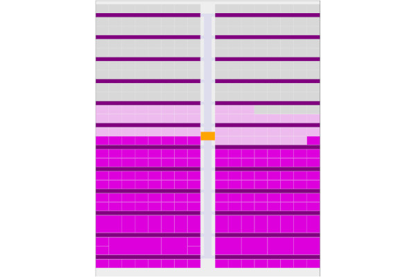
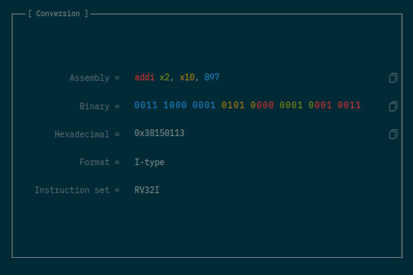
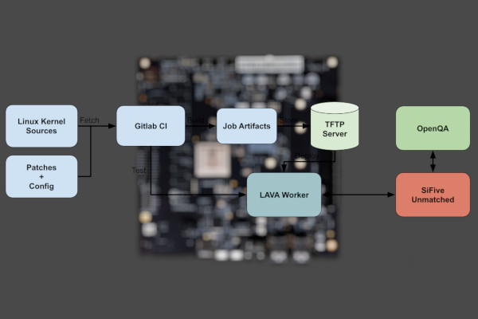
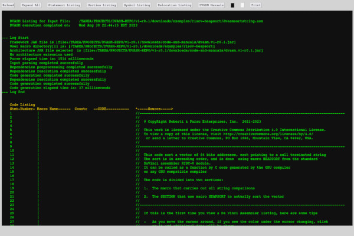
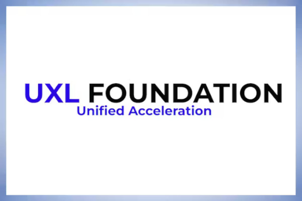
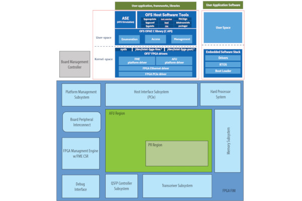

)

## ORConf is Back, Videos Available Now

[ORConf](https://www.orconf.org) is back! We've returned with yet another open source chip design tour de force courtesy of the brilliant community, our first since the previous outing in Bordeaux in 2019. The years have been kind, it seems to us all; with much progress to be presented and discussed over the three days being hosted by the University of Applied Sciences in beautiful Munich.

We were very pleased to have Andrew Kahng open the show with updates on the impressive developments in [OpenROAD's](https://theopenroadproject.org/) place-and-route capabilities, continuing to pave the way for truly open source chip design.

Plenty of virtual prototyping news, and a fascinating presentation on laser attacks determining not only circuit structure but run-time values. Stafford Horne gave us the annual [OpenRISC](https://openrisc.io/) update; plenty since Bordeaux including simulator improvements, specification updates and continued support in the Linux kernel, all major tool chains and C libraries. Karol Gugala of Antmicro shared their work with the [CHIPS Alliance](https://www.chipsalliance.org/) on tooling which is always impressive to see and of course widely used by the community.

LowRISC's Greg Chadwick joined us for a keynote on the state of their work, including having taped out [OpenTitan](https://opentitan.org/), continuing to keep [Ibex](https://ibex-core.readthedocs.io/en/latest/) improving, and future work they're undertaking; all fantastic to see. Continuing the security theme; Michael Gielda gave us the lowdown on another root-of-trust development in Caliptra, Felix Oberhansl analysing the RISC-V crypto extensions and how much they speed up software implementations, and Leon Woestenberg showing off their hardware-based (although originally RISC-V-in-the-loop) WireGuard implementation for high throughput ethernet networks.

Rihards Novickis brought up healthy debate about how Europe will implement the goal of its Chips Act, and what role FOSSi tools and designs can play in that - something which is very topical, and on the topic of which we will draw the attention of those interested to this [workshop](https://ec.europa.eu/eusurvey/runner/EUCADP923) which is coming up soon.

The folks from [ASTRON](https://www.astron.nl/) in the Netherlands shared details of their data transport implementations and other IP they are open sourcing which is great to see. Tomasz Hemperek of Cocotb maintainer fame, shared his verification flow and methodology for improving development speed and quality.

[Cocotb](https://www.cocotb.org) is definitely not dead; and in fact appears to be in rude health with a presentation on the latest and greatest from Philipp Wagner, and followed by an unconference on cocotb on Sunday, bringing together the brains trust to plot world domination one API improvement at a time.

The folks of [AsFigo](https://asfigo.com/) shared their thoughts on testbench linting and maths libraries in System Verilog. Charlos Papon showed us some details on his Spinal HDL interconnect generator using TileLink.

Closing out the event's formal proceedings in style, as always, was Davide Rossi, with a retrospective on the decade-long [PULP project](https://iis-projects.ee.ethz.ch/index.php/PULP); starting out with their humble beginnings working with OpenRISC CPUs and the inevitable switch to RISC-V, and a recap of the incredible architectural research work they've done and what is coming up. This is truly a remarkable research group who generate some very widely used IP and tooling and we're honoured to have hosted Davide a decade back in Cambridge and to have him join us this year to recap 10 years of work. Grazie Davide!

ORConf wouldn't be ORConf without plenty of social time, and this year we were treated to a couple of fantastic evening events in different sides of Munich. Great food and libations were on offer and we all hung out and chatted long into the evening, rapidly making up for 4 years between drinks.

Munich was in fine form this weekend, sunshine and warm weather were very welcome, and provided a great backdrop to a fantastic event.

A big thank you to the hosts and the folks who helped out running the show. An even bigger thank you to the attendees and presenters. The biggest thanks to professional ticket holder and our sponsors [Antmicro](https://antmicro.com/), [Axelera](http://www.axelera.ai/), [lowRISC](https://www.lowrisc.org), [Minres](http://www.minres.com/) and [Hudson River Trading](https://www.hudsonrivertrading.com/) who help make this event possible.

**All recordings of the talks are now [available on YouTube](https://www.youtube.com/playlist?list=PLUg3wIOWD8yqkkVd286RIiAxE1ppAJp2j).**

_-Julius Baxter, Director, FOSSi Foundation_

## "How CPU Works" Dives Deep with an 11-bit CPU Built from Discrete Transistors

  
An anonymous educator has published an online book, dubbed "How CPU Works," which walks through the creation and use of an 11-bit CPU constructed from discrete transistors - "no hiding complexity," its creator says, and "no integrated circuits" for the CPU itself.  
  
"There are some projects on the internet that build small 8-bit computers out of integrated circuits, like registers, bus selectors, decoders, etc.," the site's creator says. "This is not the focus of this book. We do not use any integrated circuits, there is no hiding complexity.  
There are also a lot of YouTube channels [that] showcase their processors built in the simulation. Don't get me wrong, that is impressive; but in the real world you cannot simulate, real world runs on atoms not bits.  
  
"After you finish the book you will be able to say what every single one of 2,008 transistors do and why they do that. You will also understand why some architectural choices were made, be able to design your own processors, and better understand what goes on in modern ones."  
  
The heart of the project is an 11-bit CPU built from 2,008 discrete transistors, with 32 micro-memory and ROM addresses, eight branch flags, a stack pointer register for recursive functions, and access to an LCD display and a keyboard for input and output. There's only one slight "cheat" in the process: the CPU interfaces with an Arduino-compatible microcontroller integrated circuit - though only as memory, not to drive the CPU.  
  
[The How CPU Works site](https://howcpuworks.com/) is a work-in-progress, its creator says, with the first articles already published; more information is available [in this Reddit post](https://www.reddit.com/r/ArduinoProjects/comments/16ts5r6/built_a_processor_out_of_2000_transistors/), while [a browser-based simulator](https://howcpuworks.com/pages/cpu-simulator) allows you to go hands-on with the processor's instruction set. Its creator has pledged to make the hardware design available under an open-source licence in the near future.

## lowRISC CIC Announces "Significant Funding" from UKRI for New CHERI Boards

  
The lowRISC Community Interest Company (CIC) has announced "significant funding for a new project" courtesy of UK Research and Innovation (UKRI), as part of the Digital Security by Design Programme (DSbD).  
  
"DSbD aims to provide foundational support to developers centred around a technology enhancement in the central processor (CPU): Capability Hardware Enhanced RISC Instructions, or (CHERI)," lowRISC explains. "CHERI has the potential to prevent around 2/3rds of current exploits, whilst simultaneously providing new software methods to help maintain the operational resilience and integrity of applications.  
  
"As part of a drive to ensure these advances are usable in the challenging operational technology (OT) domain as well as the more fully-featured platforms to which they were originally targeted, we are delighted to report that this announcement also included significant funding for a new project with lowRISC CIC."  
  
Under the programme, lowRISC will be funded to produce two prototype platforms: one based on the existing CHERIoT core, dubbed the Base Version (BV), and another which pairs it with the OpenTitan hardware root-of-trust system, for the Extended Evaluation Version (EEV). "We are seeking input from interested parties on the requirements for the BV," lowRISC writes. "In particular we are interested to hear about peripherals and interfaces that would be useful to those seeking to evaluate CHERIoT for use with their applications. "  
  
More information is available [on the lowRISC website](https://lowrisc.org/blog/2023/09/dsbd-cheriot-announcement/), while anyone wishing to provide feedback on the Base Version board can find details [in a Google Doc file](https://docs.google.com/document/d/1b7hSMSCFgSK6isop1aiZAJxJ173uJqsQPHb4C6UucfI/edit#heading=h.vxv4kgl0l6ui).

## Tiny Tapeout 4 Closes with Over 140 Designs, Tiny Tapeout 5 Opens

  
Matt Venn's Tiny Tapeout, which offers the chance to put small designs on a multi-project die and receive a physical chip in return, has closed its fourth round of submissions with more than 140 designs in total - and the fifth round is open now, for those who want to join in.  
  
"Very happy to have over 140 designs from 30 countries submitted to Tiny Tapeout 4," Venn writes of the recently-closed design round. "With over 200 tiles allocated to projects all around the world, it's fun browsing the layout. We have some quite chonky 2x2 projects now!  
  
"raybox-zero [by Anton Maurovic] is the biggest, a very simple ray caster demo (sort of like Wolf[enstein] 3D rendering) driving a VGA display without a framebuffer. Then we have a hardware USB device [by Darryl Miles], a string synthesiser with I2S audio out [by pyamnihc], and something that emits ASCII encoding of the LaTeX code to typeset a few dozen Laplace transforms [by phansel]."  
  
With Tiny Tapeout 4 now closed and the designs being sent off for production - from which each contributor will receive a single chip with all designs included, mounted on a carrier board - Tiny Tapeout 5 has opened. "26 IOs, ~50MHz IO, $100 for 100x160um (pay extra for more space," Venn says of the next run.  
  
More information on the projects included in Tiny Tapeout 4 is available [on the shuttle status page](https://app.tinytapeout.com/shuttles/tt04); those interested in being part of Tiny Tapeout 5 can read more and apply [on the website](https://tinytapeout.com/).

## Joël Porquet-Lupine's rcvodec.js is a Browser-Based RISC-V Instruction Tool

  
Joël Porquet-Lupine, assistant professor of computer science at the University of California Davis, has released a tool which offers encoding and decoding of RISC-V instructions in the browser: rvcodec.js.  
  
"Essentially, you type in (almost) any valid RISC-V instruction, either in its decoded assembly form (e.g., 'addi x2, x10, 897') or in its encoded binary/hexadecimal form (e.g., '0x38150113'), and it gives you the conversion as well as some useful information," Porquet-Lupine explains.  
  
"One aspect that can be particularly interesting is that it visually maps the relationships between the assembly tokens and binary fields: just hover your cursor over the fields to see it!  
  
"At this point, the project is in semi-maintenance mode as we support the most common instruction sets: RV32I, RV64I, and the entirety of the GC extensions. We also support RV128I and the Q extension as they were easy to add, and plenty of other nice features (completion of opcodes, ABI names, etc.)."  
  
The tool is available to use online [at luplab.gitlab.io/rvcodecjs](https://luplab.gitlab.io/rvcodecjs/), with the source code published [on GitLab](https://gitlab.com/luplab/rvcodecjs/) under the reciprocal GNU Affero General Public Licence 3.

## Neill Whillans Details Codethink's Automated RISC-V Kernel Testing Approach

  
Codethink's Neill Whillans has penned a post which looks at how the company uses physical RISC-V hardware to run automated kernel testing, as part of the company's desire for "long term maintainability (LTM)" for complex software projects including, but not limited to, the Linux kernel.  
  
"The main elements of our testing pipeline are [...] a GitLab CI [Continuous Integration] that fetches Linux kernel sources and a small patchset for RISC-V support that hasn't yet been upstreamed, that it then uses to build a .fit kernel image for the RISC-V board (although LAVA also supports the loading of the kernel, ramdisk and dtb from different binaries)," Whillans explains.  
  
"The final stage of the GitLab CI involves the triggering of a LAVA job that downloads the image from the CI job artefacts, stores it into the worker's TFTP server and performs the testing of the kernel. The test automates and supervises the booting of the SiFive Unmatched board and user login. When successfully logged into the OS and LAVA has detected the expected prompt, it then triggers the running of a script prelocated in the board's OS (Ubuntu 21.04), that initiates a set of OpenQA-controlled tests of the OS.  
  
"In general," Whillans adds, "now that we have deployed LAVA and OpenQA servers into our infrastructure, and added the ability to quickly spin up LAVA and OpenQA workers capable of interacting with different types of hardware, our aim is to extend our kernel testing capabilities for more architectures."  
  
The full post is available [on the Codethink blog](https://www.codethink.co.uk/articles/2023/riscv-kernel-testing/).

## Paolo Roberti's Da Vinci is an Open-Source RISC-V Macro Assembler

  
Developer Paolo Roberti has released the first beta of the Da Vinci Assembler, a Java-based project which aims to be a "universal assembler" in time - but which launches with exclusive RISC-V support.  
  
"The assembler is all written in Java and requires the Oracle GrallVM Java (the free version)," Roberti writes of his creation. "It is designed to be used by humans and not to be a target of compilers. [It has a] powerful macro processor. Macros are written in JavaScript.  
  
"It comes with a very rich set of macros such as IF, THEN, ELSE, WHILE, etc., any kind of linked list support, HEAPSORT, AVL trees and hashing, among others. Listings are generated as HTML files to be viewed with a browser for very flexible viewing. For example, with one click, you can expand the code generated by a macro and vice versa."  
  
While the Da Vinci assembler aims to support multiple instruction set architectures, the beta release only includes RISC-V support; no timeline has been provided for a stable release nor the addition of more ISAs.  
  
Full details are available [on the project website](https://dvasm.com/), along with links to documentation, examples, and to download the project source code under a Creative Commons Attribution-NoDerivatives licence.

## The Unified Acceleration Foundation Aims for One API for All Workloads

  
The Linux Foundation has announced the formation of the Unified Acceleration (UXL) Foundation, a cross-vendor industry group which aims to extend Intel's oneAPI into an open standard for accelerating compute workloads on any hardware and architecture.  
  
"The Unified Acceleration Foundation exemplifies the power of collaboration and the open source approach," claims Jim Zemlin, Linux Foundation executive director, of the UXL Foundation. "By uniting leading technology companies and fostering an open ecosystem of cross-platform development, we will unlock new possibilities in performance and productivity for data-centric solutions."  
  
"The Foundation members aspire to build the largest open ecosystem for accelerated computing," adds Rod Burns, vice president for ecosystem at Codeplay Software and the UXL Foundation's steering committee chair. "The initial contributions to the foundation will bring an existing open standards based platform with open governance. Our ultimate aim is to foster a multi-architecture and multi-vendor programming platform for all accelerators."  
  
"As a founding member of the Unified Acceleration Foundation," adds Intel's Robert Cohn, editor of the oneAPI specification on which the UXL Foundation's work will be based, "I believe that open source and standards are essential for creating a cross platform software stack for GPUs and other accelerators that will serve as the foundation for the next generation of computationally and data-intensive applications."  
  
More information on the effort is available available [on the UXL Foundation's official website](https://uxlfoundation.org/).

## Intel Spins Out its FPGA Business, Releases the Open FPGA Stack to Open Source

  
Intel has announced that it is to spin out its Programmable Solutions Group (PSG) business arm, which includes both its in-house and formerly-Altera FPGA products, into a separate company - and, at the same time, that it is making its Open FPGA Stack open source.  
  
"Developers now have full access to the open source Open FPGA Stack (OFS) hardware code, software code, and technical documentation for platform and workload development," the company says of its OFS release. "The open source OFS offering supports Intel Agilex FPGAs and Intel Stratix 10 FPGAs, enabling hardware and software developers to harness their capabilities for their solution development."  
  
The Intel Open FPGA Stack was released with the goal of addressing challenges in the development of FPGA-based acceleration hardware for Intel's Xeon server platforms. At launch, though, the project did not allow users outside of Intel itself to make contributions.  
  
“This will give PSG the independence it needs to keep growing share in the FPGA market, differentiating itself with capacity and supply resilience from IFS, and allowing Intel product teams to focus on our core business and long-term strategy," claims Intel's chief executive officer Pat Gelsinger of the company's plans to spin PSG out into an independent business unit under the leadership of Sandra Rivera.  
  
The Intel Open FPGA Stack source code is available [on GitHub](https://github.com/OFS) under the permissive MIT license.

## Steve Hoover Enlists Anthropic's Claude Chatbot to Build a RISC-V Core

  
Redwood EDA founder Steve Hoover has had a little help from an unusual source to write a RISC-V core in Verilog: Anthropic's Claude large language model (LLM) chatbot.  
  
"LLMs do a fairly good job of generating syntactically correct Verilog, but they don't tend to produce very implementable, optimised, or even functionally correct circuits," Hoover explains of the experiment. "How can we enable AI involvement in the RTL but prevent it from causing harm? It needs guardrails.  
  
"This is exactly the main problem addressed by TL-Verilog. TL-Verilog expresses RTL details in a way that partitions behaviour from physical implementation. This separation carves out some of the RTL responsibility such that AI can make low-level RTL changes that engineers can trust. In addition to this separation of concerns, LLMs can benefit from the higher-level context in TL-Verilog designs. Language shapes our thoughts. By teaching LLMs TL-Verilog, we can teach them to think and reason about digital logic."  
  
To prove the concept, Hoover set about using Claude to complete the Building a RISC-V CPU Core course he created in partnership with RISC-V International and the Linux Foundation. "With enough tweaking and guidance, Claude successfully built its RISC-V CPU core in TL-Verilog," Hoover reports.  
  
"Specifically, this CPU is an RV32I core with a few details missing, like CSR registers and byte-granular memory access. The course includes about a hundred steps to be performed by the student, and these were presented to Claude in 59 messages, basically ending a message each time Claude needed to write code. Nearly 80% of the time, Claude's code was correct. Of the incorrect answers, Claude was able to correct its mistake about half of the time when given information from Makerchip such as compiler errors. For the remainder, a carefully crafted hint from me was enough."  
  
The full experimental write-up is available [in Hoover's LinkedIn post](https://www.linkedin.com/pulse/claude-ai-codes-risc-v-core-tl-verilog-steve-hoover/?trackingId=ywqPHhxRTxmLgPKfFHqiZA%3D%3D).

**Have feedback or news for inclusion in a future newsletter? Please send this to [ecl@fossi-foundation.org](mailto:ecl@fossi-foundation.org)**.

**Subscribe to [get El Correo Libre direct to your inbox](http://eepurl.com/dnL4v1).**
