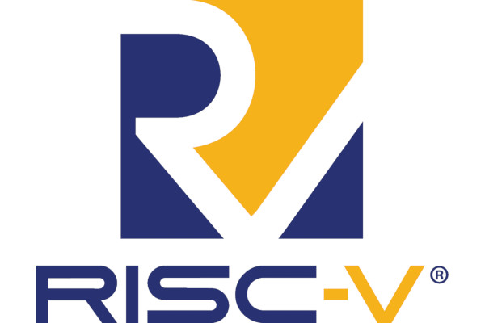

## Matt Venn's Tiny Tapeout 2 Celebrates with a Live Silicon Bring-Up

  
Matt Venn's Tiny Tapeout, which aims to offer a low-cost introduction to designing custom application-specific integrated circuits (ASICs) with contributors receiving a multi-project package for their efforts, has celebrated its second successful production run in style: with what Matt declares to be the "world's first live silicon bring-up" - with the good news that everything works, bar one small erratum.  
  
"We submitted Tiny Tapeout 2 back in December, and last week I received the chips from Efabless," Matt writes. "Most first chip designs fail, but you never hear about it because the big companies keep it a secret. So we thought - why not do the world’s first public silicon bring up?"  
  
That "public bring-up" was broadcast via YouTube to a live audience, with the chips - each one of which contains a copy of every design submitted as part of Tiny Tapeout 2 - being soldered to a breakout board and tested. Impressively, everything came up fine - though a single small erratum, in the scanchain external mode default, was spotted post-bringup.  
  
With the chips tested, assembly will now take place: each designer will receive a chip already-mounted to a breakout board and capable of running any of the projects submitted to the second run. In a second video, Matt showed off some of these to prove their functionality: a random number generator, a "worm in a maze," pi calculated to 1,000 places, an electronic die, a breathing LED, an electronic namebadge, and a 16-bit "capable but very slow" microprocessor by William Moyes.  
  
More details on the results of Tiny Tapeout 2 are available [on the Zero to ASIC Course website](https://zerotoasiccourse.com/post/tt02-silicon-is-alive/), along with links to the videos on YouTube; [Tiny Tapeout 5](https://tinytapeout.com/runs/tt05/) recently closed, with the chips - featuring a total of 720 designs - expected in April next year.

## The US Government Mulls Restrictions for RISC-V in its Trade War with China

  
The US Government is facing pressure from 18 of its members to bring the free and open-source RISC-V instruction set architecture into its ongoing trade war with China - proposing restrictions on how US entities could cooperate on the technology with their Chinese counterparts.  
  
Speaking to newswire [Reuters](https://www.reuters.com/technology/us-china-tech-war-risc-v-chip-technology-emerges-new-battleground-2023-10-06/), Rep. Mike Gallagher, chair of the House Select Committee on China, called for the Commerce Department to "require any American person or company to receive an export license prior to engaging with PRC (People's Republic of China) entities on RISC-V technology."  
  
Rep. Michael McCaul, chair of the House Foreign Affairs Committee, went a step further and accused the Chinese Communist Party (CCP) of "abusing RISC-V to get around US dominance of the intellectual property needed to design chips."  
  
RISC-V International's Calista Redmond has hit back at calls to place barriers in the way of cooperation on the ISA, [claiming that](https://riscv.org/blog/2023/10/risc-v-an-open-standard-backed-by-a-global-community-to-enable-open-computing-for-all/) "the entire tech ecosystem benefits from standards being open, whether it’s RISC-V or other popular standards such Ethernet, HTTPS, JPEG, or USB.  
  
"Open standards have been critical to technology innovation, adoption, and growth for decades. Open standards create access to opportunities and spur growth for a wide range of stakeholders, [and] RISC-V is the defined open standard Instruction Set Architecture for computing."  
  
Noted engineer Andrew "bunnie" Huang went a step further in [penning an open letter](https://www.bunniestudios.com/blog/?p=6862) to US President Joe Biden and the White House staff, asking for the call to be rejected. "Any restrictions placed on US persons sharing RISC-V technology would only serve to diminish America’s role as a technological leader," bunnie writes.  
  
"Over-broad restrictions could deprive educators of a popular tool used to teach students about computers on American campuses, for fear of also accidentally teaching to an embargoed entity. And even narrow restrictions on RISC-V could deprive US tech companies with any potential exposure to the Chinese market of access to a cost-effective, high-performance CPU technology, forcing them to pay royalties to the incumbent near-monopoly provider, ARM Holdings plc - a company that isn’t American."  
  
Thus far, the White House has not issued a formal statement on the proposals one way or another.

## Hirosh Dabui Boots Linux on the Kuchen Computer - "No RISC-V, No Fun!"

  
Engineer Hirosh Dabui has booted a custom, minimal "uLinux" distribution on Lone Dynamics Corporation's open-hardware Kuchen Computer - using his own RISC-V core design on a Lattice Semiconductor iCE40 FPGA.  
  
"Over the summer, I asked Machdyne to develop an iCE40HX8K with 32MB SDRAM," Hirosh explains of the project. "It's the first ICE40HX8K with SDRAM and uLinux in the world. This is a premiere, showing what can be achieved with ICE40s.  
  
"The BlackIceMX only had 2MB of SDRAM, that's where all the madness started. I wrote an SDRAM controller without a simulation model, just trying and erroring with the logic analyser. How crazy is that? Back then, I hadn't even developed a CPU yet."  
  
The Kuchen Computer, by contrast, pairs an iCE40HX8K with a more generous 32MB of 16-bit SDRAM running at 166MHz, with 1MB of NOR flash storage on-board. This, coupled with external flash for data storage, proved enough to run Hirosh's KianRISC-V core - an RV32IMA implementation - at 40MHz and boot the minimal KianULinux.  
  
More information is available [in Hirosh's Twitter thread](https://twitter.com/splinedrive/status/1723451379245559964); KianRISC-V is available [on GitHub](https://github.com/splinedrive/kianRiscV) under the ISC licence, while the Kuchen Computer [has its own repository](https://github.com/machdyne/kuchen) where it's made available under a custom open-source licence.

## Emulated RISC-V Brings Linux to a Whole New Platform: MIT's Scratch

  
Pseudonymous developer "bilman66" has used a popular open-source RISC-V emulator to achieve the seemingly-impossible: booting a fully-functional, if minimal, Linux distribution on MIT's Scratch visual coding platform.  
  
"A real build of the Linux 6.1.14 kernel running in pure Scratch code," the developer says of the project. "The Linux build comes with the usual programs like cat/echo and is fully capable of running shell scripts, but it also comes with Duktape (a JavaScript engine), as well as ed for text editing, and CoreMark for benchmarking."  
  
Developed as an introductory language for young students, Scratch offers a drag-and-drop jigsaw-like approach to creating programs. Rather than simple animations or games, though, bilman66's project runs a port of Charles Lohr's open-source 400-line RISC-V emulator - giving it what it needs to boot Linux.  
  
"I will release the toolchain and standard library soon that will allow you to compile and run your own C programs on the emulator," bilman66 promises for those eager to try the project out for themselves. "For now just use the ROM that's already included."  
  
More information is available [on the project's Scratch page](https://scratch.mit.edu/projects/892602496), though running it without the use of the TurboWarp Scratch accelerator is inadvisable for all but the most patient.

## Google's Project Sparrow Becomes Open Se Cura, Aims at Trustable and Efficient AI

  
Google's open-source division has announced the opening of formerly in-house Project Sparrow, an effort to develop a framework for the development of "secure, scalable, transparent, and efficient" artificial intelligence (AI) and machine learning (ML) platforms, as Project Open Se Cura - building on its existing work on the RISC-V-based OpenTitan hardware root-of-trust project.  
  
"Our goal with Open Se Cura is to evolve a set of open source design tools and IP [Intellectual Property] libraries that will accelerate the development of full-stack systems with ML workloads through co-design and development," says Google's Kai Yick of the project. "This will enable us to better centre system designs around security, efficiency, and scalability, empowering the next generation of AI experiences."  
  
The Project Se Cura framework was developed in partnership with lowRISC, Antmicro, and Verisilcon, Google says - using the RISC-V-based hardware root-of-trust from lowRISC's OpenTitan project, Antmicro's popular Renode system simulation toolchain, and with Verisilicon providing IP design expertise.  
  
"We've used these tools for the first time to extend our IP library with secure ML capabilities," Kai claims of Google's experimentation so far, "and generated a proof of concept for a low-power AI system."  
  
Google has published the full Project Open Se Cura source [on its website](https://opensecura.googlesource.com/), under the permissive Apache 2.0 licence; instructions on its use are available [in the readme](https://opensecura.googlesource.com/manifest/+/refs/heads/master/README.md).

## Rivos Inc. Open-Sources JumpStart, a Framework for RISC-V CPU/SoC Validation

  
Rivos Inc. has announced the release of JumpStart, an open-source framework for writing tests - "diags" in JumpStart parlance - for validating RISC-V central processing units and systems-on-chips.  
  
"JumpStart [...] provides design validation engineers a framework with which to write diags (tests) for RISC-V CPU and SOC validation," Rivos software engineer Jerin Joy explains. "JumpStart includes a bare-metal kernel, APIs [Application Programming Interfaces], and build infrastructure. It is used internally for design validation at Rivos and is in active development.

"Diags can be written in C and/or RV64 Assembly and use the APIs provided by JumpStart. The diags built with JumpStart can be run on the Spike simulator by default and enhanced to run on any RV64 RISC-V system."  
  
Rivos has published JumpStart [to GitHub](https://github.com/rivosinc/jumpstart) under the permissive Apache 2.0 licence; it depends on meson, the RISC-V GNU toolchain, and Spike, and has been tested on Ubuntu 22.04 and macOS.

## The PLCT Lab Launches the RISC-V Software Porting and Optimisation Championship

  
The PLCT Lab, part of the Institute of Software of the Chinese Academy of Sciences (ISCAS), has announced the first RISC-V Software Porting and Optimisation Championship - with registration due to open in December.  
  
"In the past few years, the PLCT Lab dedicated a great amount of financial and human resources along with research and development groups around the world in an effort to enhance RISC-V’s software ecosystem," Wei Wu explains in an announcement to the RISC-V Software Developers' mailing list. "Today, almost all mainstream Linux distributions are already providing or are actively working to support the RISC-V architectures. Toolchains and runtimes such as GNU, Clang/LLVM, OpenJDK, V8 and SpiderMonkey are now working reliably on RISC-V.  
  
"The fact that open sources software are not as optimized for RISC-V hardware platforms as their x86 and Arm64 counterpart points to the need for more developer input. To help attract developers to the RISC-V ecosystem and to accelerate the advancement of its software ecosystem, the PLCT Lab launched the 'RISC-V Software Porting and Optimization Championship.' This championship sets its focus on desktop and server software ecosystem, designing competitive categories for compilers, runtime environments, AI software stacks, etc. and is open to participation by developers around the globe."  
  
The championship is to be split into two competitive tracks: the porting capture-the-flag track will set the challenge of making a currently-unavailable piece of software compatible with RISC-V systems, with the win going to the team first to submit a port which passes testing; the optimisation sprint will set teams the task of improving the performance of a specific piece of software on RISC-V hardware.  
  
More information on the championship is available on the project website; a call for both sponsorship and projects has been opened, with competitor registration due to begin on the 1st of December 2023.

## The World's Smallest RISC-V CPU Gets Faster: SERV Begats QERV

  
The world's smallest RISC-V CPU design, the award-winning bit-serial SERV, has a new sibling - and it delivers an impressive performance boost with only a mild increase in size: QERV, the quadrupled SERV, developed by Qamqom from FOSSi Foundation director Olof Kindgren's original SERV design, as previewed [in our August issue](https://fossi-foundation.org/blog/2023-08-08-ecl65#serv-the-award-winning-bit-serial-risc-v-core-gets-a-four-bit-sibling-qerv).  
  
"Earlier this year I asked a Qamcom colleague to look into this," Olof writes. "Just a few days later he presented me with a mostly working implementation and we were happily surprised to see that the results looked better than we had expected. This gave us the confidence that we were on the right track and started work to finish the implementation.”  
  
QERV takes the original bit-serial design of SERV and quadruples it, producing a four-bit version which requires 13 per cent more area yet delivers more than three times the performance. Even with the size increase, it's smaller than the competition - and has a simplicity which is making it of interest for use in wearables and other low-power space-constrained applications.  
  
"The low gate-count of SERV is a great match for anyone developing a RISC-V-based processor in our low-cost FlexIC technology," says Pragmatic Semiconductor's Emre Ozer. "QERV, the 4-bit version of SERV, will boost the performance considerably for many wearable computing applications whilst minimising the area overhead."  
  
"As a leading edge design house, we always make sure to have the best tools for every task, and QERV fills a gap when it comes to PPA [Power/Performance/Area] trade-offs," says Qamcom CEO Johan Lassing. "This work is also in line with our commitment to be RISC-V experts."  
  
QERV, which is still undergoing optimisation and testing, is available [on Olof's GitHub repository](https://github.com/olofk/qerv/) under the permissive ISC licence.

## Researchers Release Cascade, a CPU Fuzzer Which Found 37 Bugs in 5 RISC-V Cores

  
A trio of researchers from ETH Zurich have released a CPU fuzzing tool dubbed Cascade - along with a paper detailing how it was used to find 37 new bugs, representing 29 new Common Vulnerabilities and Exposures (CVEs), across five RISC-V CPU designs.  
  
"Cascade is a RISC-V CPU fuzzer that generates valid, long and complex programs, and relies on a cascade-effect termination for bug detection," the team explains. "A common but unsatisfying way of detecting whether a bug has been triggered is to compare, instruction by instruction, whether the CPU state matches with the golden model state. This method is difficult to implement and expensive in terms of performance.  
  
"In Cascade-generated programs, due to the entanglement of data and control flow, a bug in the data flow will have a very high chance of altering the control flow, causing non-termination. Cascade found tens of new bugs, but the programs that trigger them are long and complex. Cascade [also] features a new mechanism that reduces bug-triggering programs into very few instructions, while preserving the bug-preserving behaviour."  
  
To prove its worth, the team ran Cascade across a set of existing RISC-V CPU designs, discovering 37 bugs across five cores - causing vulnerabilities ranging from information leakage to denial of service.  
  
The team's paper, to be presented at USENIX Security '24, is available [on the project website](https://comsec.ethz.ch/research/hardware-design-security/cascade-cpu-fuzzing-via-intricate-program-generation/) under open-access terms; Cascade itself has been released [on GitHub](https://github.com/comsec-group/cascade-artifacts) under an unspecified open-source licence.

## lowRISC Partners with zeroRISC, OpenTitan Gets New Hardware

  
Cambridge-based lowRISC has announced that startup zeroRISC has joined its OpenTitan hardware root-of-trust project - and brings with it $5 million in seed funding to deliver the first commercial implementation.  
  
"Our formal membership in the OpenTitan project marks a significant stride towards making open secure silicon a reality," claims Dominic Rizzo, founder and chief executive officer of zeroRISC. "At zeroRISC, we firmly believe that the safest and most secure systems will come to rely on open secure silicon, with trust and assurance built upon OpenTitan’s transparent foundations.  
  
"We look forward to continuing to work together with all project partners to commercialise the first truly open-source RoT chips, a remarkable achievement for zeroRISC and a powerful testament to the success of the OpenTitan project."  
  
zeroRISC was founded in April this year by members of the OpenTitan team at Google, and launches with $5 million in funding to deliver an "all-in-one, drop-in silicon, software and services solution" based on the open-source RISC-V-powered OpenTitan project.  
  
At the same time, the OpenTitan project itself has announced support for a second board for those who want to build a complete top-level emulation of the root of trust: the NewAE Luna Board, which joins the company's Bergen Board as a supported platform.  
  
More information on OpenTitan is available [on the project website](https://opentitan.org/); details on zeroRISC's plans for the project can be found [on the company's own website](https://zerorisc.com/).

## FOSSi News in Brief

-   [The OpenHW Group announces the CVA6 Platform project, offering a multi-core CVA6 RISC-V for software testing.](https://github.com/openhwgroup/cva6-platform)
-   [FOSSi Foundation director Olof Kindgren reflects on "five years of SERVing."](http://blog.award-winning.me/2023/10/five-years-of-serving.html)
-   [SkyWater announces the release of an open-source 130nm Process Design Kit (PDK) and reference design for the Cadence VLSI Fundamentals Education Kit.](https://www.skywatertechnology.com/skywater-announces-availability-of-cadence-open-source-pdk-and-reference-design-for-skywaters-130-nm-process/)
-   [RISC-V International announces the RISC-V Labs, to "grow the RISC-V open source ecosystem and accelerate the efforts of developers worldwide."](https://riscv.org/blog/2023/11/accelerating-the-open-source-software-ecosystem-with-risc-v-labs/)
-   [Google tells developers "what you need to know to get ready" for Android on RISC-V.](https://opensource.googleblog.com/2023/10/android-and-risc-v-what-you-need-to-know.html)
-   [Paper: Pingakshya Goswami, Dinesh Bhatia - Application of Machine Learning in FPGA EDA Tool Development.](https://ieeexplore.ieee.org/document/10272331)
-   [TU Graz leads an international effort to train specialists for sustainable microchips, with €7.15 in European Union funding.](https://www.tugraz.at/en/tu-graz/services/news-stories/tu-graz-news/singleview/article/bildungsoffensive-fuer-nachhaltige-mikrochips-made-in-europe)
-   [Paper: Mingjie Liu et al - ChipNeMo: Domain-Adapted LLMs for Chip Design.](https://research.nvidia.com/publication/2023-10_chipnemo-domain-adapted-llms-chip-design)

**Have feedback or news for inclusion in a future newsletter? Please send this to [ecl@fossi-foundation.org](mailto:ecl@fossi-foundation.org)**.

**Subscribe to [get El Correo Libre direct to your inbox](http://eepurl.com/dnL4v1).**
