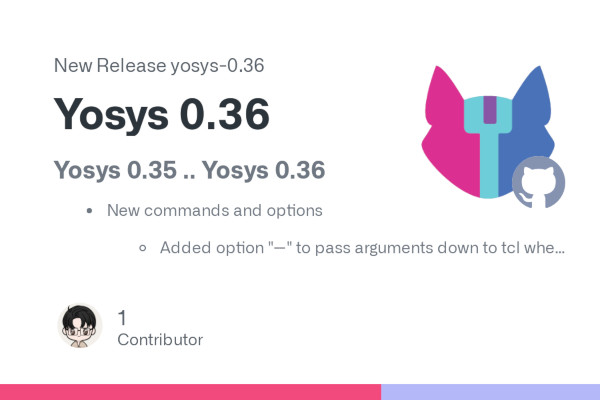
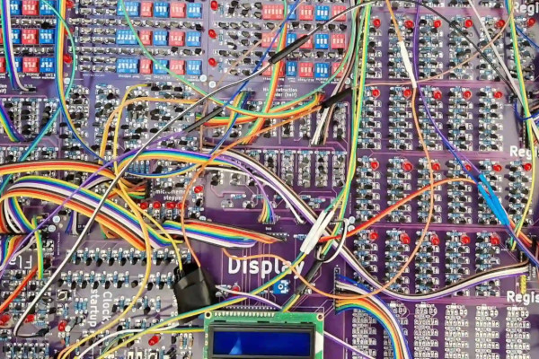
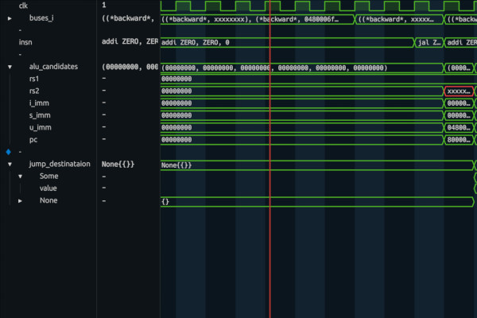
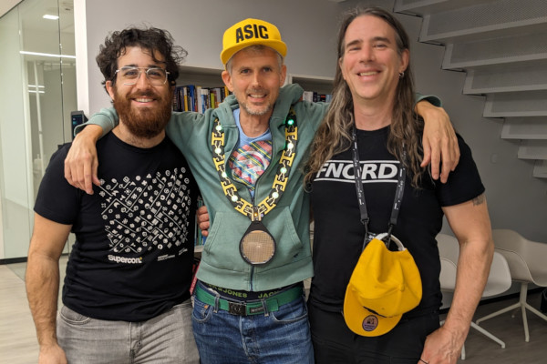
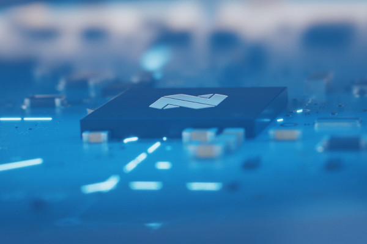

## 2023 Draws to a Close as the Free and Open Silicon Movement Powers Ahead

  
The year is drawing to a close, and for the free and open-source silicon movement the year has been nothing short of incredible. We've seen major names in the industry begin to test the waters with the adoption of free and open-source architectures, joining others who have already leapt in with both feet, and a range of breakthroughs which have helped to push the state of the art even further forward.  
  
Free and open-source silicon is not a new concept, but it's one which is really building up a head of steam - which is only going to propel things further forward as we welcome 2024. From high-performance computing to automotive, from low-power embedded to NASA's latest space-qualified processor, the momentum is undeniable and unstoppable.  
  
Enjoy the last El Correo Libre newsletter of 2023, and join us in 2024 to see what the new year has in store.  
  
_-The FOSSi Foundation Team_

## NSF Chip Workshop Report Says "Open-Source Options Should be Emphasized"

  
The US National Science Foundation (NSF)'s Integrated Circuit Research, Education, and Workforce Development Workshop has issued its final report - stating that "open-source options should be emphasized wherever possible to maximize accessibility" and proposing the foundation of a National Chip Design Centre for the development and maintenance of open-source tools and other materials.  
  
"The main recommendation of this workshop is that accessibility is the key issue," the workshop members write, referring to the issues of education on and research into integrated circuit design in the US. "To this end, a National Chip Design Centre (NCDC) should be established to further research and education by partnering academics and industry to train our future workforce. This should not be limited to R1 universities, but should also include R2, community college, minority serving institutions (MSI), and K-12 institutions to have the broadest effect.  
  
"The NCDC should support the access, development, and maintenance of open design tools, tool flows, design kits, design components, and educational materials. Open-source options should be emphasized wherever possible to maximize accessibility. The NCDC should also provide access and support for chip fabrication, packaging and testing for both research and educational purposes."  
  
The workshop, funded by an NSF grant, further proposes that the NCDC manages tape-outs for research and instructional products, that the NSF provides a separate funding programme for research tape-outs alongside the Major Research Instrumentation Programme (MRI), and provides infrastructure development support for open process design kits (PDKs) and cloud-based development environments.  
  
The full report is available [on Cornell's arXiv preprint server](https://arxiv.org/abs/2311.02055).

## Hannah Thoreson Calls for a "Craft Beer Revolution" in Chip-Making

  
Hannah Thoreson has penned a piece detailing how the semiconductor industry looks from the outside in, and calls for "more people who have some independent interest in developing their own hardware IP" in order to drive a similar explosion as experienced in the craft beer industry.  
  
"I was surprised to find out by making a trip to Silicon Valley to attend the RISC-V Summit and asking a lot of pretty naive and uninformed questions that chip manufacturing is just the big kid version of making a PCB for a science fair project," Hannah writes.  
  
"I think this is a thing where greater manufacturing capacity outside of China and Taiwan will follow on from opening up the software ecosystem, and not the other way around from subsidising supply of chip fabs first. When all of the tooling to develop and test the IP was either very expensive or lacked the transparency of open source projects where you can just go on GitHub and find decent enough instructions to get started, there wasn’t sufficient demand to have manufacturing capacity available locally.  
  
"We need more people who have some independent interest in developing their own hardware IP to have a need for additional capacity," Hannah concludes. "The craft beer revolution did not come from big companies or the government saying that as a matter of official policy, every town should have a couple of breweries. It came from people who wanted to know how to make their own beers mastering that skill first. Craft breweries only scaled up manufacturing later after there was already demand for the product via people trying it.  
  
"Semiconductor manufacturing hasn’t been like that yet, but there’s a bunch of promising concepts that have the potential to introduce that type of dynamic to the industry."  
  
The full article is available on Hannah's website, [Brickstackr](https://www.brickstackr.com/posts/how-to-make-a-computer-chip).

## Yosys 0.36 Brings New Hardware Support, Shifts to ABC 9 By Default

  
The Yosys open synthesis suite version 0.36 has now been released, bringing with it new support for the QuickLogic K6N10f and a shift to ABC 9-by-default for technology mapping on Lattice Semi ECP5, iCE40, and Gowin FPGA targets.  
  
"In my ECP5 FPGA experience," developer Will Green writes on [Mastodon](https://mastodon.social/@WillFlux/111529009839171762), "the results from ABC version 9 are almost always significantly better. "I think for ECP5 ABC9 has been recommended for a while," adds Edwin Török, "good to see it finally becoming the default."  
  
Previously, the ABC 9 tool had only been available as a selectable option during the gate-level technology mapping stage - with Yosys defaulting to an earlier version of the tool unless specifically told otherwise. Now, Yosys will use ABC 9 as standard - with a new option available to disable ABC 9 if required.  
  
"It would be interesting to see if this leads to improved CoreScores for any Yosys-powered devices," FOSSi Foundation director Olof Kindgren suggested on the news, referring to the [core-based benchmark](https://github.com/olofk/corescore) for electronic design automation tools. "Especially since the ECP5 devices have had unexpectedly low scores."  
  
The latest Yosys release is available, along with the project's source code, [on GitHub](https://github.com/YosysHQ/yosys) under the ISC licence.

## The OpenTitan Partnership Announces its "First SoC Secure Execution Environment"

  
lowRISC and zeroRISC, both members of the OpenTitan Partnership, have jointly announced the "early release" of what they describe as the project's "first SoC secure execution environment," following tapeout of its first discrete design six months ago.  
  
"Reaching this landmark milestone is yet another proof point of OpenTitan’s significance, not just as an open RoT [Root of Trust[, but a complete open-source silicon design ecosystem rapidly adaptable to many use cases," claims zeroRISC founder and CEO and OpenTitan Project director Dominic Rizzo.  
  
"OpenTitan stands tall as the pioneer and leader in open-source silicon. Its remarkable maturity in design, verification and documentation, accumulated over years of dedicated effort, sets it apart from emerging projects," adds lowRISC CEO Gavin Ferris. "OpenTitan has continuously evolved, guided by a well-developed roadmap and fuelled by a vibrant and engaged community of contributors."  
  
The OpenTitan Project was founded in 2018 with a view to creating a silicon root-of-trust built around a RISC-V core and made available under a permissive open-source licence. True to its promise, the new execution environment has been published to [the project's GitHub repository](https://github.com/lowRISC/opentitan/tree/integrated_dev) under the Apache 2.0 licence.

## "How CPU Works" Releases Their 11-Bit Discrete-Transistor CPU Design

  
Anonymous educator "How CPU Works" has fulfilled their promise to release the design of an 11-bit homebrew CPU built entirely from over 2,000 discrete transistors - though under an unspecified licence.  
  
"After you finish the book," the maker wrote in reference to the educational materials developed alongside the custom CPU, "you will be able to say what every single one of 2,008 transistors do and why they do that. You will also understand why some architectural choices were made, be able to design your own processors, and better understand what goes on in modern ones."  
  
The CPU itself is an 11-bit device made from 2,008 discrete transistors, with 32 micro-memory and ROM addresses, eight branch flags, a stack pointer register for recursive functions, and an LCD display and a keyboard for input and output. The only complex chip in the entire build is a single Arduino-compatible microcontroller, which serves as the system's memory.  
  
The project's educational material is available [on the How CPU Works website](https://us17.admin.mailchimp.com/campaigns/2,008 discrete transistors, with 32 micro-memory and ROM addresses, eight branch flags, a stack pointer register for recursive functions, and access to an LCD display and a keyboard for input and output.), while the KiCAD files for the build can be found [on GitHub](https://github.com/tensorway/2000transistors) under an unspecified licence.

## Yosys Team Shines a Spotlight on Frans Skarman's Surfer Waveform Viewer

  
The Yosys team has published a Community Spotlight looking at the work of Frans Skarman on the Surfer waveform viewer, a Rust-based tool which can run natively or in-browser using WebAssembly.  
  
"When building my HDL, Spade, I ran into a problem. With a powerful type system, the bit representation of a signal is often hard to understand, so you need a way to automatically translate the values back into their human-readable representation to effectively debug your designs," Frans explains of the project's origins.  
  
"While gtkwave has support for custom translation via external programs, it turned out to be quite hard to get right and wasn’t as powerful as I wanted. For example, I found no way to translate a value into a list of expandable sub-fields to, for example, expand individual fields of a struct. I was also bothered by small things like how zooming and scrolling works in gtkwave.  
  
"Eventually, the question of 'how hard can it be' made me start this project. Luckily, it turns out that with the right libraries, the answer to that question was that it is easier than I thought it would be. Overall, I’m very excited about having a mostly solid waveform viewer where I and others can try out new things, both in terms of translations and interface."  
  
Surfer, which includes signal translation capabilities, a RISC-V opcode translator, and a gesture-based user interface for keyboard and mouse, is available [on GitLab](https://gitlab.com/surfer-project/surfer) under the European Union Public Licence v1.2; a hosted version is available for in-browser use [on the project website](https://app.surfer-project.org/).  
  
The full Community Spotlight article is available [on the YosysHQ Blog](https://blog.yosyshq.com/p/community-spotlight-surfer/).

## Matt Venn Shows Off Custom Silicon's Capabilities with a Bit of Bling

  
Matt Venn has shown off exactly what you can achieve through programmes like [Tiny Tapeout](https://tinytapeout.com/), which encourages newcomers to silicon design to submit something for production on a multi-project chip, in wearable form - with an upgraded "ASIC necklace."  
  
"For the last few years I've worn an old four-inch wafer to conferences or whenever I'm teaching in person," Matt explains. "People rarely get to handle a wafer, and they're always interested to know more.  
  
"While it's a fantastic conversation starter, the problem with this necklace is it's too hip-hop and not enough $15 million Nikon lithography stepper. To resolve this annoyance I decided to make the most ridiculous ASIC bling possible using my own chips."  
  
The finished device, built with the help of Adam Zeloof and Patrick Deegan, uses a chain made of gold-anodised CNC-milled aluminium, matte-black PCBs, and LEDs placed under the control of a VexRiscv chip's RISC-V core - built as part of the Efabless Chip Ignite programme in 2022.  
  
A full video detailing the project is available [on Matt's YouTube channel](https://www.youtube.com/watch?v=QxjvktltZ9E).

)

## RISC-V International Announces a "Banner Year" for the Free and Open ISA

  
RISC-V International has declared 2023 a "banner year" for the free and open-source instruction set architecture, outlining new technological advances and growing adoption in fields as diverse as high-performance computing and embedded devices.  
  
“The biggest takeaway for the RISC-V community this year is that we’re going to see RISC-V everywhere," claims RISC-V International chief executive Calista Redmond. "More and more industries and companies are turning to RISC-V to innovate faster and take advantage of the vibrant culture of collaboration.  
  
"Our biggest priorities looking ahead are to continue to drive technical progress and deepen community engagement, while offering even more value and resources to accelerate the RISC-V ecosystem."  
  
Among the organisation's highlights for the year are the ratification of the Vector Crypto ISA Package and the Input/Output Memory Management Unit (IOMMU), the launch of the RISC-V Labs programme to expand the software ecosystem, expansions in the RISC-V Learn Online educational programmes, and increasing adoption of the ISA which has seen the RISC-V Exchange directory grow by 40 per cent over the course of the year.  
  
The full retrospective is available [on the RISC-V International website](https://riscv.org/announcements/2023/11/risc-v-international-marks-banner-year-for-risc-v-adoption-technical-momentum-and-community-engagement/) now.

## Nordic Semi Details its Interest in RISC-V, But Doesn't Abandon Proprietary ISAs Yet

  
Nordic Semiconductor's Svein-Egil Nielsen has written an explainer on the company's decision to adopt the RISC-V instruction set architecture - but says it will be doing so as a "complimentary alternative" to its usual proprietary ISA rather than making a wholesale shift as with competitor Espressif.  
  
"I see RISC-V in a similar way to how I see the proliferation of wireless IoT [Internet of Things] connectivity standards: no one technology can be all things to (solve) all application problems," Svein-Egil writes. "So does Bluetooth LE really compete with Thread or cellular IoT? Of course not. Each is designed to do different things well, but not everything.  
  
"At its heart, RISC-V is all about promoting innovation by giving users the ability to develop leading-edge, customised hardware based on an open-source chip architecture. What RISC-V will do for Nordic's customers is give them the freedom and flexibility, in certain specific and highly specialized applications, to strip down the instruction set to ensure extreme levels of low power consumption.  
  
"RISC-V will also lower the barriers-to-entry and level the playing field when it comes to developing IoT applications. This will encourage even greater innovation in the IoT market. RISC-V will simply further enhance the design options for Nordic customers and particularly in simpler, ultra lowest power applications where every Joule and Watt counts."  
  
The full article is available [on Nordic Semi's Get Connected blog](https://blog.nordicsemi.com/getconnected/why-nordic-is-getting-involved-in-risc-v).

## FOSSi News in Brief

-   [Tantra Analyst's podcast quizzes RISC-V International CEO Calista Redmond on the current state of the architecture.](https://www.tantraanalyst.com/ta/podcast/tantras-mantra-podcast-episode-31/)
-   [Video: The OpenHW Group publishes a recap of the RISC-V Summit 2023.](https://www.youtube.com/watch?v=JufNJ-CURps)
-   [Video: Computex's RISC-V Taipei Day video declares that "RISC-V is inevitable."](https://www.youtube.com/watch?v=HX-JlcgE2as&t=3s)

**Have feedback or news for inclusion in a future newsletter? Please send this to [ecl@fossi-foundation.org](mailto:ecl@fossi-foundation.org)**.

**Subscribe to [get El Correo Libre direct to your inbox](http://eepurl.com/dnL4v1).**
