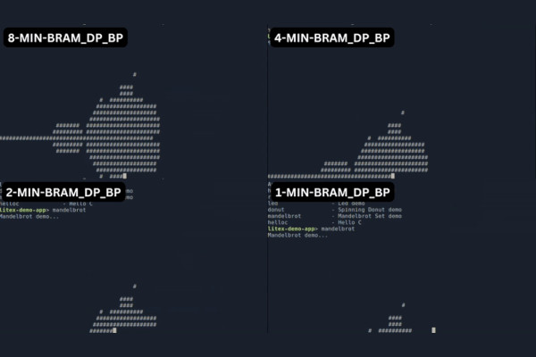
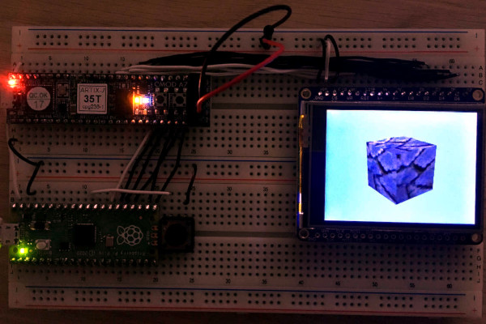
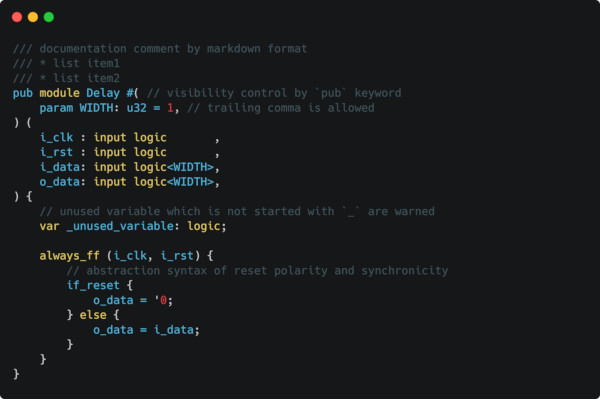
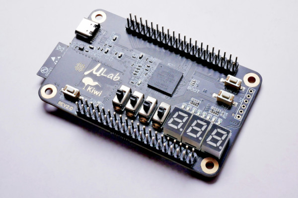
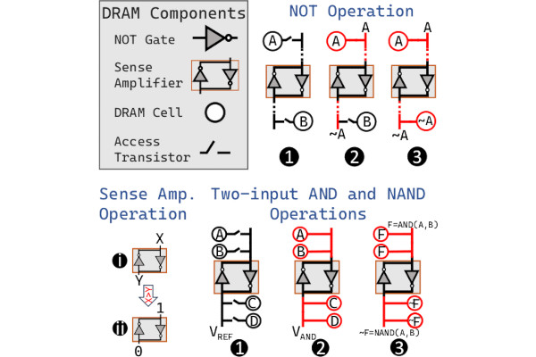
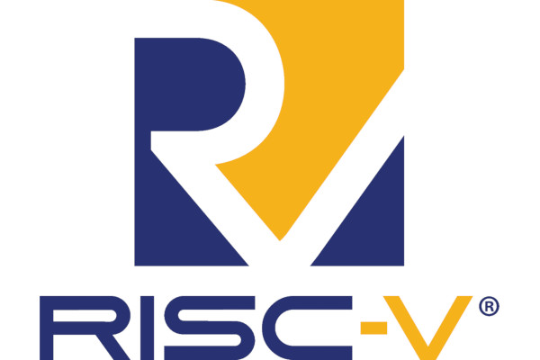
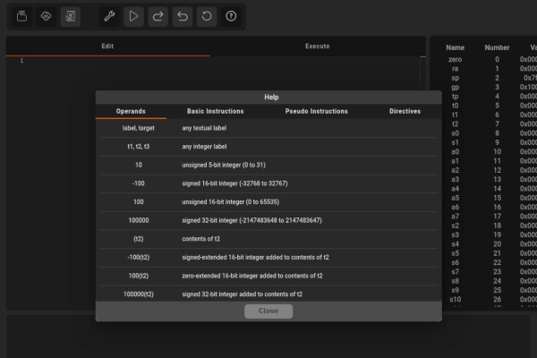

## New Latch-Up 2024 Sessions Confirmed as the Countdown Draws to a Close

  
The FOSSi Foundation is thrilled to announce the third and final batch of talks and lighting sessions for [Latch-Up 2024](https://fossi-foundation.org/latch-up/2024), taking place this April the 19th to the 21st in Boston - with tickets still available for anyone to attend!  
  
**CitizenSilicon: towards an open-source Czochralski furnace for Si growth**  
_Max Aalto_  
Max's talk will focus on pushing the reach of open source silicon further than ever, with the development of an open-source Czochralski furnace which can be used to produce silicon boules - a step towards the creation of truly open silicon wafers. "The aim of our endeavour," Max explains, "is to shed light on the highly intricate process of single crystal growth, democratize the production of one of the most important resources on earth, and enable others to begin research into their own crystal growth techniques and practices.  
  
**Riding The Wave: Building Wave Pipelines in FPGAs**  
_Rice Shelley_  
Rice's session looks at wave pipelines, an "unconventional digital design technique" for FPGAs, and their creation and optimisation in SpinalHDL. "Designing wave pipelines in FPGAs offers the opportunity to gain familiarity with a specific FPGAs architecture, timing analysis, and outside the box thinking in FPGA development," Rice says, and "will provide valuable insights into building efficient and high-performance wave pipelines in FPGAs."  
  
**ABC: The Way It Should Have Been Designed**  
_Alan Mishchenko_  
Alan's somewhat tongue-in-cheek talk title promises a look at ABC since its release nearly two decades ago, and what lessons have been learned in the years since. "This talk focuses on what is present and, more importantly, what is missing in ABC, and how ABC could be improved to make it more versatile and user-friendly," Alan says. "The motivation for this talk is to help academic researchers maximize the usefulness of their tools and to set a new standard for future versions of ABC."  
  
**Building an Ecosystem for Hardware Generators**  
_Rachit Nigam_  
Rachit's talk aims to build atop the Filament HDL to demonstrate the use of parametric signatures in Filament to avoid structural pipelining bugs and to ensure correct composition of generators written in other languages. "The goal of the system," Rachit explains, "is to enable an ecosystem where generators can be seamlessly composed with strong correctness guarantees."  
  
**Cohort: Software-Oriented Acceleration for You, Me, and Our Heterogeneous SoCs**  
_Nazerke Turtayeva_  
"We built the Cohort platform that lets developers orchestrate their accelerators in a software oriented manner," Nazerke says by way of introduction to this talk, which will showcase a prototype built atop the OpenPiton project. "In particular, we provide a user-friendly and scalable software API based on high-performance shared memory queues and a hardware wrapper around each accelerator."  
  
**Giving Students A Byte of Open-Source: Advancing Hardware Education**  
_Ethan Sifferman_  
UC Santa Cruz lecturer Ethan Sifferman's talk will showcase how SystemVerilog has become more accessible thanks to open-source efforts including FuseSoC, Verilator, Yosys, DigitalJS, CVA6, Ibex, and Sky130. "Key points include the superior pedagogical features of open-source tools compared to commercial alternatives," Ethan says, "the availability of open-source designs as references for writing scalable RTL, and the effectiveness of open-source PDKs and netlist viewers for deeper synthesis comprehension."  
  
**Artifact Evaluation for the Field Programmable Gate Array Community**  
_Miriam Leeser_  
Miriam's talk will walk through artefact evaluation (AE), by which creators can have their work evaluated by third parties in exchange for badges - an idea extended from existing projects in the world of software. "I introduced AE to the FPGA community five years ago," Miriam explains, "and it has been adopted by the major FPGA conferences and publications."  
  
**BYOL (Build Your Own Linter) – UVMLint for IEEE-UVM core code development**  
_Ajeetha Kumari Venkatesan_  
Ajeetha's presentation will focus on the verification stage of the design process, with the discussion of custom rules for linting Universal Verification Methodology (UVM) Base Class Library (BCL) code running on top of the open-source PySlint SystemVerilog testbench linter. "The eventual goal is to have these rules as gatekeepers via GitHub actions so that any future code addition to the UVM BCL is free from common pitfalls," Ajeetha explains.  
  
**Towards Cycle-accurate Simulation of xBGAS**  
_Yong Chen_  
Yong's talk covers REV-xBGAS, a cycle-based simulator for the Extended Base Global Address Space (xBGAS) project. "Leveraging RISCV’s extensibility, xBGAS integrates an extended register file and new instructions, enabling efficient global memory access," Yong explains. "REV-xBGAS allows easy configuration of network latencies, bandwidths, and topologies, enabling performance evaluations under varied conditions."  
  
**Towards xBGAS on CHERI: Examining the Benefits of a Secure Distributed Architecture**  
_Mert Side_  
Mert's poster session also talks a look at the xBGAS project, but this time an exploration in retrofitting the xBGAS runtime for compatibility with the CHERI project's hardware-enforced bounds and capabilities. "Our work lays the groundwork for future research in hybrid memory systems on capability hardware," Mert says, "and offers a blueprint to diverse architectures."  
  
**Sonata: A Development Platform to Enable Exploring the use of CHERI for Embedded Applications**  
_Hugo McNally_  
Hugo's presentation aims to detail a development platform which brings the security-enhanced CHERI technology to embedded engineers. "The Sonata platform consists of an open source and low cost FPGA development board as well as a user-friendly open source reference SoC design and demo applications," Hugo explains. "The platform builds on the work of the CHERIoT project originally developed by Microsoft, and is being worked on in the open so that stakeholders can follow and influence it's development."  
  
**Introduction to Coreboot**  
_Zachary Liebl_  
Zachary is looking to deliver an introduction to the Coreboot project to those who have not yet seen it. "Coreboot is a FLOSS firmware replacement for traditional OEM BIOSes/UEFIs," Zachary says. "Replacing existing firmware with Coreboot of course removes any OEM anti-features, but also allows for cool tricks like requiring TOTP codes to load the OS."  
  
**Open Source RTL Verification with Verilator**  
_Karol Gugala_  
Karol's presentation is a follow-up on the ORConf 2023 UVM support overview talk, looking at Antmicro's work towards enabling constrained randomisation in Verilator. "Ultimately, the work is meant to enable cloud scaling of production-grade ASIC verification workloads," Karol says. "With the new implementation, Verilator generates expressions in the smtlib2 language, letting users pick between multiple solvers, and introduces no build time dependencies."  
  
**Attempts to Design Hardware using dafny**  
_Ben Reynwar_  
Ben is in the process of designing and proving hardware using dafny, a proof assistant backed by a SAT solver it. "It's hard and I haven't made much progress," he admits, "but I'd be happy to talk about it for three minutes!"  
  
**RF Front-end receiver design for 2.4GH/5GHz Wi-Fi application**  
_Jabeom Koo_  
Jabeom's presentation will focus on two tape-outs, created through the Efabless platform and the SkyWater open-source process design kit (PDK). "Two groups of my students participated in these tape-outs," Jabeom explains. "One group prepared RF front-end receiver circuits for both 2.4GHz and 5GHz Wi-Fi application. Another team focused on designing digital circuit, [specifically a] video codec."  
  
**Surfer - An Extensible and Snappy Waveform Viewer**  
_Frans Skarman_  
Frans' presentation delivers a look at Surfer, a waveform viewer which aims to support novel workflows including the visualisation of types in modern HDLs, the analysis and visualisation of transactions, advanced translation, and interactive debugging. "In addition," Frans adds, "Surfer is intended to be a general purpose waveform viewer which feels snappy and comfortable to use for keyboard and mouse users alike. It also runs anywhere, including on the web which enables easy integration with other tools."  
  
**Leveraging Transparent Checkpointing for Fault Tolerance in RISC-V**  
_Aayushi Gautam_  
Aayushi's talk takes a look at DMTCP, distributed multi-threaded checkpointing, an open-source tool which aims to make it easier to handle parallel and distributed applications and its applicability to the RISC-V architecture. "RISC-V, being an open and extensible instruction set architecture, provides a versatile platform for diverse computing applications," Aayushi explains. "DMTCP complements this by offering a transparent and efficient checkpointing mechanism for parallel RISC-V programs."  
  
**Accelerating Hardware Design with Custom GPTs**  
_Shvetank Prakash_  
The ability for machine learning and artificial intelligence to take away some of the drudgery of development is the focus of Shvetank's talk, which looks at how custom generative artificial intelligence (gen AI) models can be used to speed up hardware design work. "By leveraging gen AI to accelerate hardware design," Shvetank argues, "we can reduce development costs and introduce a new era of efficiency and innovation in chip design."  
  
**OSHHISS Open Source for Hybrid Hetrogenous Integrated Semiconductor Systems**  
_John Goodenough_  
John plans to use his session as a call-to-action for interested parties to collaborate on open source hardware design patterns and tools for low-cost hybrid heterogeneous systems.  
  
**Teaching Modern EDA using a Tapeout-Centric University Course**  
_Anish Singhani_  
Finally, Anish will be presenting on the progress of an ongoing tapeout-centric course at Carnegie Mellon University which aims to educate students on the open-source EDA landscape and offer hands-on experience with open-source tooling. "We'll discuss the origin of the course," Anish promises, "design of lab assignments, structure of the tapeout project, successful student projects, and challenges we've faced through this process."  
  
If any of the above is of interest, you can find the full programme [on the Latch-Up 2024 page](https://fossi-foundation.org/latch-up/2024) - along with links to register to attend, either as a free ticket holder or with a paid professional ticket to support the event.  
  
We hope to see you there!

## Meinhard Kissich's FazyRV Offers a Scalable Minimal-Area RISC-V Core

  
PhD student Meinhard Kissich's FazyRV project is the latest to be highlighted in the Yosys Community Spotlight series, offering a compact RISC-V core designed for minimal footprint yet offering scalability with an adaptable data path width.  
  
"The fascination of getting the most out of a constrained environment and using even small FPGAs for 'big' projects - it is like the digital design equivalent of 'Can it run Doom?'," Meinhard explains of the inspiration behind the project. "I became captivated by [Olof Kindgren's award-winning] SERV and how small a system-on-chip design can be. However, there was a gap between the 1-bit bit-serial SERV and prevalent 32-bit cores.  
  
"That brings me to a second point: I wanted to explore how a sub-32-bit core scales between a 1-bit bit-serial and a 32-bit core in terms of area and performance. This is where FazyRV started as a scalable RISC-V core. FazyRV allows scaling the core to the project’s needs in a way that was not available to me before."  
  
Offering fine-grained options for scalability, FazyRV allows the user to explore the trade-off between area and performance by simply adjusting Verilog parameters. In one demonstration, Meinhard shows FazyRV visualising the Mandlebrot set with different chunk sizes set - delivering a very visible performance difference depending on setting.  
  
"But there is more to it: FazyRV avoids hand optimization at the gate level," Meinhard adds. "I want to inspect more closely how synthesis tools optimize the current hardware description and map the patterns. Consider having a play with FazyRV in your next project, either by using the Verilog design directly or exploring FazyRV via LiteX. We are grateful for any opinions, reported issues, or suggestions."  
  
The full Community Spotlight piece is available [on the YosysHQ Blog](https://blog.yosyshq.com/p/community-spotlight-fazyrv/), while FazyRV [is published on GitHub](https://github.com/meiniKi/FazyRV) under the permissive MIT licence.

## Rasterix Delivers an OpenGL Graphics Processor in Verilog

  
Rasterix, a project by pseudonymous developer "ToNi3141," implements an OpenGL 1.3-compatible graphics processor in Verilog - and aims to expand in the future to deliver a fixed-function renderer compatible with other application programming interfaces including Direct3D 7.0 and Glide.  
  
"The Rasterix project is a rasterizer implementation for FPGAs written in Verilog," ToNi3141 explains. "It implements a mostly OpenGL 1.3 compatible fixed function pixel pipeline with a maximum of two TMUs [Texture Mapping Units] and register combiners in hardware. The vertex pipeline is implemented in software. The renderer is able to produce 100MPixel and 200MTexel at a clockspeed of 100MHz.  
  
"The long term goal of this project is to recreate an open source fixed function renderer compatible with all fixed function APIs (OpenGL 1.5, OpenGL ES 1.1, Glide, Direct 3D 7.0) and is also suitable for embedded devices. The current focus is on OpenGL."  
  
Rasterix builds on the earlier RasteriCEr project, which offered a basic OpenGL implementation for the Lattice iCE40 FPGA family. The project has two variants available: one with an internal framebuffer, offering faster performance but requiring lots of RAM on the target FPGA, and one with an external framebuffer.  
  
"With a generic configuration," ToNi3141 writes, "the core requires around 10k LUTs [Look-Up Tables] on a Xilinx Series 7 device. A full configuration [...] requires around 36k LUTS on a Xilinx Series 7 device."  
  
Software supported by Rasterix includes Tuxracer, Quake 3 Arena, and Warcraft 3. More information is available [on the project's GitHub repository](https://github.com/ToNi3141/Rasterix), where the source is published under the reciprocal GNU General Public Licence 3.

## The Veryl Hardware Description Language Aims to Improve on SystemVerilog

  
Pseudonymous developer "dalance" is looking to improve on SystemVerilog with Veryl, a new hardware description language which aims to offer better interoperability and an optimised syntax.  
  
"Veryl is a hardware description language based on SystemVerilog, providing the following advantages," dalance writes of the project. "Optimised syntax; interoperability; productivity."  
  
The first of these claimed advantages is delivered through a syntax optimised for logic design, based on SystemVerilog but extending it with guarantees for synthesisability and with simplifications for common idioms improving the ease of development and reliability of designs.  
  
The second, interoperability, comes from the language's ability to transpile SystemVerilog source code while, dalance says, retaining "high readability [with] seamless integration and debugging."  
  
Finally, productivity improvements come from a "rich set of development support tools" including build tools, package managers, and real-time checkers compatible with popular editors from Vim and Emacs to Visual Studio Code (VSCode). "With these features," dalance claims, "Veryl provides powerful support for designers to efficiently and productively conduct high-quality hardware design."  
  
More information on the project is available [on the official website](https://veryl-lang.org/), while the Veryl source code is available [on GitHub](https://github.com/veryl-lang/veryl) dual-licensed under the permissive Apache 2.0 and MIT licences.

## Antmicro Works to Speed Traffic Flow on the OpenROAD

  
Antmicro has detailed an ongoing project to boost the performance of the mainstream OpenROAD flow, aiming to deliver faster turnaround times for larger and more complex designs.  
  
"[We have] an ongoing project focusing on improving execution time of the mainstream OpenROAD flow at the Floorplan, Placement, Clock Tree Synthesis, and Routing stages," the company writes of its work. "The general idea of that project is to suggest technical, general software optimisations, e.g. improving data structures or refactoring code for efficiency and scalability.  
  
"There’s [also] potential for even more optimisation that we are currently exploring. One of the methods that could yield promising results is parallelisation by scaling the flow on many CPU cores.  
  
"With this in place, it would be possible to scale up OpenROAD workloads into the cloud to yield even shorter turnaround times. On top of that, the design could be partitioned in order to spawn multiple parallel builds on many machines in the cloud, and without licensing limitations, you could potentially significantly shorten your ASIC development time."  
  
Even before it tackles the thorny issue of parallelisation, Antmicro says it has found a range of ways to boost OpenROAD performance - including a change to the the Gate Resizer module which delivered an 80 per cent reduction in the time taken for Clock Tree Synthesis and repair when tested on the Ariane design.  
  
Antmicro's full write-up is available [on the company blog](https://antmicro.com/blog/2024/03/speeding-up-openroad/), and will be detailed further in a talk at [the Open Hardware and Software Mini Summit](https://sched.co/1aBJ0) on the 15th of April.

## Alex Lao Offers a List of "Unconventional" Things to Do With an FPGA

  
Computer engineer Alex Lao has put together a list of self-described "unconventional uses" for field-programmable gate arrays - arguing that "the digital circuitry in your FPGA chip are analogue circuits" in reality, and thus can be cajoled into a variety of interesting behaviours.  
  
"My favourite phenomenon in digital circuitry is when digital threatens to become analogue again. For example, a lot of people are interested in the idea of overclocking an FPGA for more performance and are usually encouraged not to do so," Alex explains.  
  
"However, thinking about the reasons why overclocking goes wrong and learning to understand the issues with overclocking can allow you to achieve a stable overclock or at least help you understand your chip better. This is only one example of exploring odd behaviour of FPGAs when pushing beyond suggested limits."  
  
With this in mind, Alex has considered the aspects of an FPGA that can lead to unexpected behaviours and put together a list of projects proving exactly that - where digital FPGAs are turned into analogue strain gauges, ultra-wideband pulse generators, random number generators, radio-frequency digital to analogue converters, and even a tunable antenna.  
  
The full list is available on Alex's blog, [Voltage Divide](https://voltagedivide.com/2024/03/18/unconventional-uses-of-fpgas/).

## Researchers Perform Boolean Logic with Real, Off-The-Shelf DRAM Chips

  
Researchers from ETH Zurich have made a major step towards processing-using-DRAM (PuD), a paradigm which aims to deliver massively-parallel computation directly in memory, by demonstrating "functionally-complete" Boolean logic operations using commercial off-the-shelf (COTS) DRAM chips.  
  
"We experimentally demonstrate that COTS DRAM chips are capable of performing 1) functionally-complete Boolean operations: NOT, NAND, and NOR and 2) many-input (i.e., more than two-input) AND and OR operations," the team writes of its work.  
  
"Among our 19 new observations, we highlight four major results. First, we can perform the NOT operation on COTS DRAM chips with a 98.37 per cent success rate on average. Second, we can perform up to 16-input NAND, NOR, AND, and OR operations on COTS DRAM chips with high reliability (e.g., 16-input NAND, NOR, AND, and OR with an average success rate of 94.94 per cent, 95.87 per cent, 94.94 per cent, and 95.85 per cent, respectively).  
  
"Third," the researchers continue, "data pattern only slightly affects bitwise operations. Our results show that executing NAND, NOR, AND, and OR operations with random data patterns decreases the success rate compared to all logic-1/logic-0 patterns by 1.39 per cent, 1.97 per cent, 1.43 per cent, and 1.98 per cent, respectively. Fourth, bitwise operations are highly resilient to temperature changes, with small success rate fluctuations of at most 1.66 per cent among all the tested operations when the temperature is increased from 50°C to 95°C."  
  
A preprint detailing the team's work is available [on Cornell's arXiv server](https://arxiv.org/abs/2402.18736).

## Public Review Periods Open for Several New RISC-V Extensions

  
Public review periods are now open for a series of extensions to the RISC-V instruction set architecture: Zicfilp, Zicfiss, Smmpm, Smnpm, Ssnpm, Sspm, Supm, and Smrnmi.  
  
"The Zicfilp extension provides landing pads for forward-edge control-flow integrity," Georgios Christou explains of the first extension pair, "and the Zicfiss extension provides shadow stacks for backward-edge control-flow integrity." The review period for these closes on the 27th of April, with more information available [in Georgios' announcement](https://groups.google.com/a/groups.riscv.org/g/isa-dev/c/_5ot6Yoa5fU).  
  
"The RISC-V J Extension TG is delighted to announce the start of the public review period for the proposed Smmpm, Smnpm, Ssnpm, Sspm, and Supm standard extension to the RISC-V ISA," writes Martin Maas, "collectively known as Pointer Masking." This review period ends on the 19th of April, with more information available [in Martin's announcement](https://groups.google.com/a/groups.riscv.org/g/isa-dev/c/JhPyyLhQe4Q).  
  
"We're happy to announce that the Smrnmi extension for resumable non-maskable interrupts is ready for public review," says Andrew Waterman of the last of the extensions to be under public review. This review period also ends on the 19th of April, with details [in Andrew's announcement](https://groups.google.com/a/groups.riscv.org/g/isa-dev/c/alVTNbanfdU).

## Brazil Becomes a RISC-V Premier Member, Inks a Collaborative Partnership on HPC

  
The nation of Brazil is aiming to develop high-performance computing and artificial intelligence technologies powered by the RISC-V architecture - signing a memorandum of understanding (MoU) between the Instituto ELDORADO and the Barcelona Supercomputing Center (BSC), shortly after joining RISC-V International as a Premier Member.  
  
"The initiative is part of the Priority Program for National Interest (PPI-Softex)," RISC-V International explains of the partnership, "and is aligned with the support of the Ministry of Science, Technology and Innovation (MCTI) in establishing technological partnerships between Brazil and the European Union, strengthening knowledge exchange and support for excellence in research and development.  
  
"In the constantly evolving landscape of High Performance Computing (HPC), open RISC-V processors are promising to revolutionise the way we deal with computational tasks. These processors, which follow an open instruction set architecture standard, without royalties and with global contribution, are gaining prominence for their customisation and expandability. They offer unmatched flexibility and efficiency compared to traditional proprietary architectures.

"In this project, a Matrix Acceleration Unit will be developed based on a processor that offers this flexibility and high performance," RISC-V International continues. "Working in collaboration with researchers from UNICAMP and BSC, ELDORADO is already discussing proposals for high-performance architectures, strengthening knowledge in RISC-V for HPC."  
  
The full announcement is available [on the RISC-V International website](https://riscv.org/blog/2024/03/brazil-and-europe-sign-innovative-project-with-risc-v-technology-for-hpc/).

  
Computer science student Eduardo Michel Deves de Souza has created a simulator which puts a 32-bit RISC-V core in your browser, with the aim of it being used in education and for personal experimentation.  
  
"In the last year I worked on my final coursework at my college, which is based on the RARS simulator," Eduardo explains of the project. "It is a web simulator for RISC-V, using RV32I, the objective is that students at the University of Vale do Itajaí use in class."  
  
The simulator, written in JavaScript, allows the user to write RISC-V assembly in-browser and have it executed as though running on an RV32I core. "It was developed with the aim of providing an affordable [RISC-V] implementation," Eduardo says, "allowing students, enthusiasts and developers to experiment and learn about this popular processor architecture."  
  
The source code for the simulator has been published [to GitHub](https://github.com/eduardoMichell/rv-sim) under an unspecified open-source licence, while a live version is hosted [on GitHub Pages](https://eduardomichell.github.io/rv-sim/) for immediate use.

## FOSSi News in Brief

-   [Paper: Hardware Phi-1.5B: A Large Language Model Encodes Hardware Domain Specific Knowledge, Fu et al.](https://arxiv.org/abs/2402.01728)
-   [Paper: An All-Optical General-Purpose CPU and Optical Computer Architecture, Kissner et al.](https://arxiv.org/abs/2403.00045)
-   [RISC-V International announces the RISC-V Enterprise Software Ecosystem Dashboard.](https://riscv.org/blog/2024/03/introducing-the-risc-v-enterprise-software-ecosystem-dashboard/)

**Have feedback or news for inclusion in a future newsletter? Please send this to [ecl@fossi-foundation.org](mailto:ecl@fossi-foundation.org)**.

**Subscribe to [get El Correo Libre direct to your inbox](http://eepurl.com/dnL4v1).**
