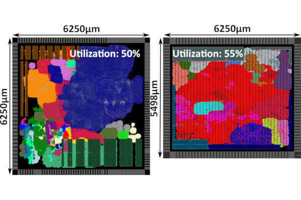
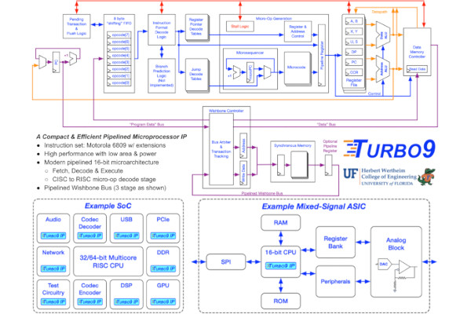
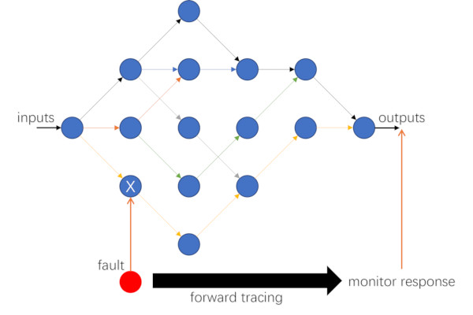
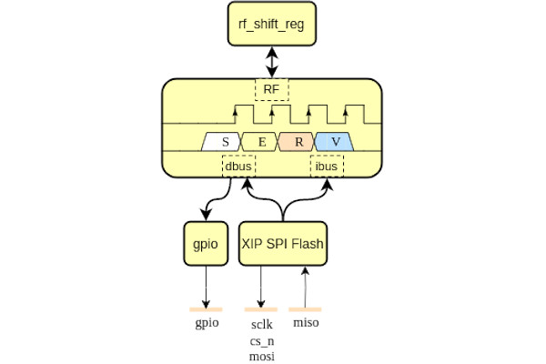
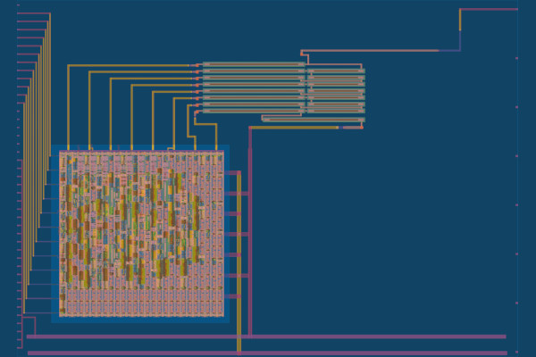
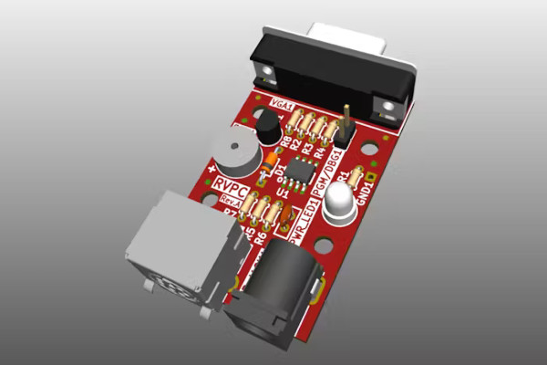
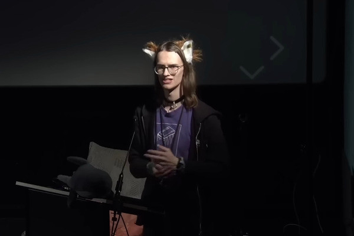

## ORConf 2024 Registration Now Open

  
The FOSSi Foundation is, as always, very proud to announce that registrations for ORConf 2024 have now opened.  
  
You can join us over the weekend of September 13 to 15 in Gothenburg Sweden, for all things open source semiconductor design! Follow the links [on the event website](https://fossi-foundation.org/orconf/2024) for registration.  
  
This will be the tenth instalment of the event, our flagship annual European conference on all things FOSSi - that is, Free and Open Source Silicon related. We're humbled to have seen this event continue to grow as it has, and to have been so well attended and supported by the community since its inception.  
  
If you've never been to an ORConf, you can think of it like an in-person ECL email; a stream of fascinating presentations and discussions on the latest and greatest in the Open Source Silicon world, but in 3D! The weekend is focused on getting folks together in the same room (be it a lecture hall or a pub) to share our passion for, and stories on the projects we're all working with.  
  
You can expect a very high standard of presentations on FOSSi topics from hobbyists, academics and folks in industry. You'll always hear about something new and excellent you've never come across before, and sometimes mind-expanding ideas that you never thought possible until someone, with the help of FOSSi tools, tried it, or if the FOSSi tool didn't exist, wrote the tool and then tried it! Each year's proceedings never cease to amaze, and particularly in recent years with the trajectory of the field absolutely on the up.  
  
For those of you who have joined us in the past, you know what you're in for and we always love seeing familiar faces again each year. The event serves as a time to network and catch up with collaborators, colleagues and friends. There is an emphasis on socialising time throughout the weekend to make the most of the effort put into travelling to the event.  
  
The weekend usually begins Friday midday with a half day of presentations, and informal social events afterwards. Saturday is a full day of presentations, lunch and an official conference social event in the evening. Sunday is usually a more casual affair with workshops and Birds of a Feather (BOF) sessions. Should you be interested in a workshop or BOF on the Sunday please get in touch with the event organisers via the details [on the contact section of the event site](https://fossi-foundation.org/orconf/2024#contact).  
  
Presentation submissions are also open, and may be submitted [through the Eventbrite event registration portal](https://www.eventbrite.com/e/orconf-2024-tickets-912195410027).  
  
As ever, ORConf is put on by volunteers from the FOSSi Foundation, and to cover as much of the event's costs as possible we kindly ask for support from sponsors and those of you who are able to purchase professional tickets. If you are considering sponsorship, please [take a look at the sponsorship prospectus available via the conference page](https://fossi-foundation.org/orconf/2024#sponsors).  
  
We're excited to be hosting the event in Gothenburg this year; there is plenty of semiconductor industry activity in the region, and Gothenburg is a beautiful city. Details of the precise venue location will be available in the coming month or so, but it will be easily accessible from central Gothenburg should you wish to begin booking accommodation.  
  
As ever we're very excited about the prospect of another excellent ORConf event. We invite ECL readers to explore joining us in Gothenburg in September.  
  
All details can be found [at the conference site](https://fossi-foundation.org/orconf/2024).  
  
We hope to see you there!  
  
_-Julius Baxter, on behalf of the ORConf organisers at the FOSSi Foundation_

## Basilisk Boosts Open EDA Flows for a RISC-V ASIC with "Competitive Performance"

  
Researchers from ETH Zurich and the University of Bologna have penned a paper describing Basilisk, extending a previous project dubbed Iguana to prove that open-source electronic design automation (EDA) tools can deliver a system-on-chip design with "competitive performance" - while improving said tools along the way.  
  
"Recently, Benz et al. presented and released Iguana, an end-to-end open-source Linux-capable system-on-chip (SoC) created with open tools and implemented in IHP’s open 130nm technology," the researchers explain. "Iguana proved that a completely open-source design flow can be used to implement a Linux-capable SoC, but the authors did not optimize their design for performance or reduce design rule check (DRC) violations to a minimal level desirable for tapeout.  
  
"In this work, we extend the previous work on Iguana by optimising the synthesis and the physical implementation of the Cheshire SoC with open-source electronic design automation (EDA) tools; we call the resulting application-specific integrated circuit (ASIC) Basilisk.  
  
"As was done for Iguana," the researchers continue, "we avoid simplifications to the original RTL description utilizing complex SystemVerilog and instead focus on improving the EDA tools, their flow scripts, and the overall physical implementation and constraints. In the spirit of open-source, we actively foster international and cross-institutional exchange, collecting knowledge and building on existing efforts on cutting-edge algorithms and open EDA tools."  
  
The paper includes an extensive study on a state-of-the-art open EDA flow, based on Yosys for synthesis and OpenROAD for place-and-route, delivers improvements to existing tools based on the findings of said study, provides an optimised open silicon implementation flow, and even improves on Iguana's physical design with an optimised power grid and automatic inference of multiply-accumulate (MAC) operations. All told, the researchers claim a 2.3x boost in operating frequency over Iguana original EDA flow and a five percentage point increase in core utilisation.  
  
The paper has been submitted as a poster to the RISC-V Summit Europe 2024, with a preprint available [on Cornell's arXiv server](https://arxiv.org/abs/2405.03523).

## Turbo9 Brings Motorola's 6809 Back as Open Silicon for Vintage Computing and More

  
Computer engineers Kevin Phillipson and Micheal Rywalt have delved into Motorola's history for an open silicon project which builds on the classic Motorola 6809 - turning it into a modernised 16-bit pipelined core they hope will see use in both vintage computing projects and as a more compact alternative to 32-bit cores in embedded applications.  
  
"Current industry trends are to adapt 32-bit RISC IP for microcontroller use," the researchers say of the driving force behind the project, "however their large 32x32 register files and loosely encoded instructions limit their absolute minimum footprint. So with the goal of a creating a performance and compact microprocessor IP, we need an 16-bit instruction set architecture (ISA). Also, we want an architecture that is capable of running C code effectively.  
  
"The Turbo9 is a pipelined microprocessor IP written in Verilog that executes a superset of the Motorola 6809 instruction set. It is a new modern microarchitecture with 16-bit internal datapaths that balances high performance vs small area/low power. The Turbo9R with a 16-bit memory interface achieves 0.69 DMIPS/MHz [Dhrystone Million Instructions Per Second per Megahertz] which is 3.8 times faster than Motorola's original 8-bit MC6809 implementation.  
  
"The target applications are SoC sub-blocks or small mixed-signal ASICs that require a compact and efficient microprocessor for programmable high-level control," the pair concludes, while admitting the design may be of interest to those working with hardware built for Motorola's original 6809 processor. "There are many 32 or 64-bit RISC-V or Arm cores that try to fill this niche, but prove to be inefficient solutions given many of these applications only require 16-bit precision."  
  
More information on the project is available [on the Turbo9 GitHub repository](https://github.com/turbo9team/turbo9), where the source is made available under the permissive BSD 1-Clause licence.

## Researchers Showcase Formal Verification for Ibex Soft-Error Evaluation

  
Bing Xue and Mark Zwolinski, researchers at the University of Southampton's School of Electronics and Computer Science, have published a paper which looks at using formal verification to test a RISC-V core for reliability in the face of Single Event Upset (SEU) errors.  
  
"Reliability has been a major concern in embedded systems. Higher transistor density and lower voltage supply increase the vulnerability of embedded systems to soft errors," the pair explain in the abstract to their paper. "A Single Event Upset (SEU), which is also called a soft error, can reverse a bit in a sequential element, resulting in a system failure.  
  
"Simulation-based fault injection has been widely used to evaluate reliability, as suggested by ISO26262. However, it is practically impossible to test all faults for a complex design. Random fault injection is a compromise that reduces accuracy and fault coverage. Formal verification is an alternative approach.  
  
"In this paper," the researchers continue, "we use formal verification, in the form of model checking, to evaluate the hardware reliability of a RISC-V Ibex Core in the presence of soft errors. Backward tracing is performed to identify and categorize faults according to their effects (no effect, Silent Data Corruption, crashes, and hangs). By using formal verification, the entire state space and fault list can be exhaustively explored."  
  
In their testing of the free and open source Ibex core the researchers found that "most of the bits" within the core were vulnerable to silent data corruption in the face of soft errors, and that the second pipeline stage was more vulnerable than the first - a finding which would have been difficult to prove using fault injection instead of formal verification. Future work will, the pair says, include coverage of Double Event Upsets (DEUs).  
  
A preprint of the team's paper is available [on Cornell's arXiv server](https://arxiv.org/abs/2405.12089).

## SERV, the World's Smallest RISC-V CPU, Heads to Silicon via Tiny Tapeout

  
FOSSi Foundation director Olof Kindgren has announced that SERV, the world's smallest RISC-V CPU design, is to be manufactured in silicon as part of Matt Venn's Tiny Tapeout programme, which puts free and open source silicon projects into a multi-project die to dramatically reduce the per-project manufacturing cost.  
  
"I just managed to fit the award-winning SERV, the world's smallest RISC-V CPU into two Tiny Tapeout slots, together with a GPIO [General-Purpose Input/Output] controller and an XIP [Execute In-Place] controller," Olof announced via Twitter, "which makes it possible to run any application loaded onto an SPI flash."  
  
"As we all know, Tiny Tapeout caters to an underserved ASIC market, which is why I chose to call this project Underserved. Big thanks to Matt Venn for running the show and to Efabless, who provides the backend services and from whom I got the free tile, and big thanks to my employer Qamcom for sponsoring a second tile!"  
  
The Underserved project crams a lot into two Tiny Tapeout project tiles, but does come with some caveats. "While we can read data and instructions from SPI flash, there is no RAM for storing any data," Olof admits. "SERV is small, but memories cost a lot of chip area.  
  
"However, we can still store a few words of data in the GPR registers. Weeeell... actually... implementing all the 31 32-bit words needed for RV32I, or even the 15 needed for RV32E would take up a considerable amount of space. So, right now Underserved only implements four GPR registers. Other than that though, it's a fully capable RISC-V SoC and I'm sure you can think up a lot of fun things to do with it."  
  
More information on the project is available [on the Underserved GitHub repository](https://github.com/olofk/underserved), where the design is published under the permissive Apache 2.0 licence; additional details can be found [on the Tiny Tapeout website](https://tinytapeout.com/runs/tt07/328/).  
  
Submissions for Tiny Tapeout 8 are open [on the website](https://tinytapeout.com/) now.

## Matt Venn Showcases Tiny Tapeout's Shiny New Mixed-Signal Capabilities

  
Matt Venn, creator of the Zero to ASIC Course and Tiny Tapeout multi-project chip programme, has published a video showcasing the recently-introduced mixed-signal capabilities in Tiny Tapeout - allowing open silicon projects to experiment with analogue circuits as well as digital.  
  
"One of the things I was super excited about for Tiny Tapeout 6 was the analogue projects," Matt explains in the new video. "If you take a look at the shuttle stats, we got 27 out of the 32 possible slots filled - and so for this little video I thought I would show you one of the projects I made, which was this R2R DAC, which is a mixed-signal design.  
  
"[It's] arranged in such a way so that when you provide zeros or ones in the top here, the digital, it adds up all the voltages and then you end up with the analogue out there. And then it also has this digital block here, and that's generated by OpenLane.  
  
"I think mixed signal design is a really exciting and interesting new frontier that we have access to with the open-source tools, and now that Tiny Tapeout supports it I'm hoping to see a lot of really interesting and cool designs."  
  
The full video is available [on the Zero to ASIC Course YouTube channel](https://www.youtube.com/watch?v=sXWISMBNh_w), and includes an overview of the toolchain used to create R2R DAC, while more information on Tiny Tapeout is available [on the official website](https://tinytapeout.com/). R2R DAC itself is published [to GitHub](https://github.com/mattvenn/tt06-analog-r2r-dac) under the permissive Apache 2.0 licence.

## lowRISC Chief Gavin Ferris Talks OpenTitan, Open Source Silicon, and More

  
Shauli Zacks, of Safety Detectives, has published an interview with Gavin Ferris, chief executive officer of lowRISC - discussing the OpenTitan open-source silicon root-of-trust project and the importance of open silicon from a security perspective.  
  
"We provide a home for collaborative engineering to create and maintain high quality IP such as OpenTitan, the world’s first open-source silicon root of trust (RoT)," Gavin explains of lowRISC in the interview. "We've finally made open-source silicon work the same way as open-source software, despite the cost, time, and correctness hurdles (not to mention the physical supply chain!) that makes hardware development so challenging.  
  
"We're all familiar with the hugely beneficial, industry-level transformation that took place once open-source software achieved critical mass, and with this milestone the silicon industry is now primed for a similar change. There’s still a long way to go of course, but the die is cast.  
  
"Similar to open-source software," Gavin continues, "we strongly believe that open-source silicon: enhances trust and security through design and implementation transparency - issues can be discovered early, the need for blind trust is reduced, and system audits are greatly facilitated; enables and encourages innovation through contributions to the open-source design via a collaborative approach to design; provides implementation choice and preserves a set of common interfaces and software compatibility guarantees through a common, open reference design."  
  
The full interview is available [on Safety Detectives](https://www.safetydetectives.com/blog/gavin-ferris-lowrisc/) now.

## Olimex Unveils the "Lowest Cost" RISC-V PC, the RVPC - Priced at Just €1

  
Bulgarian open hardware specialist Olimex has unveiled what it claims will be the world's cheapest RISC-V personal computer, the RVPC - using a microcontroller and a minimum of parts to bring the retail cost down to just €1 per unit.  
  
"The idea about [a] €1.00 Do-It-Yourself educational RISC-V computer came at TuxCon 2024 and I made lighting talk about it," Olimex founder Tsvetan Usunov explains of the project's origins. "Then after the event I thought some more and decided to use SO8 package and to drop the SD Card which would take too much resources."  
  
Built with cost very much in mind, the RVPC uses a proprietary implementation of the RV32 RISC-V architecture - specifically, the ultra-low-cost WCH Electronics CH32V003, a 32-bit chip designed for embedded use as a microcontroller  
  
"As [the] CH32V003 have only 2k[B] of RAM, [a] VGA resolution of 320x200 is possible," Tsvetan explains of the machine's admittedly limited capabilities, "[and] in text mode 40x25 characters. The video will be generated without graphics video buffer, for the games user defined characters could be used.  
  
"It is more toy than computer," Tsvetan admits of the machine, which is built with experimentation and education in mind, "but this is how I learned computers 40 years ago."  
  
More information on the RVPC, which will launch at OpenFest in Sofia later this year, is available [on the Olimex blog](https://olimex.wordpress.com/2024/05/15/meet-rvpc-the-world-lowest-cost-open-source-hardware-all-in-one-educational-risc-v-computer-with-vga-and-ps2-keyboard-which-will-be-available-for-diy-soldering-workshop-on-open-fest-in-sofia-this-year/); the hardware designs will, as with all Olimex creations, be released as open hardware.

## Frontgrade Gaisler Partners with the ESA to Send RISC-V to the Stars

  
Microprocessor specialist Frontgrade Gaisler has announced a deal with the European Space Agency (ESA) to design a new radiation-hardened processor implementing the free and open-source RISC-V architecture - for use in upcoming space missions.  
  
"Building on over 25 years of successfully using the SPARC open ISA in space, this effort is an important step forward in the transition to the emerging and equally open RISC-V architecture," says ESA technical officer Roland Weigand of the partnership. "RISC-V is the preferred architecture across a wide range of space products, from microcontrollers to advanced SoC-FPGAs and high performance microprocessors for on-board data processing."  
  
"Frontgrade Gaisler has decades of experience supplying the space industry with products that implement open standards, and now we’re applying our proven know-how to bring RISC-V advancements to the space industry," adds Frontgrade Gaisler's Sandi Habinc. "Our team is committed to providing tangible benefits that help progress and grow the entire space community and enable new types of space missions."  
  
This isn't the first time Frontgrade Gaisler has experimented with RISC-V: the company already has a RISC-V processor design, dubbed NOEL-V, which is included in its GRLIB IP collection under the reciprocal GNU General Public Licence 3; it has not yet announced how the new design will be licensed.  
  
More information on NOEL-V is available [on the Frontgrade Gaisler website](https://www.gaisler.com/index.php/products/processors/noel-v).

## Steve Markgraf Turns Cheap HDMI Capture Dongles into High-Speed Data Paths

  
Developer Steve Markgraf has come up with an unusual use for MacroSilicon MS2130-based USB 3.0 HDMI capture dongles, costing as little as $10 each: capturing data from FPGA projects at a rate beyond that available on a USB 2.0 connection.  
  
"This project aims to (ab)use cheap USB 3.0 HDMI capture sticks based on the MacroSilicon MS2130 as a general purpose USB interface," Steve writes. "In combination with small FPGA boards with HDMI interface like the [Sipeed] Tang Nano series, it can be used to capture high speed data streams from an external data source like an ADC, do-it-yourself SDR, or simply build a high speed logic analyser.  
  
"I was looking at how I can capture data at high speeds and low cost," Steve explains in a talk on the project presented at OsmoDevCon 2024 earlier this year. "One thing that was really a limiting factor with USB oscilloscopes is that they are only USB 2.0 High Speed, so you have 480Mbit/s [bandwidth] and get around 45MB/s [throughput]."  
  
Steve's solution is simple: while adding USB 3.0 or higher to a project is complex and often expensive, off-the-shelf USB 3.0 HDMI capture dongles are cheap. Combined with an equally-inexpensive FPGA board with HDMI output capabilities, it's possible to encode data as a video stream (pictured above) and capture it for decoding at high speeds - delivering, in testing, up to 184MB/s throughput.  
  
More details on Steve's creation are available [on the hsdoah GitHub repository](https://github.com/steve-m/hsdaoh), where the client-side source code is published; the FPGA source code is available [on a separate repository](https://github.com/steve-m/hsdaoh-fpga) under the permissive MIT licence. Steve's OsmoDevCon presentation video, meanwhile, can be found [on media.ccc.de](https://media.ccc.de/v/osmodevcon2024-200-low-cost-high-speed-data-acquisition-over-hdmi#t=53).

## Kleines Filmröllchen Highlights RISC-V, "The Only Architecture You'll Ever Need"

  
Pseudonymous hacker "Kleines Filmröllchen" has presented during Swabia's FSCK 2024 conference on RISC-V, describing it as "the only architecture you'll ever need."  
  
"I try to provoke everyone," Kleines admits, "by saying it's the only architecture you'll ever need for microcontrollers, embedded systems, desktop CPUs, accelerators, servers - pick [them] all.  
  
"RISC-V is an open standard for an instruction set architecture - so 'open' as in freely open source, you can do whatever you want with it. Let's discuss why RISC-V is cool: on a little more of a technical level, RISC-V is very modular - and it's one of the most modular instruction sets that exists.  
  
"So the base ISA just contains the bare minimum stuff that you need for a Turing-complete microprocessor," Kleines continues, "and it's basically enough to make a very, very simple microcontroller - but you can have a variety of extensions, and many of the common extensions are also the ones you would want in your desktop computer."  
  
The full talk is available [on media.ccc.de](https://media.ccc.de/v/fsck-2024-48-risc-v-the-only-architecture-you-ll-ever-need) now.

**Have feedback or news for inclusion in a future newsletter? Please send this to [ecl@fossi-foundation.org](mailto:ecl@fossi-foundation.org)**.

**Subscribe to [get El Correo Libre direct to your inbox](http://eepurl.com/dnL4v1).**
