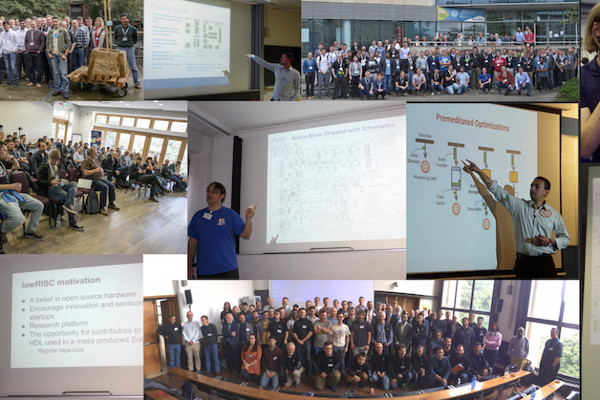
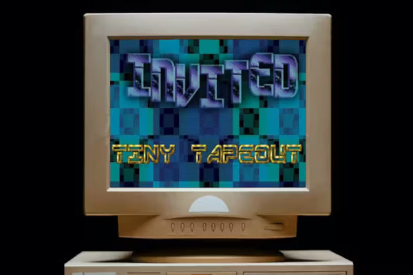
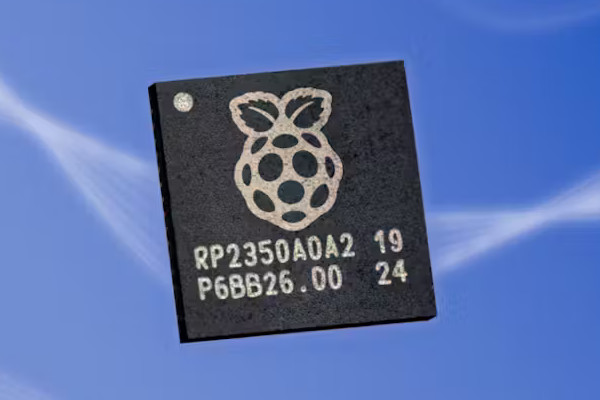
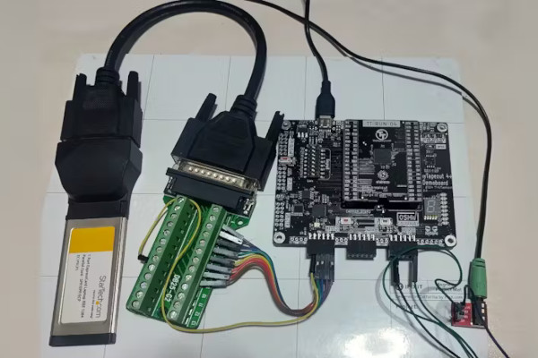
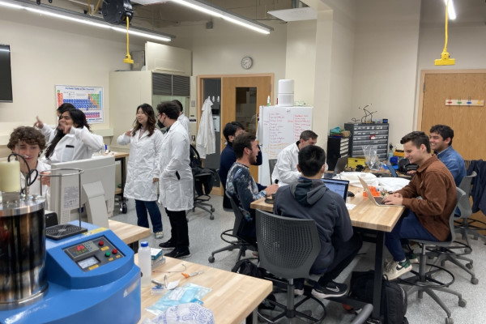
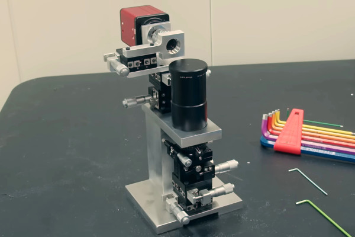
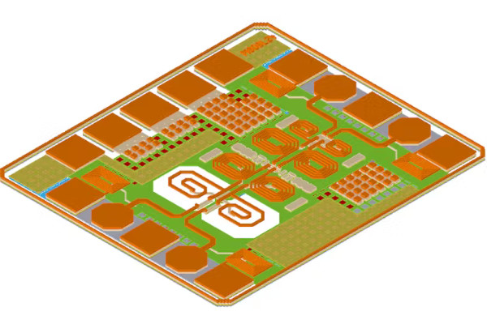

## First ORConf 2024 Speakers Confirmed, Register Now to Attend!

  
The 10th instalment of [ORConf](https://fossi-foundation.org/orconf/2024/), the FOSSi Foundation's conference dedicated to free and open-source silicon, rapidly approaches - and for those who have yet to [register to attend the event](https://fossi-foundation.org/orconf/2024/), taking place in Gothenburg, Sweden from Friday the 13th of September to Sunday the 15th of September, perhaps this list of freshly-confirmed speakers will spur you into action.  
  
**Accelerating software development for emerging ISA extensions with cloud-based FPGAs: RVV case study**  
_Marek Pikuła_  
Marek will be discussing the RISC-V Vector Extension (RVV), and in particular development approaches which can deliver more efficient use - and ensure that the performance gains of vectorisation are worth the time spent, through use of FireSim and cloud-based FPGA simulation.  
  
**FazyRV: A RISC-V Core that Scales to Your Needs**  
_Meinhard Kissich_  
Meinhard's will be walking through the features of FazyRV, a scalable RISC-V core which can be synthesised as either a one-, two-, four-, or eight-bit serial CPU and which boasts a plethora of variants in order to adapt to a given target technology. Meinhard will also look at how FazyRV's performance can be improved, and look at possible extensions which could be adopted in future revisions.  
  
**Understanding and Supporting Open Source Silicon Communities**  
_Stefan Wallentowitz_  
FOSSi Foundation director Stefan will be delivering a talk on how to understand and better support free and open-source silicon communities, in order to deliver a broader and more supportive ecosystem for all.  
  
**Debug your Design with a Tiny Interpreter**  
_Christopher Lozinski_  
Christopher's talk will be taking a look at swapping traditional cross-device interpreters for an on-device interpreter which runs on an FPGA and in a simulator - requiring less than 2kB of memory and avoiding the bottleneck of interprocess communications.  
  
**VexiiRiscv : A Debian demonstration**  
_Charles Papon_  
Charles will be delivering a live demonstration of the Debian Linux distribution running atop VexiiRiscV (Vex2Risc5), an extended successor to the VexRiscv project aimed at improving performance and functionality alongside delivering 64-bit support, on real FPGA hardware.  
  
**Project Arrakeen: One API to rule all PDKs**  
_Staf Verhaegen_  
Staf's talk will be focusing on Project Arrakeen, which aims to deliver a Python framework for portable and scalable digital and analogue circuit design - building on the PDKMaster base project and adding standard cells, input/output (IO) cells, SRAM compiler, and analogue blocks, and currently supporting the SkyWater Sky130, IHP SG13G2, and GlobalFoundries GF180MCU open process design kits (PDKs).  
  
**naja_edit: An Open Source Tool for Gate-Level Netlist Editing and Optimisation**  
_Christophe Alexandre_  
Christophe will be presenting on naja_edit, an open-source project which optimises and edits gate-level netlists with algorithms including dead-logic elimination, constant propagation, and primitives optimisation - demonstrating its capabilities with real-world optimisation results across a series of open-source designs.  
  
**Forastero: cocotb Testbenches with Batteries Included**  
_Peter Birch_  
Peter's talk will be looking at Forastero, a Python library designed to add standard components like drivers, monitors, and scoreboards to cocotb without the need for a full Universal Verification Methodology (UVM) environment. "While in some ways a spiritual successor to cocotb-bus," Peter explains, "Forastero goes further and provides mechanisms for generating complex random stimulus."  
  
**DFHDL: The 3-in-1 Abstraction Approach to Hardware Design**  
_Oron Port_  
Oron will be diving deep into the DFiant Hardware Description Language (DFHDL), which offers a unique three-layer abstraction model designed to blend Dataflow (DF), Register-Transfer (RT), and Event-Driven (ED) models into a single framework. "Expect a straightforward discussion on how each layer of DFHDL works," Oron promises, "why it matters, and what it means for the future of hardware design."  
  
**BYOL (Build Your Own Linter) - UVMLint for IEEE-UVM core code development**  
_Ajeetha Kumari Venkatesan_  
AsFigo's Ajeetha will be presenting his team's custom rules for linting UVM BCL code on top of the open-source PySlint SystemVerilog testbench linter. "The eventual goal is to have these rules as gatekeepers via GitHub Actions," Ajeetha explains, "so that any future code addition to the UVM BCL is free from common pitfalls."  
  
**My Open Source Analogue Microelectronics Journey**  
_Matt Venn_  
From Zero to ASIC Course and Tiny Tapeout founder Matt will be presenting a look at his experience in taping out his first analogue designs. "I will cover motivation, tools, my designs, and my success and failures so far," he promises. "The presentation will end with a discussion on how this fascinating topic fits into the wider picture of open source silicon and the next steps needed to enable radio transmitters and receivers."  
  
**OSVVM in a NutShell, VHDL’s #1 Verification Methodology**  
_Jim Lewis_  
Jim's talk will focus on OSVVM, a suite of libraries designed for more streamlined VHDL verification process. " Each library provides independent capabilities, allowing selective adoption and a learn-as-you-go approach," Jim says. "With OSVVM and a good team lead, any VHDL engineer can do verification - and have fun doing it."  
  
**Open Source Standard Cell Library Design**  
_Antoine Sirianni_  
"With the avenue of AI [Artificial Intelligence] as a game changer, what would Open Source Standard Cell Library Design consist in to date," Antoine will ask. "Where to start? Let's focus on combinatorics to provide with an unexpected contribution."  
  
**cocotb as a Way Towards a New Verification Methodology**  
_Marek Cieplucha_  
Martek's presentation is set to look at how cocotob, the open-source coroutine-based cosimulation testbench environment, could provide a path forward to a new way to handle verification.  
  
**A Very Small Cross Compiler for OpenRISC, and Maybe Your Homebrew Processor**  
_Jörg Mische_  
Jörg will be discussing PunyCC, a cross-compiler which targets a very small subset of C - supporting only one source file, using no preprocessor, no structs, no floating-point, and only one datatype. "Due to these simplifications the compiler source code is very small and can easily be adopted to a new target instruction set," Jörg explains - and will prove exactly that by showing how it can be adapted to OpenRISC.  
  
**The Saturn Vector Unit: Design of a Fully Compliant Open-Source RISC-V Vector Unit**  
_Jerry Zhao_  
Jerry will be presenting on the Saturn Vector Unit, a vector accelerator which is based on the ratified version of the RISC-V Vector Extension (RVV) and which is published under an open  
source licence for all to add into their own designs.  
  
**OS-EDA: An Open-Source Course about Open-Source EDA**  
_Thorsten Knoll & Christian Wittke_  
Thorsten and Christian will be discussing the creation of the OS-EDA course, an open-source educational course covering open-source electronic design automation (EDA) tools - and will be unveiling details of the first live "test-run" of the course, to take place at IHP with a view to creating an open-source tapeout.  
  
**Synthesising Music Synthesisers**  
_Sebastian Holzapfel_  
Blending two very different meanings of "synthesis," Sebastian will be discussing the Tiliqua project - which aims to use an open hardware development platform, digital signal processing (DSP) libray, and Amaranth HDL-based examples to make FPGA-based audio and video synthesis more accessible.  
  
**cocotb Gets A Glow Up: Fixes and Features of 2.0**  
_Kaleb Barrett_  
Kaleb's talk will take a look at the new features and enhancements to be found in the 2.0 release of cocotob, the open-source coroutine-based cosimulation testbench environment. "cocotb 2.0 includes changes to how tests are parameterised and selected," Kaleb explains, "how tasks are managed, how HDL values are represented in Python, and how simulations are run."  
  
**The Future of FuseSoC**  
_Olof Kindgren_  
Finally, FOSSi Foundation director Olof will be discussing the FuseSoC project, likely the world's most widely-used package manager, but rather than focusing on its past will be peering into the future - offering a look at planned new features in both FuseSoC and its sister project Edalize.  
  
If those talks have you interested in attending, you can find out more about the event and register for a free general admission ticket [on the ORConf page](https://fossi-foundation.org/orconf/2024/); if you're attending on behalf of a company or other organisation and want to help support the event, you can purchase a professional ticket through the same site - and you would have our thanks!  
  
We look forward to seeing all of you in Gothenburg this September!

## Tiny Tapeout Gets a Demoscene Contest

  
The Tiny Tapeout project, which uses a web-based toolchain and a multi-project chip layout to allow people to design their own silicon for production at an extremely low cost, has opened a new contest which aims to bring people over from the demoscene into free and open source silicon - and vice-versa: the Tiny Tapeout Demoscene Competition.  
  
"The home computer demoscene has resulted in some amazing feats of hacking and pushing hardware to its limits," Tiny Tapeout founder Matt Venn says of the project's contest. "The Tiny Tapeout demoscene competition sticks to the same audio/visual output format, but instead of using an existing computer, you create your own ASIC [Application Specific Integrated Circuit] hardware!"  
  
Participants in the competition are asked to keep their designs to two or fewer tiles of the multi-project chip layout - though one judging category, "rulebreaker," allows for larger designs or those which rely on an external Raspberry Pi RP2040 microcontroller to operate - and come up with a design capable of outputting video and, optionally, audio inspired by the eight- and 16-bit home computer demoscene.  
  
Other judging categories include best soundtrack, best graphics, and most impressive design for a given size. Video output is via a VGA PMOD add-on, with a second PMOD providing an audio output. Rulebreaker entries aside, no other hardware should be required.  
  
More information on the project is available [on the Tiny Tapeout website](https://tinytapeout.com/competitions/demoscene/); entries must be made for submission as part of Tiny Tapeout 8, which closes on the 6th of September.

## Raspberry Pi's New RP2350 Includes a Pair of Open Hazard3 RISC-V Cores

  
Raspberry Pi has launched the successor to its popular RP2040 microcontroller, the RP2350 family and Raspberry Pi Pico 2 development board - and it comes with the surprise inclusion of a pair of free and open source Hazard3 RISC-V cores, selectable either in place of or alongside its proprietary Arm cores.  
  
"Raspberry Pi Pico 2 is our new $5 microcontroller board, built on RP2350: our new high-performance, secure microcontroller," Raspberry Pi boasts of the new chip. "With a higher core clock speed, double the on-chip SRAM, double the on-board flash memory, more powerful Arm cores, optional RISC-V cores, new security features, and upgraded interfacing capabilities, Raspberry Pi Pico 2 delivers a significant performance and feature boost, while retaining hardware and software compatibility with earlier members of the Raspberry Pi Pico series."  
  
The original Raspberry Pi RP2040, the first chip to launch from the company's in-house application specific integrated circuit team, featured a pair of proprietary Arm Cortex-M0+ cores; in the RP2350, these have been replaced by Arm Cortex-M33 cores. They're not the only cores present, though: the chip also includes a pair of Hazard3 cores, 32-bit RISC-V cores designed by Luke Wren and released under the permissive Apache 2.0 licence.  
  
That Raspberry Pi is interested in RISC-V isn't news: the company recently became a "Strategic Member" of RISC-V International, though downplayed any plans to release RISC-V hardware of its own. The RP2350 isn't RISC-V exclusive, either, with users able to select between the proprietary Arm and open Hazard3 cores at runtime - or to run one of each cores in a heterogeneous multiprocessing mode.  
  
The inclusion of performant free and open RISC-V cores in what is likely to be an extremely popular microcontroller part - with multiple third parties having already announced their own products built around the RP2350 - is an undeniably breakthrough, and will provide a low-cost ready-to-run platform for anyone wanting to experiment with developing for the Hazard3 core specifically or RISC-V more generally.  
  
The Raspberry Pi Pico 2, which pairs the RP2350 with 4MB of off-chip flash on a compact breadboard-friendly development board, is available to order now at $5; RP2350 chips are available in two footprints with optional 2MB stacked flash memory from Raspberry Pi's authorised resellers. More information is available [on the Raspberry Pi website](https://www.raspberrypi.com/products/rp2350/), while Hazard3 is available [in Luke's GitHub repository](http:// https://github.com/Wren6991/Hazard3) under the permissive Apache 2.0 licence.

## Tomi Rantakari Says ChipFlow is "Making the Impossible Possible"

  
ChipFlow founder Tomi Rantakari has been interviewed by RISC-V International about the company's vision, and makes big promises - saying it is "truly making the impossible possible" in lowering barriers to entry in application specific integrated circuit design and production.  
  
"Traditionally, innovation in chip design has been restricted to software, leaving hardware advancements out of reach for many," Tomi claims in the interview. "By developing a software platform, we empower OEMs to design custom chips more cheaply and quickly, leveraging their existing software talent and accessing the semiconductor supply chain directly.  
  
"ChipFlow’s approach, rooted in open-source hardware, drastically lowers costs. Our front-end design utilizes Python libraries, making chip design accessible to a broader range of people. Furthermore, our development process incorporates best practices from software development, such as continuous integration, ensuring a seamless and efficient workflow.  
  
"We are pioneering a new market category with our offering," Tomi claims. "It's natural for people to be skeptical and ask, 'where's the catch?' The truth is, there isn't one. Our solution is as good as it sounds. We aim to make custom chip design accessible, removing traditional cost and complexity barriers. Our team is composed of leaders in open-source hardware and seasoned professionals from the existing EDA world, such as Michel Laudes. Our end-to-end platform gives us unique visibility across the entire supply chain, allowing us to continuously optimise our processes and stay ahead of technological advancements."  
  
The full interview is available [on RISC-V International's website](https://riscv.org/uncategorized/2024/07/how-chipflow-is-making-the-impossible-possible/); ChipFlow plans to launch its platform in subscription late next year, promising a fee "a fraction of current EDA [Electronic Design Automation] prices." More information is available [on the ChipFlow website](https://www.chipflow.io/).

## Yeo Kheng Meng's Covox Speech Thing Clone is Tiny Tapeout Powered

  
Maker Yeo Kheng Meng has designed a clone of the Covox Speech Thing, a simple soundcard released back in 1987 which turned signals from a PC's parallel port into analogue audio - but rather than relying on software emulation, he recreated it as an ASIC through Tiny Tapeout.  
  
"When one thinks of designing an Application-specific Integrated Circuit (ASIC) chip, one would typically imagine a very high production cost, lack of access to tools and individuals can't really do this unless you work in a company or academia," Yeo says. "Thanks to Tiny Tapeout, these barriers are broken down and I managed to have a chip that contains my own design. I sent in a very simple project but it is still my submission no less.  
  
"I took part in Tiny Tapeout 4 (TT04). It was submitted to Efabless 2309C chipIgnite shuttle using the open source Skywater 130nm Process Design Kit (PDK). The PDK contains the specification, design rules and standard libraries used by the foundry. Submission closed in Sept 2023 and I just received the chip and carrier board last week. So an approximately nine-month wait from submission to receiving the result."  
  
Yeo's creation is a simple digital to analog converter, designed to mimic the functionality of the Covox Speech Thing. Digital signals are transferred from a PC via its parallel port and turned into analogue audio. As the project was created before mixed-signal and analogue support was added to the Tiny Tapeout platform, it uses pulse-width modulation (PWM) in place of a true analog output - but with impressive results.  
  
"It is extremely satisfying to have my design baked into physical hardware and working as expected," Meng says of the project. "No flashing of microcontroller firmware, computer software or FPGA bitstream. Just fixed electronic circuits doing your bidding."  
  
More information, including demos of the device in use, is available [on Yeo's website](https://yeokhengmeng.com/2024/06/my-first-chip-with-tiny-tapeout-cvx/).

## GhostWrite Vulnerability Hits T-Head's XuanTie C910, C920 RISC-V Cores

  
Researchers have warned of what they say is a serious security issue in Alibaba T-Head's XuanTie C910 and C920 application-class RISC-V cores - allowing anyone read and write access to any memory location on-demand.  
  
"The GhostWrite vulnerability affects the T-Head XuanTie C910 and C920 RISC-V CPUs," the CISPA Helmholtz Center for Information Security research team explains. "This vulnerability allows unprivileged attackers, even those with limited access, to read and write any part of the computer's memory and to control peripheral devices like network cards. GhostWrite renders the CPU’s security features ineffective and cannot be fixed without disabling around half of the CPU’s functionality.  
  
"The attack is 100% reliable, deterministic, and takes only microseconds to execute. Even security measures like Docker containerization or sandboxing cannot stop this attack. Additionally, the attacker can hijack hardware devices that use memory-mapped input/output (MMIO), allowing them to send any commands to these devices. The only way to mitigate this issue is to disable the entire vector functionality, which disables roughly 50% of the instruction set, severely impacting the CPU's performance and capabilities."  
  
T-Head released the XuanTie C910 core commercially and as the OpenC910 core, the latter available under the permissive Apache 2.0 licence; the C920 core is the company's proprietary follow-up. Both use the same vulnerable implementation of the RISC-V Vector Extension (RVV), designed to boost performance for selected workloads including on-device machine learning and artificial intelligence. Multiple devices based on the C910 have already reached the market, including single-board computers from companies including BeagleBoard.org, Milk-V, and Sipeed.  
  
The GhostWrite vulnerability was discovered during testing of a differential hardware fuzzing tool the team calls RISCVuzz, which also found "unprivileged 'halt-and-catch-fire' instruction sequences" capable of halting target CPUs irrecoverably in T-Head's earlier XuanTie C906 and C908 cores.  
  
Full details, including the team's paper on the topic, are available [on the GhostWrite website](https://ghostwriteattack.com/); the team has pledged to release RISCVuzz under an open license "with acceptance of the paper" with a preliminary release available [via Anonymous GitHub](https://anonymous.4open.science/r/riscvuzz-artifacts-116D).

## Hacker Fab Aims to Make ASIC Prototyping "As Fast As 3D Printing"

  
A project dubbed Hacker Fab, inspired by the work of Sam Zeloof and founded by Elio Bourcart and Alexander Hakim, aims to bring application specific integrated circuit fabrication to hackspaces around the world, making it possible for anyone to build simple prototypes as quickly as they might 3D print an object.  
  
"Our goals [are to:] make integrated circuit prototyping as fast as 3D printing; make DIY version of every nanofabrication tool; get there with collaborative open source hardware," the team writes of its efforts. "Right now we use factories and tools that are optimized to manufacture at scale to do our integrated circuit prototyping. There does not exist a set of machines that enable rapid tape-out of semiconductor devices on a budget, nor are there sufficient resources to make/modify fab tools from the ground up.  
  
"Nanofabrication is often communicated as complex magic, where every machine is immutable. We believe that innovation in the industry requires a thorough understanding of these machines from first principles, which will lead us to simpler solutions. Even on machines and processes of magnitudes less complexity than modern industry, there are designs worth sharing.  
  
The use of low-cost, abundant, and fast-turn-around hardware serves a larger purpose than making the fab cheaper," the Hacker Fab team notes. "These design constraints are what enable others to recreate, modify, and contribute to our work. The simpler the better."  
  
The first Hacker Fab has been opened at Carnegie Mellon University, with students having spent four months transforming "an empty room with cardboard boxes of equipment [into] a fabrication facility capable of making functioning transistors." That fab, the University explains, provides the ability to prototype self-aligned NMOS parts with a 10μm gate length and up to 20 transistors per die.  
  
More information is available [on the Hacker Fab website](https://hacker-fab.gitbook.io/hacker-fab-space); the hardware is licensed under the weakly reciprocal version of the CERN Open Hardware Licence v2, the software under the Mozilla Public Licence 2.0, and the documentation under the Creative Commons Attribution-ShareAlike 4.0 licence.

## Zachary Tong's Homebrew Photolithography Lab Nears a 1µm Feature Size

  
YouTuber and former neurobiologist turned software engineer Zachary Tong has been working on building homebrew photolithographic equipment for a number of years, now, but his recent efforts eclipse previous projects by an order of magnitude - delivering the ability to pattern at a 2µm feature size in a garage.  
  
"It's 2024," Zachary says by way of introduction to his latest video, "which means I can cheat and use modern technology to speedrun through the last 30 years of progress and hopefully make it a little cheaper than $2 million. I've dabbled with photolithography a little bit in the past, and the machine I made was... well, charitably, it wasn't very good. In fact, it was basically unusable other than as a demonstration. I have two goals with this project. First, I really want to hit that one micron [1µm] feature size. The second goal [is] to write patterns over a large area."  
  
To achieve this, Zachary starts by performing maskless photolithography using a projector modified to shine an ultraviolet light and using custom optics. While sound in principle, the practical prototype proved unable to hit the level of detail required to produce usable patterns at a one-micron resolution. Rather than go all the way back to the drawing board, though, Zachary came up with a clever workaround: using the device to create pattern masks which could be reduced 10:1.  
  
Even that, sadly, doesn't quite get the project to the target 1µm feature size - though it's close, delivering around 2µm at the cost of being a two-step rather than one-step process. "I now have the tools to build features on par with 1980," Zachary says, "which, you can do a lot with that - there's a lot of really cool chips out there from that time period."  
  
The full video is available on Zachary's YouTube channel, [Breaking Taps](https://www.youtube.com/watch?v=RuVS7MsQk4Y).

## IHP Launches Offers Free 130nm BiCMOS Production

  
IHP, the Leibniz Institute for High Performance Microelectronics, has announced the opening of a production offer which will see selected open-source chip designs fabricated on a 130nm bipolar CMOS (BiCMOS) process node using an open process design kit (PDK) - fully funded by Forschungsfabrik Mikroelektronik Deutschland Module Quanten- und Neuromorphes Computing project.  
  
"Project funds can be used exclusively to produce chip designs for non-commercial activities, such as university education, research projects, and others," IHP's documentation detailing the offer explains. "The mandatory criteria is to provide design data together with open source license. [The] design should use tools supported by [the] IHP open PDK [Process Design Kit].  
  
"Mandatory criteria for IP selection: completeness of IP data, the mandatory criteria is to provide design data together with open source license; the submitted design should fulfil the DRC (Design Rule Check) criteria; the maximum area below 2mm² preferred (larger designs only if area is available); potential export restrictions  
  
"Additional criteria for IP selection: first time submission (preferred); design should use tools supported by IHP open PDK; for SG13G2 runs designs [should be] using SiGe (preferred); documentation quality; uniqueness, not yet seen designs (i.e. if there were no ADCs before, an ADC design would get a higher point); area utilization (designs that make more use of the padframe are preferred)."  
  
Designs already submitted for production include a delta-sigma modulator from Boris Murmann's electronic engineering course at the University of Hawaiʻi at Mānoa, a 24GHz low-noise amplifier (LNA) from Martin Sander at Ulm University, a different LNA targeting cellular devices from a team at the Friedrich-Alexander-Universität Erlangen-Nürnberg (FAU), and a simple RISC-V CPU designed by Daniel Schultz and Steffen Reith.  
  
More information is available [in the project documentation](http:// https://ihp-open-ip.readthedocs.io/en/latest/); interested parties can [fork the GitHub repository](https://github.com/IHP-GmbH/IHP-Open-DesignLib), made available under the permissive Apache 2.0 license, to receive copies of submitted projects and submit their own as a pull request.

## EE Times Details RISC-V's "Ambitious Prospects" in Europe

  
Pablo Valerio, of EE Times, attended the RISC-V Summit Europe and has penned a piece about RISC-V's prospects in the region - including expert comment from FOSSi Foundation director Stefan Wallentowitz.  
  
Speaking to Pablo at the event, Stefan predicted significant market penetration for RISC-V in industrial applications "in the next five years, probably by 2027" - even before the news that Raspberry Pi's new RP2350 microcontroller would include two permissively-licensed Hazard3 RISC-V cores. "In the end, it is the responsibility of the companies [to commercialise research]," he added. "We are all for transferring our stuff to industry, but it's not our task to make it happen."  
  
Stefan also highlighted a need for deeper collaboration between researchers and private companies, in particular in regions like Germany where research projects "are only allowed to produce outputs up to Technology Readiness Level 4 or 5" with a private company required to take that research further.  
  
Pablo also interviewed Teresa Cervero, a research engineer at the Barcelona Supercomputing Centre (BSC), who described researchers as being there to "put ideas on the table and demonstrate the improvements, [but] the companies have to see the potential of that and use it."  
  
The full article, which includes that the future of RISC-V in Europe "looks promising" thanks to its free and open nature and describes it as "a strategic imperative" in a move towards "greater technological sovereignty" for the region, is available [on the EE Times website](https://www.eetimes.com/risc-v-shows-ambitious-prospects-in-europe/).

pg)

## FOSSi News in Brief

-   [Angelo Jacobo gives UberDDR3 an AMBA AXI4 interface, built atop the existing Wishbone interface.](https://www.openiphub.com/post/uberddr3-new-feature-axi4-interface)
-   [Video: The RISC-V Ecosystem Panel, Andes RISC-V Con Silicon Valley.](https://www.youtube.com/watch?v=hQfmT_LM-zY)
-   [Linux 6.11 gets patches for the RISC-V Zve32[xf], Zve64[xfd], Zimop, Zcmop, Zca, Zcf, Zcd, Acb, and Zawrs extensions.](https://lore.kernel.org/lkml/mhng-099fa737-a1fc-466d-bf27-9ad62173bb45@palmer-ri-x1c9/)
-   ["Informal survey" aims to take a snapshot of RISC-V processors currently in development.](https://groups.google.com/a/groups.riscv.org/g/hw-dev/c/dKVFMEcf92A/m/X-FIAlzXAAAJ)
-   [Beeman Strong announces the public review period for Smcrt/Ssctr RISC-V ISA extensions, closes 22nd of August.](https://groups.google.com/a/groups.riscv.org/g/isa-dev/c/rek-WgRiaqQ)

**Have feedback or news for inclusion in a future newsletter? Please send this to [ecl@fossi-foundation.org](mailto:ecl@fossi-foundation.org)**.

**Subscribe to [get El Correo Libre direct to your inbox](http://eepurl.com/dnL4v1).**
