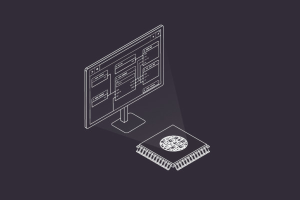
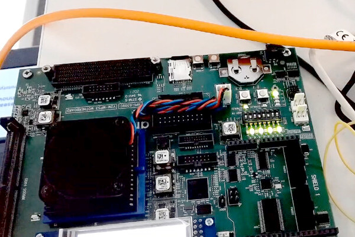
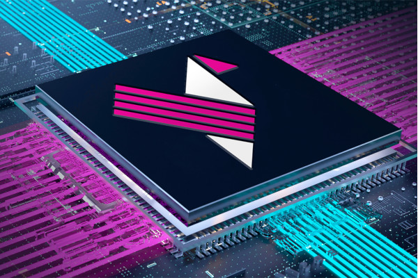
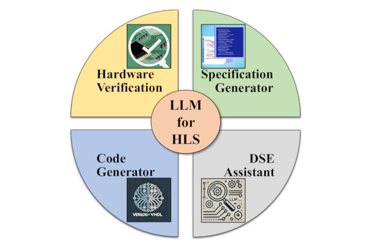

## ORConf 2024 is Here At Last!

  
[It's ORConf time!](https://fossi-foundation.org/orconf/2024/)  
  
This year's programme shows us that the pace of development and maturation within the open source silicon movement continues to impress. I've noticed several clear threads of activity emerge; be it advancing truly open source chip fabrication, verification in Python with cocotb, RISC-V implementations and related advanced SoCs, all manner of EDA and, encouragingly, constructive user stories and feedback from the trenches.  
  
ORConf started out loosely as the OpenRISC project conference, although it rapidly became a broad church for all open source silicon topics. Since 2011 we have had the great privilege to bear witness to the emergence of many brilliant projects in this space. The RISC-V project is one of these, and it's heartening to witness its continued momentum as the standard matures and expands, and open source implementations emerge and evolve. RISC-V ISA CPUs are clearly the most popular open source implementations these days, permitting designers to focus on making them ever-more sophisticated, and largely removing the temptation to start over from scratch at the ISA level.  
  
On verification, it's excellent to see the continued swell of support around cocotb, a personal favourite of mine, and is reflected in the number of presentations we have in the programme. Indeed, sophistication in this area is increasing be it via cocotb or other languages, and is very important for quality of the IP.  
  
The advent of a truly open source silicon flow, from RTL to GDS, is still a mind-boggling achievement by everyone involved in the community, and happened relatively quickly if you ask me. I'm very much looking forward to hearing about Matt Venn's journey, and what he thinks is up next in this area, and hear what the latest developments in this area have been from others. Matt's talk and several others are going to be valuable sessions of reflection on what we have and what opportunities for improvement exist. I welcome this topic of discussion among the community.  
  
That's to say nothing of the other areas we'll cover at ORConf this year during formal presentation sessions, lightning talks, and the catch-ups, ideas and spontaneous collaboration germinating in the halls and pubs of Gothenburg across the weekend. ORConf continues to be one of the signature events on the FOSSi Foundation calendar, we are very proud to be able to contribute to the community in this way. Of course none of this could or would happen without the community's support and the generous support of the sponsors who cover the costs of the event every year, ensuring we can keep the event as accessible and comfortable as possible.  
  
A big shout out and expression of gratitude to our sponsors at ORConf 2024: Our headline sponsor Antmicro, sponsors Chalmers University, Mullvad VPN, Tillitis, Hudson River Trading, lowRISC and Qamcom. And to those of you who purchase professional tickets and make donations, everything helps us put the event together, so a big thank you!  
  
For those of you who are unable to join us in person this year, we will not be live streaming proceedings however videos should be available on our YouTube channel quickly afterwards as is customary for FOSSi Foundation events.  
  
All the details of the event can be found on [https://orconf.org](https://fossi-foundation.org/orconf/2024/) - be sure to check it out if you're coming, as the schedule is now live. There are still opportunities to submit lightning talks.  
  
Safe travels to everyone who is joining us, and I look forward to seeing you all September 13 to 15 in Gothenburg, Sweden. Keep an eye out in coming ECLs for a rundown of how it all went.  
  
_-Julius Baxter, Director, FOSSi Foundation_

## Delivering a Roadmap to Open-Source EDA

  
The FOSSi Foundation has been invited to support the GoIT project in delivering a roadmap towards open-source electronic design automation (EDA) in the European semiconductor ecosystem - with a first draft due to be published this week during ORConf 2024.  
  
The roadmap, developed under the auspice of FOSSi Foundation's Matthew Venn and Stefan Wallentowitz, includes contributions from experts on areas including verification, analog, radio-frequency, and mixed-signal design on mature process nodes, generators and automated layout systems, digital design flows for mature nodes, heterogeneous integration and packaging, productivity, and tool interoperability.  
  
"Currently," Stefan explains, "leaders for each of those focus areas are working with the community on describing the industry perspective, highlight open source success stories, and identifying the gaps and necessary work in those focus areas. Finally, for each focus area the roadmap will make recommendations for short term and mid/long term opportunities that could benefit from funding."  
  
The first release of the roadmap is scheduled for the 13th of September, during a presentation at ORConf 2024 - which will be recorded and published as quickly as possible, for those unable to attend. The release will be followed by an open feedback period, with a view to finalizing the roadmap at the end of October.  
  
More information is available [on the FOSSi Foundation blog](https://fossi-foundation.org/blog/2024-08-16-roadmap).

## Antmicro's Topwrap Offers a Toolkit for Modular Digital Logic

  
Antmicro has designed an open-source toolkit, Topwrap, for modular, parameterisable digital logic design - allowing both FPGA and ASIC projects to easily build up HDL modules into full designs.  
  
"The toolkit is designed to take advantage of the ever-growing library of open source digital logic blocks that we also heavily contribute to and, thanks to its structuredness, offers a user-friendly graphical interface sitting on top of a well-formed CLI," Antmicro claims. "This in turn lets you mix-and-match high-level GUI-driven design with more fine-grained CLI-level adjustments and present designs in the form of a diagram thanks to the integration with Antmicro’s Pipeline Manager.  
  
"Topwrap makes composing designs more convenient by automatically connecting whole sets of signals bundled into interfaces, performing sanity checks and generating the necessary interconnects, while aiming at parametrization of designs at the top level, regardless of underlying methodologies. Top-level design is performed by providing YAML files that contain its description, which in itself should be easier than writing out the top level by hand in e.g. SystemVerilog, and thanks to a structured definition, this process can also be carried out in the Pipeline Manager GUI, with the description files generated automatically.  
  
"Near-term goals for Topwrap include integrating it with other tools to enable calling synthesis, P&R, and simulation from the graphical interface," Antmicro adds of its roadmap for the project, "and co-simulation with Renode enabling end-to-end digital design from a single 'command center' perspective."  
  
A walkthrough of using Topwrap to build a VexRiscv-based system-on-chip is available [on the Antmicro blog](https://antmicro.com/blog/2024/08/parameterizable-digital-logic-design-with-the-topwrap-toolkit/); Topwrap itself is published [on GitHub](https://github.com/antmicro/topwrap) under the permissive Apache 2.0 licence.

## RISC-V International Announces New Board Members

  
RISC-V International has appointed new officers and members to its board of directors, including FOSSi Foundation's Stefan Wallentowitz - who will serve as the organisation's vice-chair, as well as being the elected representative for the RISC-V community.  
  
"In his second year as Chair, Lu Dai leverages his extensive experience with standards bodies and his role as a representative of a major end-user corporation to provide valuable insights to both RISC-V and the community," RISC-V International writes of the returning chair. "Joining him is Vice Chair, Stefan Wallentowitz. Active in various RISC-V projects over the past six years, Stefan has contributed to the debug task group and recently assumed the role of chair for the RISC-V SIG 'Academia & Education.'  
  
"Treasurer Philipp Tomsich brings significant RISC-V expertise to his role, serving as Vice Chair of the Technical Steering Committee and Chair of the Applications and Tools Horizontal Committee. His work in guiding software ecosystem outreach, standardization, and global alignment strengthens RISC-V’s impact on software innovation. Secretary Mark Hayter joins us from Rivos Inc. With a background in systems architecture and hardware development, he previously led engineering teams at Google’s Chrome OS Hardware division and held key roles at P.A. Semi, Broadcom, and SiByte."  
  
Other board elected board members include Jeffrey Osier-Mixon from Red Hat and IBM, Ken Dockser from Tenstorrent, Philipp Tomsich from VRULL GmbH, and Frank Gurkaynak from ETH Zurich.  
  
The full announcement is available [on the RISC-V International website](https://riscv.org/blog/2024/08/introducing-the-newly-elected-risc-v-board-of-directors-officers/).

## CHERIoT Provides "A Study in CHERI"

  
Members of the research team behind CHERIoT have published a look at the platform, which they say serves as "a study in CHERI" - the security-focused Capability Hardware Extension to RISC-V, targeting devices built for the Internet of Things (IoT).  
  
"CHERIoT (Capability Hardware Extension to RISC-V for Internet of Things) is a 32-bit RISC-V extension optimised for IoT and embedded applications. Although CHERIoT began as a Microsoft Research project," the team members note, "the platform is now a thriving multi-vendor open-source platform. It includes a formal specification of the instruction set architecture (ISA), an LLVM toolchain, real-time operating system (RTOS), and a reference implementation of a RISC-V core supporting the extension. It has been recently contributed to the RISC-V standardization effort.  
  
"CHERIoT is designed to bring the best of CHERI research to targets that traditionally have higher security challenges, such as microcontrollers. Microcontroller security has become increasingly important as those controllers can be exposed in IoT devices. The CHERIoT platform provides a showcase of what is possible on a system that can assume CHERI. It builds on top of Microsoft’s CHERI research to provide object-granularity temporal safety and lightweight compartmentalisation.  
  
"CHERIoT also highlights the value of the RISC-V extension model. It is possible to build extensions that are aggressively optimised for a specific range of microarchitectures. In our case, CHERIoT is optimised for microcontroller-scale cores, in low core counts, with memory sizes ranging from tens of KiBs to tens of MiBs. It can make design trade-offs that provide enormous wins in this space, but which would not scale to massive multicore server systems. This can coexist in the RISC-V ecosystem with other extensions that are optimised for high-throughput servers, but which would have unacceptable power and area costs in a microcontroller."  
  
The full article is available [on the RISC-V International blog](https://riscv.org/blog/2024/08/cheriot-a-study-in-cheri/).

## RISC-V Opens Public Reviews for Priv 1.13, RVA23/RVB23

  
RISC-V International has announced the opening of public review periods for the Machine-Level ISA Version 1.13 and the Supervisor-Level ISA Version 1.13 specifications, collectively known as "Priv 1.13," and for the RVA23 and RVB23 profiles - ending on the 1st of October and the 3rd of October respectively.  
  
"The Chair and Vice-Chair of the Privileged ISA Committee are pleased to announce the start of the public review period for the 'Priv 1.13' specifications - namely the Machine-Level ISA, Version 1.13 and the Supervisor-Level ISA, Version 1.13 chapters within the Privileged Architecture ISA Manual (Volume II Privileged Architecture)," Greg Favor and Andrew Waterman, chair and vice-chair respectively, have announced. "Note that the first section within the Preface chapter lists all of the changes that have been made since version 1.12 of the Machine-Level and Supervisor-Level ISAs.  
  
"During the public review period, corrections, comments, and suggestions will be gathered for review by the Privileged ISA Committee. Any minor corrections or uncontroversial changes will be incorporated into the specification. Any remaining issues or proposed changes will be addressed in the public review summary report. If there are no issues that require incompatible changes to the public review specification, the Privileged ISA Committee will recommend that the updated specifications be approved and ratified by the RISC-V Technical Steering Committee and the RISC-V Board of Directors."  
  
A separate review period has also opened for the RVA23 and RVB23 profiles. "The RVA23 profiles are designed to align implementations of RISC-V 64-bit application processors, enabling binary software ecosystems to rely on a large set of guaranteed extensions and a small number of discoverable coarse-grain options," Greg and Krste Asanovic, chair and vice-chair of the RVA23/RVB23 Profiles Task Group, explain. "An explicit non-goal of the RVA series of profiles is to allow a large degree of implementation flexibility  
  
"RVB23 profiles are intended to be used for customised 64-bit application processors that will run rich OS stacks, usually as a custom build of standard OS source-code distributions. The approach is to provide a large guaranteed set of relatively inexpensive and/or widely beneficial features but allow optionality for more expensive and/or more targeted extensions. Unlike the RVA profiles, RVB profiles explicitly do not aim to provide a single standard ISA interface supporting a wide variety of binary kernel and binary application software distributions."  
  
Information on how to participate in either or both of the review periods is available in [the Priv 1.13 review](https://groups.google.com/a/groups.riscv.org/g/isa-dev/c/m_C8HDUmrQw) and [RVA23/RVB23 review notifications](https://groups.google.com/a/groups.riscv.org/g/isa-dev/c/Vu4wuLzIid4).

## MIPS Celebrates a Milestone for the RISC-V N-Trace Technical Group

  
MIPS, which recently moved away from the proprietary architecture which bears its name and embraced the free and open-source RISC-V architecture in its place, has celebrated a milestone for the RISC-V N-Trace Technical Group - as it should, with the company's Robert Chyla serving as its chair.  
  
"As the chair of the RISC-V International N-Trace TG for the past four years," Robert writes, "let me share an important milestone in RISC-V debug, trace, and performance monitoring territory. The goal of the RISC-V International N-Trace TG was to utilise the widely used and well documented IEEE-ISTO 5001 Nexus Trace Standard as the basis for an equivalent solution targeting the RISC-V architecture.  
  
"There are three fundamental RISC-V Trace specifications: RISC-V N-Trace (Nexus based Trace) Specification; RISC-V Trace Control Interface Specification; RISC-V Trace Connectors Specification. These went through a lot of scrutiny and are currently declared Frozen and in the Public Review phase with a realistic ambition to become officially Ratified ahead of the upcoming RISC-V Summit North America in October 2024.  
  
"Trace is great, but often misunderstood technology," Robert concludes. "People pull the trace when nothing else works. I am an advocate of using trace in everyday work. By making trace available and easily accessible to end users, hopefully the days of using print statements to debug software will be a thing of the past."  
  
The full post is available [on the MIPS blog](http:// https://mips.com/blog/risc-v-international-n-trace-tg-milestone/); the frozen specifications are available [on GitHub](https://github.com/riscv-non-isa/tg-nexus-trace/releases/tag/1.0_rc50_Frozen).

## Researchers Investigate LLMs as High-Level Synthesis Tools

  
A trio of researchers from the University of Arizona's school of electrical and computer engineering have taken a look at large language models (LLMs) to see if their generative artificial intelligence trickery can be applied to high-level synthesis (HLS) - pitting their capabilities against a traditional HLS tool.  
  
"The increasing complexity and demand for faster, energy-efficient hardware designs necessitate innovative High-Level Synthesis (HLS) methodologies. This paper explores the potential of Large Language Models (LLMs) to streamline or replace the HLS process, leveraging their ability to understand natural language specifications and refactor code," the team explains.  
  
"We survey the current research and conduct experiments comparing Verilog designs generated by a standard HLS tool (Vitis HLS) with those produced by LLMs translating C code or natural language specifications. Our evaluation focuses on quantifying the impact on performance, power, and resource utilization, providing an assessment of the efficiency of LLM-based approaches. This study aims to illuminate the role of LLMs in HLS, identifying promising directions for optimised hardware design in applications such as AI acceleration, embedded systems, and high-performance computing."  
  
The researchers' hands-on experiments revolved around OpenAI's ChatGPT-4o, comparing its performance on nine benchmarks from the Polybench suite. While some benchmarks took considerable effort to produce a usable output from the LLM and two were noticeably more resource-intensive, seven of the nine outperformed the traditional tool - offering improvements in resource usage, execution cycles, and power consumption.  
  
There is, of course, a caveat: the team discusses what it calls "the energy elephant in the room:" the high energy usage required by large language models like ChatGPT, estimated at 2.9Wh per query even before the computationally intensive training process is considered. "If the energy cost of fine-tuning and utilising an LLM is greater than the energy saved across all resulting hardware designs," the researchers note, "then employing LLMs in this way would be counterproductive for energy efficiency."  
  
A preprint of the full paper is available [on Cornell's arXiv server](https://arxiv.org/abs/2408.10428).

## ACM's Samuel Greengard Looks at AI's Reinvention of Chip Design

  
Samuel Greengard, writing for Communications of the ACM, has a bold claim: that "AI reinvents chip design," pointing to work being carried out at companies from Apple and AMD to Intel, IBM, and NVIDIA on turning the current boom in artificial intelligence on the problem of designing the chips that will power their successors.  
  
"AI is completely rewriting the equation," Samuel claims. "It is introducing new ideas, concepts, methodologies, and tools that drive gains in design optimisation, design synthesis, performance, verification, and manufacturing. Among other things, AI and ML can spot tiny errors and oversights that go undetected by analytics and simulation models, pinpoint coding problems, and find interconnect issues that might not otherwise become obvious until a chip is far along in the development process.  
  
"Despite the rapid adoption of AI by chip producers," Samuel notes, "experts say that the industry has only begun to realise the full potential of the technology. The biggest obstacle to adoption, experts say, is that the chip industry is just beginning to learn how to use it effectively. Likewise, software firms - the likes of Synopsys, Cadence, and Siemens - have only started to build basic AI tools into their CAD and EDA applications.  
  
"In practical terms, this means that chipmakers must, at least for now, develop their applications, tools, and processes largely on their own."  
  
The full article is available [on the Communications of the ACM website](https://cacm.acm.org/news/ai-reinvents-chip-design/).

## FOSSi News in Brief

-   [Video: Matt Venn's keynote at the Free Silicon Conference 2024 (FSiC 24).](https://peertube6.f-si.org/w/nLjx998SVEuJPQRqbSVBbM) [(Slides and more)](https://wiki.f-si.org/index.php?title=The_long_tail_of_semiconductors_-_Education%2C_Tools_and_Artisanal_ASICs)
-   [Video: Robert Feranec and Stacey on How to do Ethernet in an FPGA.](https://www.youtube.com/watch?v=78tkdc6Lq_8)
-   [Video: MIPS waxes lyrical on the benefits of RISC-V.](https://www.youtube.com/watch?v=v5DBoHM2jHY)

**Have feedback or news for inclusion in a future newsletter? Please send this to [ecl@fossi-foundation.org](mailto:ecl@fossi-foundation.org)**.

**Subscribe to [get El Correo Libre direct to your inbox](http://eepurl.com/dnL4v1).**
