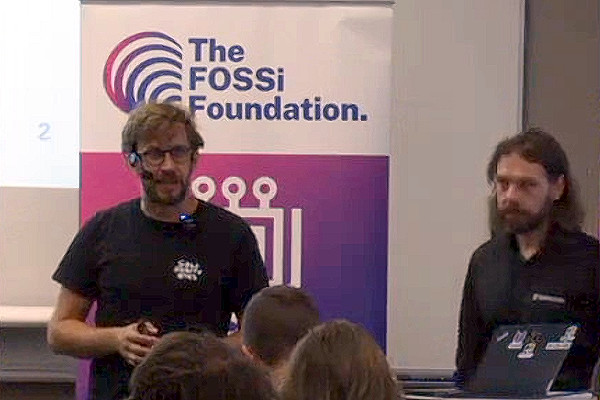
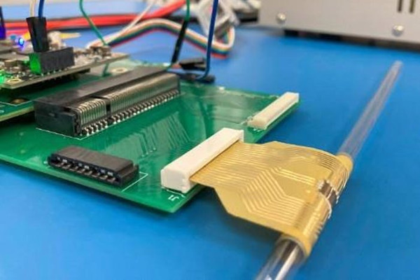
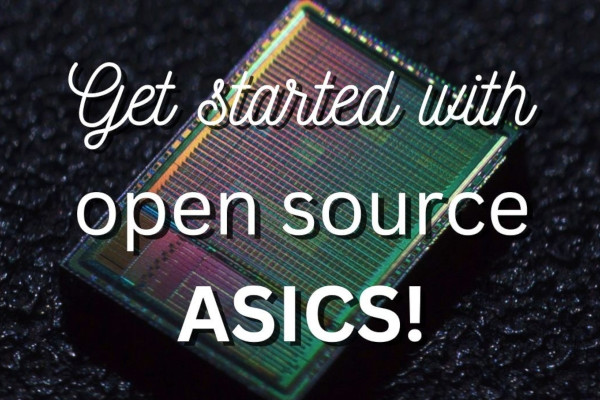
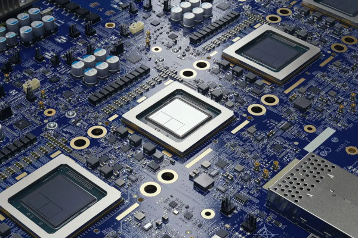
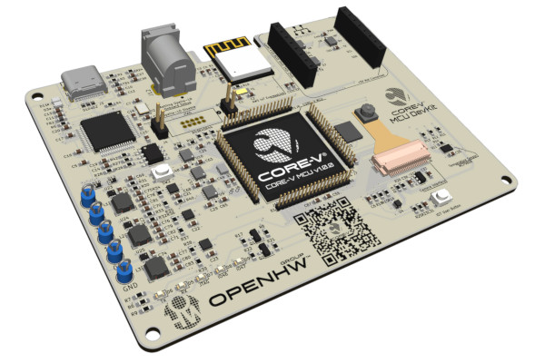
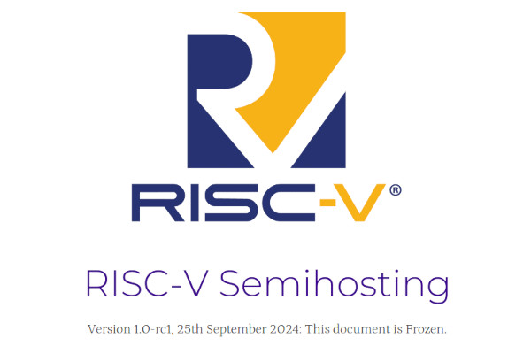
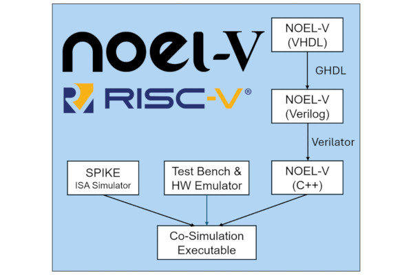
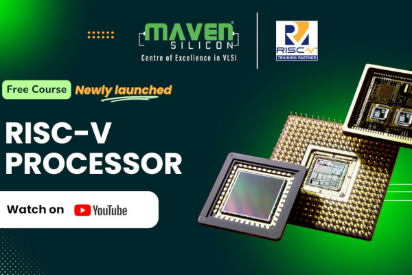

## Celebrating ORConf 2024

ORConf 2024, the tenth instalment of the conference dedicated to free and open source silicon, is a wrap, having taken place mid-September in Gothenburg Sweden - and we want to thank everyone who attended, both our presenters and those to whom they presented.  
  
As always, it was a delight to see so many people engaged in the free and open silicon ecosystem, and to hear about projects big and small to advance the state of the art in fields ranging from open-source graphics processors and accelerators for artificial intelligence workloads to building your own linter.

For those who couldn’t attend, as well as attendees who are looking for refresher, we have uploaded all the talks [to our YouTube channel](https://www.youtube.com/@FOSSiFoundation). Whether you’re looking for Jerry Zhao’s talk on [the Saturn vector unit](https://youtu.be/5eitFdW8CCM), Charles Papon’s look at [Debian on VexilRiscv](https://youtu.be/dR_jqS13D2c), Frans Skarman’s [Surfer waveform viewer](https://youtu.be/0pcSoX1s_vc), or Staf Verhaegen’s [Project Arrakeen](https://youtu.be/6mTJ31eXVzA), you’ll find plenty to keep you entertained and informed - to mention only a small handful of the dozens of excellent presentations that took place at this year’s ORConf.

A [separate video](https://www.youtube.com/watch?v=Xm_kUVhMBdw) covers all of this year’s lightning talks, with presentations from Matt Venn, Nathan Gifford, Frans Skarman, Todd Strader, Marek Pikula, Christiaan Baaij, Simon Cook, Francisco Izquierdo, PEter Birch, Christophe Alexandre, Oron Port, Piotr Węgrzyn, Olof Kindgren, Stefan Wallentowitz, Julian Baxter, and Rob Taylor, packing a wealth of knowledge into just 43 minutes.

If you’re looking for a particular talk, links to each video are now included [on the ORConf 2024 schedule](https://fossi-foundation.org/orconf/2024) - along with slide deck downloads, where available. Thanks again to all involved, and here’s to the next ORConf!

## SERV Goes Flexible with Silicon-Free ASIC Implementation

  
SERV, the world’s smallest bit-serial RISC-V processor, has chalked up another milestone: production as a hardware ASIC, but one which eschews silicon in favour of a flexible plastic substrate - and which, as a result, can run even when curled around a cylinder.

“Happy to finally reveal a project that Qamcom, Harvard [University], and Pragmatic have worked on for the past two years, creating the first ever fully programmable, general-purpose SoC [System-on-Chip] on printed electronics,” FOSSi Foundation director and SERV creator Olof Kindgren writes. “And yes, of course it uses the award-winning SERV! If you need something really small and easily bendable, I’m your guy! Should add that to my Tinder profile.”

“This is an exciting step forward in flexible semiconductor technology. Enabling an open-standard, non-silicon 32-bit microprocessor will democratise access to computing, unlocking emerging applications while opening the door to sub-dollar compute,” says Pragmatic’s lead researcher and senior director of processor development Emre Ozer of the project. “By enabling scalable, low-cost compute in a flexible form factor - in combination with the rapid turnaround and low non-recurring engineering costs associated with our FlexIC Foundry - we really are ushering in a step-change in the art of the possible for flexible electronic systems.”

The Flex-RV chip designed by the team is a hardware implementation of SERV, using the RV32E RISC-V instruction set - but rather than being built on brittle silicon, it’s printed using indium gallium zinc oxide (IGZo) thin-film transistors on a polyimide substrate. As a result, it’s bendable - continuing to operate with only a 4.3 per cent drop in performance even when curled around a cylinder. It’s also extremely low power, drawing only 6mW at load - though this, admittedly, is based on a somewhat limited 60kHz clock speed.

Flex-RV is documented in full in [Nature](https://www.nature.com/articles/s41586-024-07976-y) under open-access terms.

## Matt Venn Offers an Intro to Open Source ASIC Design

  
Matt Venn, creator of the Zero to ASIC Course and Tiny Tapeout, has published a video aimed squarely at those new to the idea of open source application-specific chip design - walking through the best way to get started using free and open tools.

“I’ve been involved in the open source silicon movement for about the last four years,” Matt explains in the introduction to his latest video. “I’m going to give you a bit of context, the history, I’m going to signpost the best resources and the best tools to get started, and give you a few demonstrations.”

One of those demonstrations is Tiny Tapeout itself, an educational platform which allows anyone to design a chip using open-source process design kits (PDKs) and tools and then submit it for physical production at a very low cost - achieved by splitting a single silicon die into multiple projects, selectable at-will once the chip has been packaged and installed in a development board.

“The community is one of the great things that the open source tools offer,” Matt offers as one of the advantages of open tooling over proprietary equivalents. “Normally in the industry everybody is very siloed and specialised, things are secret, and it’s difficult to share information. With the open source community we have nearly 7,000 members on the open source silicon Slack channel, the tools are all open source, and you can read the source and contribute.”

The full video is available [on the Zero to ASIC Course YouTube channel](https://www.youtube.com/watch?v=hSFUd7S2otE).

## FuseSoC 2.4 Brings EDAM Filter Functions

  
FuseSoC, the free and open-source build system for digital hardware with integrated package manager to make block-level design reuse as easy as possible, has reached version 2.4 - and the new release brings with it a new feature: EDAM filters.

“That took longer than expected,” FuseSoC author and FOSSi Foundation director Olof Kindgren writes, “but now FuseSoC 2.4 is finally released. As always, there’s a number of bug fixes and convenience features. The big new feature is EDAM filter functions.”

“The last thing FuseSoC does before handing over to Edalize is to prepare an EDAM file containing a description of the complete system and everything that the EDA tools need to know,” FuseSoC’s documentation explains of this new feature. "It is sometimes useful to make system-wide changes after the system is assembled, and this is where filters come in. Filters are additional tasks that can be run to analyse and modify the EDAM structure, and through that structure the filters have access to the complete dependency tree and all source files.

“Technically, an Edalize frontend can perform the exact same task as a FuseSoC EDAM filter. The difference is more philosophical in that a filter can be seen as something that fixes up the system before it is ready to be consumed by an EDA tool, while an Edalize frontend typically is an EDA tool. The filters will also possibly have access to more FuseSoC internals in the future.”

The new release includes “a few built-in filters for generally useful tasks,” including an autotype filter which sets file types based on a filename prefix, a dot filter which creates a GraphViz dot file of the dependency tree, and a custom filter which runs a specified command with two arguments passed.

The latest version of FuseSoC is available [on the project’s GitHub repository](https://github.com/olofk/fusesoc), where it is released under the permissive BSD two-clause licence; more information on the EDAM filters is available [in the online documentation](https://fusesoc.readthedocs.io/en/latest/user/build_system/filters.html).

## Google DeepMind Digs Deep into AlphaChip AI

  
Google’s DeepMind, a division dedicated to deep learning and artificial intelligence, has released an update detailing how its open-source AlphaChip reinforcement learning system, first detailed without the name in a preprint paper released in 2020, has “accelerated and optimised chip design” around the world - enabling “superhuman chip layouts” in a variety of real-world projects.

“Computer chips have fuelled remarkable progress in artificial intelligence, and AlphaChip returns the favour by using AI to accelerate and optimise chip design,” explain DeepMind’s Anna Goldie and Azalia Mirhoseini. "The method has been used to design superhuman chip layouts in the last three generations of Google’s custom AI accelerator, the Tensor Processing Unit (TPU).

"AlphaChip was one of the first reinforcement learning approaches used to solve a real-world engineering problem. It generates superhuman or comparable chip layouts in hours, rather than taking weeks or months of human effort, and its layouts are used in chips all over the world, from data centres to mobile phones.

“We believe AlphaChip has the potential to optimise every stage of the chip design cycle,” the pair continue, “from computer architecture to manufacturing — and to transform chip design for custom hardware found in everyday devices such as smartphones, medical equipment, agricultural sensors and more. Future versions of AlphaChip are now in development and we look forward to working with the community to continue revolutionising this area and bring about a future in which chips are even faster, cheaper, and more power-efficient.”

To support its claims, DeepMind has published an addendum in [Nature](https://www.nature.com/articles/s41586-024-08032-5) as a follow-up to [its original paper](https://www.nature.com/articles/s41586-021-03544-w); AlphaChip remains available [on GitHub](https://github.com/google-research/circuit_training) under the permissive Apache 2.0 licence, and now includes [a pre-trained model checkpoint](https://github.com/google-research/circuit_training/?tab=readme-ov-file#PreTrainedModelCheckpoint).

## OpenHW Group Joins the Eclipse Foundation

  
The OpenHW Group has announced that it is to become an official member of the Eclipse Foundation in a “strategic collaboration” due to complete by the end of the year - and through which the group is hoping to accelerate the development and deployment of free and open source alternatives to proprietary architectures in fields including artificial intelligence, automotive, and high-performance computing.

“Joining the Eclipse Foundation is a transformative moment for OpenHW, solidifying our commitment to delivering trusted open hardware solutions to the global market,” claims Florian Wohlrab, the OpenHW Group’s chief executive officer. “This partnership provides the long-term stability, infrastructure, and open source expertise we need to continue driving innovation in RISC-V hardware, benefiting both our members and the broader industry.”

“Throughout its five-year history, OpenHW has played a pivotal role in pushing the boundaries of open source hardware,” adds Mike Milinkovich, executive director of the Eclipse Foundation, of the collaboration. “Together, we’re now much better positioned to advance cutting-edge technologies in areas like AI, software-defined vehicles, and the Industrial IoT [Internet of Things], further strengthening the role of open source in these critical industries.”

The shift comes with a change for the OpenHW Group, in the form of a new name: under the Eclipse Foundation, the organisation will be rebranded to the OpenHW Foundation. It will remain, however, involved in its current projects, including the CVA6 32- and 64-bit high-performance industrial processor core project, CVE4 32-bit embedded core project, CVE2 power-efficient core project, and its various software initiatives.

More information about the deal, including answers to questions about the transition process which is expected to complete by year’s end, is available [on the OpenHW Group website](https://www.openhwgroup.org/about-us/transition-faq/).

## RISC-V Opens Semihosting Spec Up for Public Review

  
RISC-V International has announced the start of the public review period for the RISC-V Semihosting fast-track non-ISA specification - with interested parties invited to provide their feedback by the 25th of October 2024.

“Semihosting is a technique where an application running in a debug or simulation environment can access elements of the system hosting the debugger or simulator including console, file system, time and other functions,” the draft document explains of the new specification. "This allows for diagnostics, interaction and measurement of a target system without requiring significant infrastructure to exist in that target environment.

“The RISC-V semihosting specification adopts the design of the Arm semihosting specification to minimise the development effort. The services defined by the Arm semihosting specification are portable across different architectures, and only the mechanism of invoking a semihosting service (aka semihosting binary interface) is architecture specific. The RISC-V semihosting specification only defines the semihosting binary interface for RISC-V platforms and all other aspects of semihosting are defined by the Arm semihosting specification.”

“During the public review period, corrections, comments, and suggestions, will be gathered for review by the authors,” says Anup Patel, chair of the RISC-V privileged software horizontal committee. “Any minor corrections and/or uncontroversial changes will be incorporated into the specification. Any remaining issues or proposed changes will be addressed in the public review summary report. If there are no issues that require incompatible changes to the public review specification, the Privileged Software Horizontal Committee will recommend the updated specifications be approved and ratified by the RISC-V Technical Steering Committee and the RISC-V Board of Directors.”

The RISC-V Semihosting specification is available [on GitHub](https://github.com/riscv-non-isa/riscv-semihosting) under a Creative Commons Attribution-ShareAlike 4.0 licence; feedback should be sent as Issues or Pull Requests on the repository, or mailed to the RISC-V isa-dev mailing list.

## Frontgrade Gaisler Details its Co-Simulation Strategy

  
Frontgrade Gaisler’s Fabio Malatesta has written up the company’s co-simulation strategy, as used for verification of its NOEL-V RISC-V processor implementation - combining Verilator-based behavioural simulation with the SPIKE ISA simulator.

“Traditional processor verification methodologies often rely on a combination of simulation, formal methods, and emulation,” Fabio explains. "Simulation-based approaches entail executing test vectors on a model of the processor to validate its behaviour against the expected outcomes. While effective, simulation is time-consuming and may not capture all corner cases. Formal methods, on the other hand, provide mathematical proofs of correctness but are often limited in scalability and practicality. Emulation offers a middle ground, but it is costly and complex to set up.

"The RISC-V ecosystem’s flexibility allows us to tailor verification approaches to better suit various implementations and configurations. Our verification strategy for the NOEL-V processor revolves around comparing execution flows between two models: the behavioural simulation of NOEL-V’s VHDL implementation and the SPIKE RISC-V ISA simulator.

“This method is based on: maintaining consistent states between the two processor models. Any deviations are pinpointed with accuracy, indicating discrepancies between the implementation and the reference model; [and] introduction of implementation-specific behaviours into SPIKE with minimal alterations: certain hardware components, like specific I/O devices, may require state overwriting in SPIKE to ensure a consistent state.”

The full write-up is available [on the Frontgrade Gaisler blog](http://blog.gaisler.com/accelerating-risc-v-processor-verification-a-co-simulation-strategy/).

## Maven Silicon Launches a Free RISC-V Design Course

  
VLSI specialist Maven Silicon has launched a course focused on the design and use of a RISC-V processor - and is making it freely available to all on YouTube.

“In this course, our founder and CEO, Mr. P R Sivakumar, explains the layered architecture of RISC-V open ISA and how chip designers design various chips, such as simple embedded microcontrollers and complex desktop and cloud server chips/SoCs [Systems on Chips], using various layers of RISC-V Instruction Set Architecture,” the company explains of the new course.

“Now engineers can easily understand all the layers of RISC-V ISA, Base ISA, Extensions, Machine ISA, Supervisor ISA, and Hypervisor Extension as part of Unprivileged and Privileged architectures. Also, this course explains the RISC-V RV32I Base ISA and instructions with assembly examples.”

The course is split into two, with the first ten videos covering the RISC-V architecture and its various instructions - culminating in a guide to programming a RV32I base specification processor in assembly. The second half, consisting of nine videos, looks at the actual RTL processor design across a total of nine videos. Both halves of the course are freely accessible to all, hosted on Google’s YouTube video sharing platform.

The first half of the course can be accessed [through this playlist](https://www.youtube.com/playlist?list=PL3_RRtJ5Iqgg94er7ErGAUSyhTXwPv6zy), with the second half [on this playlist](https://www.youtube.com/playlist?list=PL3_RRtJ5Iqgj2f37E_0ylvGQnCS14u7wX).

## RISC-V “Changes the Global Landscape of AI and ML”

  
Electrical engineer Jake Hertz has penned an article arguing that RISC-V “changes the global landscape” for artificial intelligence (AI) and machine learning (ML) workloads - both areas currently experiencing explosive growth.

“Enabling widespread access to AI/ML hardware and software is now a matter of global importance,” Jake argues in an article for Wevolver. "RISC-V is a proven player in this effort. Through the use of a single architecture, RISC-V eliminates the need for separate programming paradigms for different processing units. As such, RISC-V reduces the learning curve and minimizes the overhead associated with switching between different architectures. Ultimately, this simplifies coding efficiency, reduces errors, and accelerates development cycles.

"The RISC-V industry standard Instruction Set Architecture (ISA) removes proprietary barriers, allowing developers, companies, and academic institutions worldwide to contribute to and benefit from the RISC-V architecture. In contrast to proprietary ISAs, where mainly major players have significant influence, RISC-V allows innovation to emerge from anywhere. It empowers smaller entities and individual contributors to take a first-hand approach in the technological revolution, resulting in a more equitable and dynamic technological ecosystem.

“By eliminating vendor lock-in,” Jake continues, “RISC-V enables developers to work faster, be more creative, and explore more flexible and rapid development cycles. RISC-V can further support the development and use of advanced technologies without restrictions on innovation. Where the goal is to create an equitable AI/ML landscape, RISC-V can help regions innovate independently, foster local talent, and establish a robust technological infrastructure that supports long-term growth and sustainability, while also maintaining access to a global market and ecosystem of partners.”

The full article is available [on Wevolver](https://www.wevolver.com/article/how-risc-v-changes-the-global-landscape-of-aiml).

**Have feedback or news for inclusion in a future newsletter? Please send this to [ecl@fossi-foundation.org](mailto:ecl@fossi-foundation.org)**.

**Subscribe to [get El Correo Libre direct to your inbox](http://eepurl.com/dnL4v1).**
