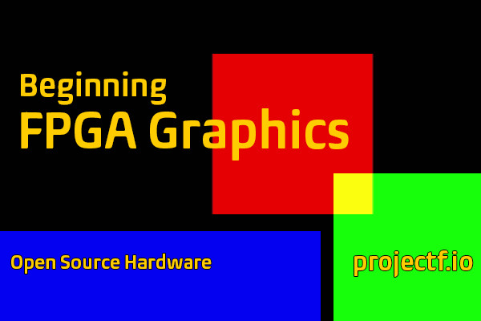
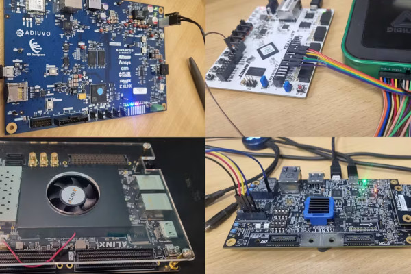
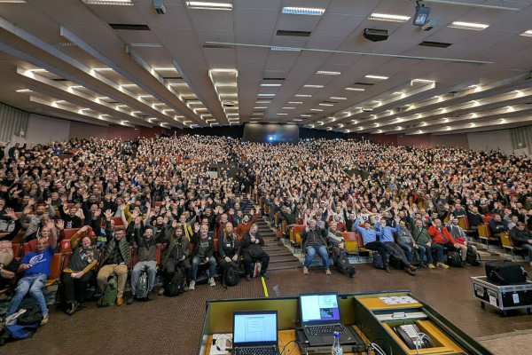
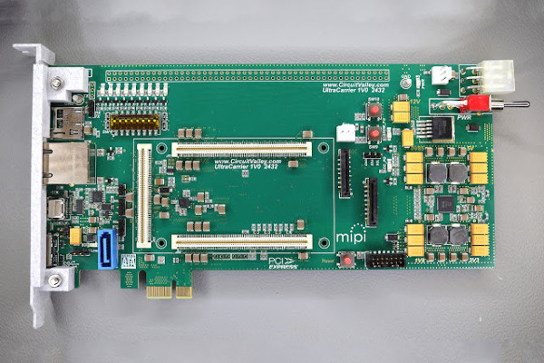
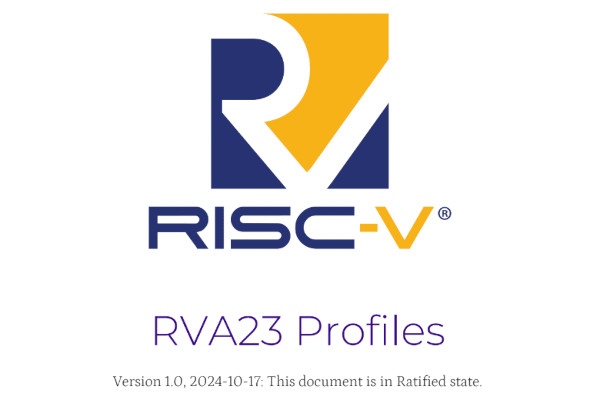
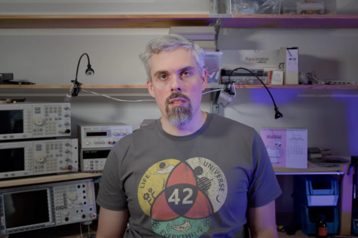
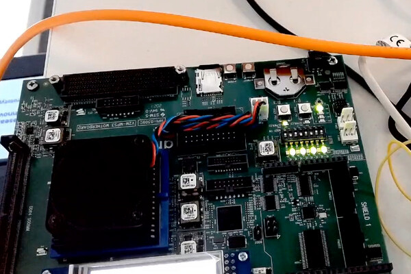
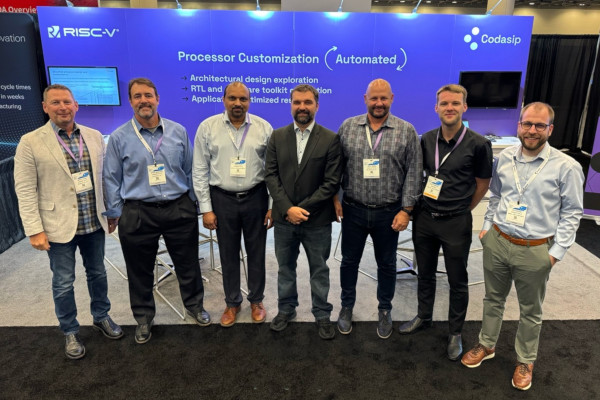
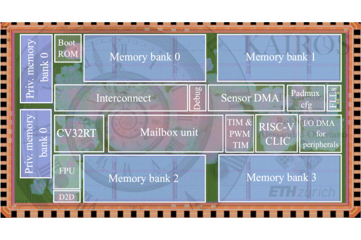

## Will Green Updates "Beginning FPGA Graphics" for the Radiona ULX3S

  
Project F’s Will Green has updated his Beginning FPGA Graphics tutorial to cover the Radiona ULX3S Lattice Semiconductor ECP5-based FPGA development board as a target, with all sources published under a permissive licence.

“Beginning FPGA Graphics now covers [the] RadionaOrg ULX3S (ECP5) in addition to the Digilent Arty/Nexys Video and iCEBreaker,” Will writes of the new release. "Four years after it began, I continue to update this series to make #FPGA development accessible.

“In this series, we learn about graphics at the hardware level and get a feel for the power of FPGAs,” Will wrote of the guide, which he launched as part of Project F in May 2020. “We’ll learn how screens work, play Pong, create starfields and sprites, paint Michelangelo’s David, draw lines and triangles, and animate characters and shapes. Along the way, you’ll experience a range of designs and techniques, from memory and finite state machines to crossing clock domains and translating C algorithms into Verilog.”

The update adds support for the Radiona ULX3S and other Lattice ECP5-based boards, alongside existing support for the iCEBreaker and other Lattice iCE40-based boards, the Digilent Arty and other Xilinx 7-series boards with VGA output, and the Digilent Nexys Video and other Xilinx 7-series boards with DVI output.

The tutorial series is available [on the Project F website](https://projectf.io/posts/fpga-graphics/), with all SystemVerilog sources - including sources designed for use in simulation, for those looking to learn but without access to hardware - [published to GitHub](https://github.com/projf/projf-explore/tree/main/graphics/fpga-graphics) under the permissive MIT licence.

## Adam Taylor Invites You to Have Fun with FuseSoC

  
Embedded engineer Adam Taylor has published a guide which invites the reader to “have fun with FuseSoC,” using the tool to easily port a simple project between multiple different FPGA devices.

“FuseSoC is intended to encourage reuse of IP, along with easing the build and simulation of FPGA based solutions,” Adam explains of the free and open-source project. "One of the key aspects of FuseSoC is its ability to rapidly change target devices, for example from a AMD Spartan 7 to a AMD Artix 7 device and then [an] AMD Kintex UltraScale.

“I intend to target the following boards: Digilent Arty S7, Digilent Arty A7, [and] Alinx KU040,” Adam continues. "To do this we will be creating one core library called SRC under which I am adding in the three source files for the HDL elements. As I want to also show how we can use AMD Vivado Design Suite IP integrator designs and build them with FuseSoC, I am going to include some elements of the design in IP integrator. This approach can be considered a hybrid approach, the IP integrator design will be mapped into a top level VHDL design.

“As I do not want to create several different build elements in AMD Vivado Design Suite for different build versions,” Adam continues, “I am going to create a TCL script which can be run by FuseSoC. This script will instantiate the AXI BRAM controller and BRAM to be connected to the custom RTL modules. I will then create a top level RTL file which connects the IP integrator block diagram with the custom RTL modules to complete the design.”

The full tutorial is available [on Hackster.io](https://www.hackster.io/adam-taylor/fun-with-fusesoc-7b2b1d); the source files are available [on GitHub](https://github.com/ATaylorCEngFIET/hackster_fusesoc) under an unspecified licence. FuseSoC itself is also available [on GitHub](https://github.com/olofk/fusesoc), under the permissive BSD two-clause licence.

## FOSDEM 2025 Opens its Call for Participation

  
The Free and Open-Source Software Developers’ European Meeting (FOSDEM) has opened a call for participation for 2025, its 25th year in operation - after being founded by Raphael Bauduin in 2000 as OSDEM, gaining the “F” a year later.

“FOSDEM offers open source and free software developers a place to meet, share ideas and collaborate. Renowned for being highly developer-oriented, the event brings together some 8000+ geeks from all over the world,” the event’s organisers write.

“Main track presentations cover topics of interest to a significant part of our audience that do not fit into any of the developer rooms, perhaps because of the topic or the large size of the anticipated audience. Presentations should be 50 minutes long including audience questions. Where necessary, FOSDEM covers reasonable travel expenses agreed in advance and arranges accommodation for accepted main track speakers.”

Aside from the main track, FOSDEM 2025 will once again feature “developer rooms” organized around specific topics - with rooms of particular interest to readers of this newsletter including the Embedded, Mobile, and Automotive Room, Open Hardware and CAD/CAM Room, and RISC-V Room. The event will also include lightning talks, 15-minute presentations focused on topics which do not fit into the developer room or main track categories.

“The conference language is English. All content must relate to Free and Open Source Software. By participating in the event you agree to the publication of recordings, slides and other content provided under the same licence as all FOSDEM content (CC-BY),” the organisers explain. “You also accept the [FOSDEM Code of Conduct](https://fosdem.org/2025/practical/conduct/).”

More information, and links to both the main track and individual developer room calls for participation, is available [on the FOSDEM website](https://fosdem.org/2025/news/2024-11-03-call-for-presentations/); FOSDEM 2025 is scheduled for 1st-2nd February 2025 at the ULB Campus Solbosch in Brussels, with all presentations to be made in English.

_FOSDEM 2024 crowd picture courtesy [RichiH](https://en.wikipedia.org/wiki/FOSDEM#/media/File:FOSDEM_2024_welcome.jpg), CC BY-SA 4.0._

## Gaurav Singh Designs an Open-Source UltraZed Carrier Card

  
Avionics engineer Gaurav Singh has released an open-hardware PCI Express (PCIe) carrier card for Avnet’s UltraZed AMD Zynq UltraScale+ FPGA system-on-module (SOM).

Gaurav’s design breaks out the key features of Avnet’s UltraZed SOMs, which are based on AMD’s Zynq UltraScale+ multi-processing system-on-chip (MPSoC) FPGA platform, including a PCI Express Gen. 2 lane brought out to a standard connector - allowing the carrier to be used as an add-in board for desktops, workstations, and selected single-board computers.

Other features of the carrier board design include USB 3.0, SATA 3, mini-DisplayPort video output, gigabit Ethernet, a microSD Card slot for storage, user-addressable LEDs and DIP switches, a phase-locked loop (PLL) clock generator, and a power management integrated circuit (PMIC) regulator. There’s a fan power connector for active cooling of the MPSoC, 2.54mm general-purpose input/output (GPIO) at the top of the board, and connectors for external power.

Guarav has released the design of the board under the permissive Creative Commons Attribution 4.0 International licence, allowing for free sharing, adaptation, and even commercial reuse - providing an appropriate credit is given.

More information on the carrier board is available [on Guarav’s website](https://www.circuitvalley.com/2024/09/open-source-avnet-ultrazed-pcie-carrier-xilinx-zynq-ultrascale-plus-amd.html) and [in a supporting video](https://www.youtube.com/watch?v=APrIkn0p9bU); the design files are available [on GitHub](https://github.com/circuitvalley/ultrazed_base_boards) along with production-ready Gerbers, a 3D-printable PCIe bracket, and a stock firmware.

## RISC-V International Ratifies the RVA23 Profile Standard

  
RISC-V International has announced the formal ratification of the RVA23 Profile, which adds vector and hypervisor extensions to the 64-bit application processor RVA Profile alignment standards.

“Profiles are the foundations of application and systems software portability across RISC-V implementations. A large software ecosystem is only possible with a standard Profile for software vendors to target and within which multiple suppliers can work together,” claims RISC-V International’s vice president of technology Andrea Gallo. “Software vendors need portability to reduce their development and maintenance costs and enable them to successfully sell their software and services on a wide variety of RISC-V products. The ratification of RVA23 makes this happen.”

The main changes in RVA23 are the inclusion of two extensions to the instruction set. The first is the RISC-V Vector Extension, which provides instructions designed to accelerate on-device machine learning and artificial intelligence workloads alongside cryptography, compression, and decompression, and which is a requirement of the Android RISC-V Application Binary Interface (ABI). The second is the RISC-V Hypervisor Extension, delivering hardware support for virtualisation and targeting both mobile devices and server platforms.

“The RISC-V community has grown tremendously to more than 16,000 engineers around the world. The focus, collaboration, and investment of our members has truly formed the bedrock of computing for generations to come,” says RISC-V International chief executive officer Calista Redmond. “RISC-V’s open standard is now propelling innovation across industries and implementations. Today’s announcement is a great milestone and further positions the RISC-V ISA as the future of computing.”

The ratified version of the RVA23 Profile is available [on the RISC-V Technical Specifications wiki](https://lf-riscv.atlassian.net/wiki/spaces/HOME/pages/16154769/RISC-V+Technical+Specifications#Profiles); sources for all profiles are published [on GitHub](https://github.com/riscv/riscv-profiles) under the Creative Commons Attribution 4.0 International licence.

## Sylvain Munaut Unveils the SKY130 ROM Compiler Project

  
Sylvain Munaut is working on the development of a ROM compiler for the SkyWater SKY130 open process design kit (PDK), describing it as “rapidly approaching a state where I can actually tape out some silicon” for production at SkyWater’s fabs.

“ROM, as you most likely know, stands for ‘read-only memory,’” Sylvain explains by way of introduction. "That is, memory where the content is fixed. In this context, it’s fixed when you design the chip. That can be useful for a lots of things: if you have some video output you might need a font or some icons, if you’re making a CPU maybe you need some microcode for it or a boot ROM, if you need to do some computation maybe you need a sine table.

“A ROM compiler is, then, just a piece of software that takes your ROM content and generates a macro that you can integrate into your larger designs. The macro size and external interface are also independent of the ROM content, meaning you can easily update it without having to change anything else in your project.”

While there’s an existing ROM compiler for Sky130, detailed in a 2023 thesis by Sage Walker and dubbed OpenROM, already available as part of the OpenRAM project, Sylvain is aiming to resolve issues relating to performance, optimisation, and manufacturability in order to deliver a production-ready ROM compiler. “The generated macro doesn’t actually meet the DRC [Design Rules Check] rules, meaning you can’t get it manufactured,” Sylvain explains. “[That’s] why I thought writing a new ROM compiler would be a good idea.”

Sylvain goes into more detail [in a YouTube video](https://www.youtube.com/watch?v=MlqDm_Kg0u8) introducing the project, and has promised more videos to follow.

## The CHERIoT Platform Details Roadmap to ISA 1.0 and Beyond

  
The CHERIoT Platform, a project to create a version of the Capability Hardware Enhanced RISC Instructions (CHERI) targeting embedded deployment, has published its plans for reaching version 1.0 of its instruction set architecture - and what the project will do afterwards, too.

“The CHERIoT ISA has been fairly stable for a while now,” says CHERIoT’s David Chisnall. "The main addition has been the newer sentry types that allow us to differentiate between function pointers and return addresses and to better protect interrupt-disabled functions from abuse. There have also been a few small fixes to corner cases. The 1.0 release will include a stable abstract machine and something that we expect to support in the toolchain for a long time. This will be referred to as the Xcheriotv1 extension to RISC-V.

"Our goal with the 2.0 release of the CHERIoT ISA is to rebase on top of the official [RISC-V] Zcheripurecap extension, once this has been ratified. We expect to be able to provide compatibility between 1.0 and 2.0, such that anything that isn’t machine code can run on both. We anticipate that RISC-V International will assign new opcodes for the CHERI instructions and so this release won’t be binary compatible, but we expect to be able to maintain source compatibility.

“2.0 is not the end for CHERIoT,” David continues. “There are a lot of potential code-size optimisations. Several of the compressed instructions are optimised for patterns that are less common in CHERIoT systems and the converse is also true. The core model is now working well, but there’s a lot of scope for both performance and code-size improvements. We expect that most of these will be used by the compiler and have no impact on software that isn’t writing hardware.”

David’s full roadmap is available [on the CHERIoT website](https://cheriot.org/isa/roadmap/2024/10/31/isa-roadmap.html).

## Codasip Donates its CHERI SDK to the CHERI Alliance

  
In other CHERI news, Codasip has donated its CHERI software development kit (SDK) to the CHERI Alliance - including a full toolchain, CHERI-RISC-V Sail model, QEMU-powered emulator, and everything you need to get to a “basic user-space environment” based on the Linux 6.10 kernel and Busybox.

“As more organizations and governments discover the potential of the CHERI technology to protect us, we need to speed up the pace of making the technology available in real systems," says Codasip’s chief executive officer Ron Black of his company’s largesse. “We have made a massive effort to implement a full Linux-capable SDK that we are now opening for everyone to use. I am confident this will be a great asset for the CHERI and RISC-V communities.”

“The CHERI Alliance is strongly focused on collaboration and openness to make sure that CHERI security gets integrated into all high-tech products,” adds CHERI Alliance director Michael Halsall. “The fact that Codasip makes their SDK openly available through the Alliance supports the standardisation effort of CHERI for RISC-V. CHERI can deliver a more secure future for electronics, and we must come together to make that happen, between academia, industry and government.”

The SDK is available [from the CHERI Alliance GitHub organisation](https://github.com/CHERI-Alliance), under a range of free and open-source licences.

## RISC-V’s Calista Redmond Highlights the “Stronger Path from Research to Commercialisation”

  
RISC-V International chief executive officer Calista Redmond espoused the benefits of the recently-passed European Chips Act in providing “a much stronger path from research to commercialisation” of RISC-V designs, in an interview with eeNews Europe’s Nick Flaherty.

“When the community comes together you get a boost, you get the proof points,” Calista tells Nick in the interview. "In the past there was stronger reliance on collaborative research in different labs and these now have acceleration to put more confidence into those projects and outcomes. We have organisations coming together for commercialisation such as Quintauris, you have organisations like OpenCHIP, the more stakeholders you bring into the tent the more you have to satisfy and align their requirements.

“But we get that this means RISC-V is the broader global incubator that demonstrates the wider approach to investors and governments," Calista notes. “We have 80 workgroups and committees coming together and we have started a certification committee that is coming together, not just for the base ISA but for platforms.”

Other topics touched on in the interview include RISC-V International’s relationship with those deploying the ISA in China - “we don’t engage in commercial developments,” she says, “we provide the composable building blocks” - the status of RISC-V as a global standard, the organisation’s approach to security, and growth in the software ecosystem.

The full interview is available [on eeNews Europe now](https://www.eenewseurope.com/en/ceo-interview-chips-act-boost-for-risc-v/).

## ControlPULPlet Delivers a RISC-V Controller for 2.5D Systems-in-Package

  
A team from ETH Zurich and the University of Bologna have published a paper detailing ControlPULPlet, a flexible real-time multi-core RISC-V controller designed for 2.5D systems-in-package (SIPs).

“The increasing complexity of real-time control algorithms and the trend toward 2.5D technology necessitate the development of scalable controllers for managing the complex, integrated operation of chiplets within 2.5D systems-in-package,” the team writes of its work. "These controllers must provide real-time computing capabilities and have chiplet-compatible IO interfaces for communication with the controlled components.

"This work introduces ControlPULPlet, a chiplet-compatible, real-time multi-core RISC-V controller, which is available as an open-source release. It includes a 32-bit CV32RT core for efficient interrupt handling and a specialized direct memory access (DMA) engine to automate periodic sensor readouts. A tightly-coupled programmable multi-core accelerator is integrated via a dedicated AXI4 port. A flexible AXI4-compatible die-to-die (D2D) link supports inter-chiplet communication in 2.5D systems and enables high-bandwidth transfers in traditional 2D monolithic setups.

“We designed and fabricated ControlPULPlet as a silicon prototype called Kairos using TSMC’s 65nm CMOS technology,” the researchers continue. “Kairos executes predictive control algorithms at up to 290 MHz while consuming just 30mW of power. The D2D link requires only 16.5kGE in physical area per channel, adding just 2.9% to the total system area. It supports off-die access with an energy efficiency of 1.3pJ/b and achieves a peak duplex transfer rate of 51Gb/s per second at 200MHz.”

The paper detailing ControlPULPlet is available as a preprint on Cornell’s arXiv server under open-access terms; the project’s sources have been published [on the ControlPULP GitHub repository](https://github.com/pulp-platform/control-pulp) under the permissive SolderPad Hardware License v0.51.

## News In Brief

-   [Renode gains fast RISC-V interrupts support for real-time applications.](https://renode.io/news/fast-interrupt-controller-for-risc-v-simulated-in-renode/)
-   [Video: XiangShan - an open-source project for high-performance RISC-V processors meeting industrial-grade standards.](https://www.youtube.com/watch?v=JXV501KtCF8)
-   [TechPowerup interviews RISC-V International's Andrea Gallo.](https://www.techpowerup.com/327781/interview-with-risc-v-international-high-performance-chips-ai-ecosystem-fragmentation-and-the-future)

**Have feedback or news for inclusion in a future newsletter? Please send this to [ecl@fossi-foundation.org](mailto:ecl@fossi-foundation.org)**.

**Subscribe to [get El Correo Libre direct to your inbox](http://eepurl.com/dnL4v1).**
