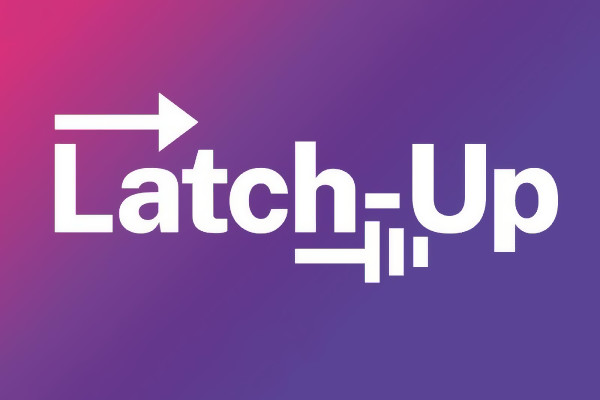
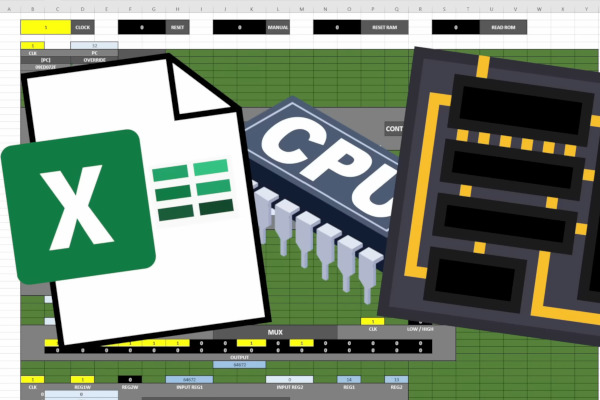
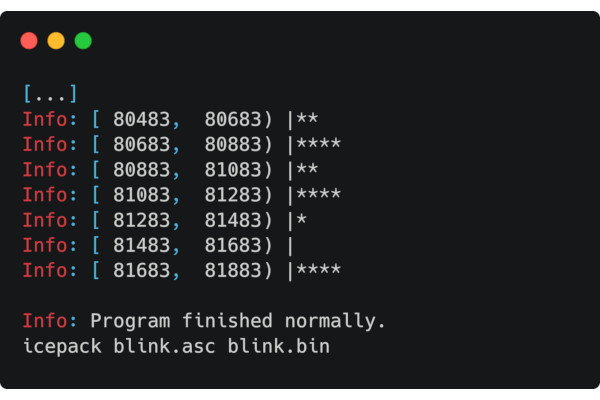
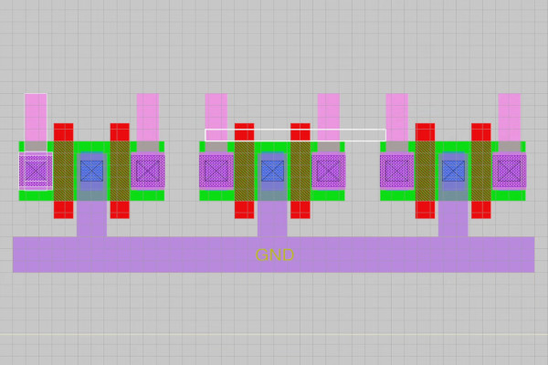
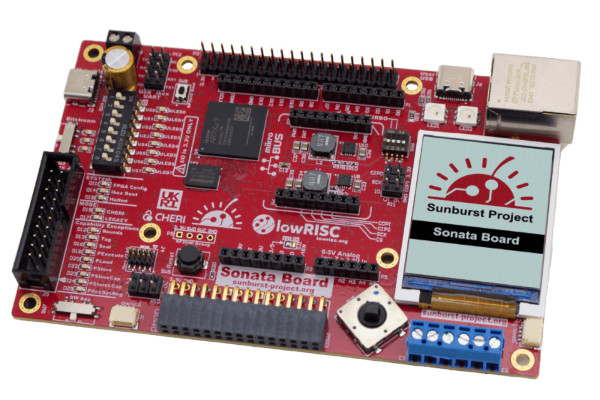
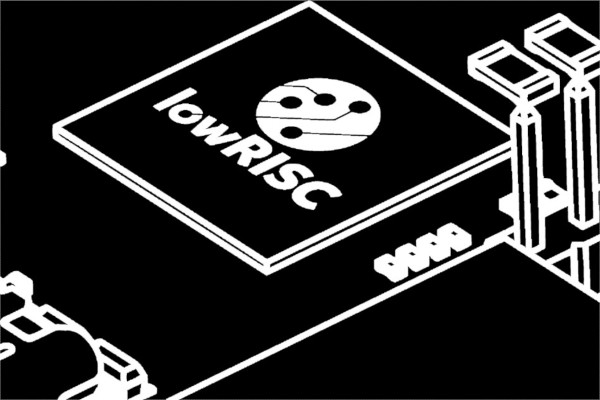
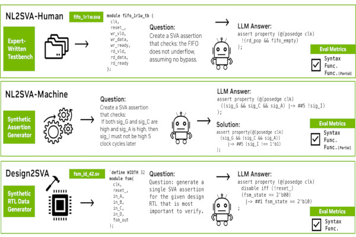
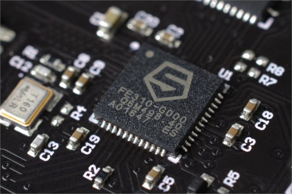

## Join Us for Latch-Up 2025 in Santa Barbara

We are proud to announce [Latch-Up 2025](https://stackedit.io/latch-up/2025), a conference dedicated to free and open source silicon to be held over the weekend of May 2-4 in Santa Barbara, CA, USA.

Following up on the fantastic event we had at MIT [last year](https://stackedit.io/latch-up/2024) we set the sight on the US West coast this year, but in all other regards it will be a familiar setup in the spirit of previous Latch-Up and our long-running [ORConf](https://stackedit.io/orconf).

Latch-Up is a community-focused conference for open source semiconductor, digital design and embedded systems professionals and enthusiasts. Expect presentations on a wide range of topics; open source IP blocks and SoCs, open source simulators, compilers, synthesis and physical implementation tools for both FPGA and ASIC.  

## What is Latch-Up?

Technically speaking, latch-up is a short circuit, an inadvertent path of low-impedance. We have co-opted this word to represent what we’d like to encourage among members of the community: paths of communication leading to collaboration, inadvertent or not.

Latch-Up brings together open source digital design community in North America for an event in the mould of ORConf - the FOSSi Foundation’s annual European community conference. Like ORConf, Latch-Up is free to attend and consist of a relaxed format of presentations and discussions throughout a weekend, with plenty of time for networking.

These events go to the FOSSi Foundations’ goal of lowering barriers of entry to the digital design field, whilst encouraging the open source development model and promoting open collaboration.  

## Visiting Latch-Up

The event will be free of charge but attendees are required to register. Registration will open soon.  

## Speaking at Latch-Up

We invite anyone who is involved in any aspect of open source digital design and embedded systems engineering to join us to present their work.

All presentations at Latch-Up will be recorded (with your permission) and posted on the FOSSi Foundation’s YouTube channel after the event.  

## Supporting Latch-up

Latch-Up is free of charge to attend, but not free to run.  
Events like Latch-Up are a great way to get your brand in front of a passionate audience of engineers. Please get in touch if you’d like to view our sponsorship packages and help make Latch-Up a success.

We also need folks on the ground to lend a hand - so if you have any expertise in helping to run or staff such events, your help would be greatly appreciated, so please do [get in touch](https://stackedit.io/latch-up@fossi-foundation.org) to let us know you’d like to help out.  

## When and where

The conference will be held during the weekend May 2-4 2025 at University of California, Santa Barbara, USA.

All event information is available at [latchup.io](http://latchup.io)

_-Phillip Wagner, Director, FOSSi Foundation_

## Inkbox Software Unveils a Custom Eight-Bit RISC CPU - in Excel

  
The anonymous mind behind the Inkbox Software YouTube channel has followed up an earlier project to create a working CPU in Microsoft’s Excel spreadsheet app with an improved, shrunken eight-bit RISC variant — capable of running at up to 14Hz.

“Previously, I built a working 16-bit CPU inside of Excel, without any VisualBasic scripts, that ran at around 1-2Hz,” the host of Inkbox Software explains. "Now, as great as this is, I wasn’t too thrilled with the overall performance of the machine, and with the entire system taking up a footprint of over 100,000 cells, this is basically the Excel equivalent of a computer from the 1950s. But since publishing that project, I’ve had a lot of ideas on how I can improve the performance of the system, dealing with both the CPU architecture and the size that the system takes up on the spreadsheet itself.

“First, there’s the instruction set architecture: 26 whole instructions. Obviously, this is nowhere near the levels of the x86 complexity, and also certainly beats out a ‘RISC’ architecture like Arm, but just how reduced can an instruction set be? A minimal instruction set architecture really only needs to complete a few functions.”

The spreadsheet’s creator then set about figuring out exactly what those instructions should be, settling on a final set of just 10 instructions - ranging from saving from memory into a register, carrying out mathematical operations on values, and loading from a register into memory to comparatives, conditional branching, and unconditional branching.

“I’m not sold on just shrinking down the old design to only two registers,” the Inkbox host continues. “So I’m actually going to get rid of this second register and make a slight redesign to the architecture of the system by adding a stack, getting rid of the multiple register instructions. Now the single register can pop and push values to and from the stack. One final simplification to make here is that it’s possible to get rid of the unconditional branch instruction and only use the branch greater or equal instruction. For unconditional jumps, the programmer can just set the carry zero flag, then call the conditional branch instruction. And it’s also possible to test all the greater than, less than, or equal conditions with only this one instruction. Albeit this isn’t very friendly towards the programmer, but I’m not going to go nearly double the total count by adding a separate instruction for each condition.”

The result is a working CPU which runs in an unmodified version of Microsoft Excel running on a modern desktop or laptop at around 12-14Hz - sedate by modern standards, true, but impressive for a CPU running in a spreadsheet. A full video walkthrough is available [on YouTube](https://www.youtube.com/watch?v=MNRKi7Rum_c), with files [on GitHub](https://github.com/InkboxSoftware/excelRISC-CPU) under the reciprocal GNU General Public License; the earlier 16-bit design, which runs at around a tenth the speed, is available [in a separate repository](https://github.com/InkboxSoftware/excelCPU).

## Intel Scientists Argue for a Classical-plus-AI Chip Design Approach

  
Research scientists at Intel’s AI Lab have argued that running full-tilt towards a future where generative artificial intelligence (AI) is the go-to technology for chip design may deliver suboptimal results - and that a hybrid approach combining machine learning with classical search could prove better.

“Modern chip engineering is an iterative process of nine stages, from system specification to packaging,” the researchers write in an article for IEEE Spectrum. “Each stage has several substages, and each of those can take weeks to months, depending on the size of the problem and its constraints. Many design problems have only a handful of viable solutions out of 10,100 to 101,000 possibilities - a needle-in-a-haystack scenario if ever there was one. Automation tools in use today often fail to solve real-world problems at this scale, which means that humans must step in, making the process more laborious and time-consuming than chipmakers would like.”

While Intel, and others, are investigating how machine learning and generative AI can assist with reducing this bottleneck, the researchers argue against the popular view that a move to artificial intelligence will be a panacea. Instead, they say that experiments have shown that machine learning algorithms “are often insufficient on their own” — and that better results can be achieved through a hybrid approach between traditional technologies like classical search and machine learning.

“In fact, our recent attempts at developing an AI-based solution to tackle a tricky design task known as floor-planning led us to a far more successful tool based on non-AI methods like classical search,” the team explains. “This suggests that the field shouldn’t be too quick to dismiss traditional techniques. We now believe that hybrid approaches combining the best of both methods, although currently an under-explored area of research, will prove to be the most fruitful path forward.”

The full article is available [on the IEEE Spectrum website](https://spectrum.ieee.org/chip-design-ai), and in the publication’s December 2024 print issue.

## Michael Wiebusch Investigates Yosys’ Lesser-Known VHDL Support

  
Physicist and musician Michael Wiebusch has penned an article looking into something that many may not know is a feature of the Yosys OSS CAD Suite: support for VHDL, as well as Verilog.

“I discovered that YosysHQ’s oss-cad-suite now ‘secretly’ supports code entry not just in Verilog but also in VHDL,” Michael explains. “VHDL support [has been] there for a long time already - it just was not obvious to me! And I still see a lot of blog and forum posts claiming that you need the commercial version of oss-cad-suite for VHDL.”

Traditionally, the OSS CAD Suite - an all-in-one binary distribution of the Yosys toolchain - has been focused on Verilog as its language of choice. A commercially-supported bundle dubbed Tabby CAD delivered native VHDL support, but as Michael has discovered the feature gap was only temporary: OSS CAD Suite now includes VHDL support, through the integration of the GHDL simulator and the necessary plugin.

“I actually wanted to share my Docker container with you where I solved the problem once, so you don’t have to,” Michael explains. “But meanwhile there seems to be an even simpler solution: I discovered that the oss-cad-suite includes the ghdl-yosys-plugin (and of course GHDL) by default! Someone must have added it recently (actually a while ago). They just don’t make a big deal out of it!”

Michael’s full write-up is available [on his blog](https://acidbourbon.wordpress.com/2024/12/02/yosyshq-fpga-toolchain-with-vhdl-support/), including an eight-step process for downloading the latest Yosys OSS CAD Suite and compiling a simple blinky VHDL sample.

## Sylvain Munaut Offers More Details on his SKY130 ROM Compiler

  
Sylvain Munaut has published a second video detailing his read-only memory (ROM) compiler for SkyWater’s SKY130 open-source process design kit, first unveiled last month, this time focusing on the bit cell and his design choices therein.

“The bit cell [is] quite literally the heart of the ROM,” Sylvain explains. “We obviously want the bit cell to be as small as possible, and as is often the case we might end up being limited not so much by how small a transistor we can make but by the contacts and associated signal routing. It’s all about trade-offs and various things having to come together that you only find about later.”

Sylvain’s video walks through the creation of the smallest transistor possible under the design rules for SKY130, then how it needs to be increased in order to provide the necessary contact area. This quick-and-dirty design is then compared to a ROM on a commercially-produced microcontroller, providing some clues as to how the design can be improved.

“The next episode will probably be a bit of a special edition,” Sylvain promises of his ongoing video series, “since there was a [Tiny Tapeout] tapeout a couple of weeks ago, and it included some ROMs using the prototype compiler. I thought I’d quickly go over what I put on there, but then after that we’ll resume on the ROM design and I will go over some modelling of the bit cell and estimation of the parasitics involved.”

The full video is available [on Sylvain’s YouTube channel](https://www.youtube.com/watch?v=j_K0H7tIKok).

## Phil Day Offers a Tour of the CHERIoT Ecosystem as Sonata Boards Launch

  
Anyone interested in the CHERIoT project, which brings the Capability Hardware Enhanced RISC Instructions (CHERI) to the Internet of Things (IoT), should now be able to find their way around a little more easily thanks to a guide published by Phil Day - just in time for lowRISC’s v1.0 of the Sonata CHERIoT development board.

“I thought it might be useful to capture some of the things I’ve learnt in the last few months about the ecosystem,” Phil explains. "The easiest and quickest way to get up and running is to use the dev container. I have a fairly strong aversion to installing new software on my base system, and this just requires that you have docker installed. Opening a repo with dev container support in VS code will ask you if you want to reopen in a container. Do that and in a few seconds you’re in a pre-built dev environment. Simples, to paraphrase a meerkat.

"The CHERIoT ecosystem is split across a number of git repositories, and makes extensive used of submodules to link them and other external code from other places such as FreeRTOS. There is no version or release tagging in the repos, so you can only tell how current a submodule is by comparing the commit hashes. Versioning will start with the CHERIoT 1.0 release, which you can track here. On the plus side the CI system and maintainers do a good job of keeping it all compatible, and any breaking changes are discussed in the Signal channel.

“[From zero to CHERIoT in two minutes with Sonata](https://cheriot.org/fpga/ibex/2024/06/10/sonata-quick-start.html) covers how to extend a dev container to include a Sonata board,” Phil concludes, for those who are hands-on with the new hardware. “If you power up your Sonata board after opening VS Code, then you need to tell VS Code to rebuild the dev container (Ctrl-Shift-P -> Dev Containers:Rebuild Container) to get it to re-establish the volume mount.”

The full tour, which includes links to each code repository and what they are for, is available [on the CHERIoT blog](https://cheriot.org/rtos/sonata/git/2024/11/08/navigating-the-ecosystem.html). More information on the Sonata board is available [on the lowRISC website](https://lowrisc.org/news/sonata-v1-0-release/).

## lowRISC Partners with SCI for Commercial CHERIoT Tapeout

  
In other CHERIoT news, lowRISC has announced a partnership with SCI Semiconductor for a commercial tapeout of the Sonata design, to launch as part of SCI’s ICENI microprocessor family, as part of the UK Research and Innovation (UKRI) funded Sunburst Project.

“Open source, done right, creates a true virtuous circle - with strong economic benefits for all participants - and represents a significant market transformation for our industry,” says lowRISC chief executive Gavin Ferris. "Our team is uniquely equipped to take on this challenge as we host both the Ibex and OpenTitan projects, have helped successfully prepare the ‘Earl Grey’ OpenTitan chip design for commercial tapeout, and have partnered with Microsoft on the build-out of CHERIoT-Ibex DV [Design Verification]. This new collaboration brings us one step closer to our shared vision: a world where commercial-grade open source silicon is embraced by all.”

“A lack of commercial availability of CHERI technology is a critical challenge for governments and industry stakeholders globally. Our team, which includes many previous Microsoft CHERIoT-Ibex core contributors, is aiming to resolve that by giving users the ability to deliver new integrated systems and create competitive designs,” adds SCI chief executive Haydn Povey, whose company will be handling the project’s proprietary aspects including non-public IP.  
  
"The innovation supported by this effort will enable SCI Semiconductor’s ICENI family of microprocessors, a new generation of CHERI-enabled RISC-V microcontrollers, into the marketplace. As the chip industry accelerates its already widespread adoption of the RISC-V architecture, this project marks a significant inflection point for developers. Now every engineer, every company and every organisation can embrace high-integrity security in their microcontrollers.”

The collaboration will see the release of a new open-source top-level design with publicly-available design verification dashboards, which will then serve as the basis for a new entry in SCI’s ICENI processor family as a commercial product. Initial samples will be produced on GlobalFoundry’s 22nmFDX SOI multi-project wafer process.

More information is available [from lowRISC](https://lowrisc.org/news/lowrisc-and-sci-semiconductor-partner-to-create-first-cheriot-commercial-tapeout/).

## Olof Kindgren Interviewed on Open Source’s Past, Present, Future

  
FOSSi Foundation director Olof Kindgren has been interviewed Qamcom colleague Christopher Ahlström for the company’s latest Circular Knowledge podcast - on no smaller topic than the past, present, and future of open source technologies.

“I started out with open source software,” Olof explains. "I came in contact with it during my university years. I have been contributing and using open source software for a long, long time. My studies took me into the world of chip design. I also started be interesting in open source for chip design. This was not a very big field back then, it still isn’t a very big field, but things have changed very, very rapidly the past 10 years.

"We have open source software, we have open source hardware, and we also have open source silicon. And the latter two are typically bundled together, but there are some important differences. When we talk about open hardware or open source hardware, we typically talk about things that are 3D printed models, or it can be chairs, or it can be houses, or it can be textiles - physical objects. Open source software, of course, is programming code, and open source silicon is specifically microchips. This is kind of between software and hardware, depending on how you look at it, and there are some special rules and regulations, both in patent law and copyright law, that makes this a topic that needs to be handled separately. And this is where my expertise has been the past 10 years.

“I think open source software and open source silicon typically follows the trends we see in society. AI, of course. Another big thing is security, where we see an increased digitalisation in the society. Overall, we also see an increased need to address security in a way that that wasn’t the same 10 years ago. Another thing that has changed in this regard is the attitude towards open source. When I started out, the prevalent view was that open source was risky because you showed what was inside your devices. You showed the source code. This has very much changed now, where you instead see the companies requiring open source, because then they know what is going into their devices, which you can’t see with closed source.”

The full interview is available [on the Qamcom website](https://www.qamcom.com/circular-knowledge-episode-02/).

## FVEval Investigates Large Language Models for Formal Verification

  
Researchers from the University of California at Berkeley and NVIDIA have published a paper investigating how large language models for generative artificial intelligence could be used for formal verification - delivering a dedicated benchmark for the task, dubbed FVEval.

“The remarkable reasoning and code generation capabilities of large language models (LLMs) have spurred significant interest in applying LLMs to enable task automation in digital chip design. In particular, recent work has investigated early ideas of applying these models to formal verification (FV), an approach to verifying hardware implementations that can provide strong guarantees of confidence but demands significant amounts of human effort,” the researchers explain. "While the value of LLM-driven automation is evident, our understanding of model performance, however, has been hindered by the lack of holistic evaluation.

"In response, we present FVEval, the first comprehensive benchmark and evaluation framework for characterizing LLM performance in tasks pertaining to FV. The benchmark consists of three sub-tasks that measure LLM capabilities at different levels: from the generation of SystemVerilog assertions (SVAs) given natural language descriptions to reasoning about the design RTL and suggesting assertions directly without additional human input. As test instances, we present both collections of expert-written verification collateral and methodologies to scalably generate synthetic examples aligned with industrial FV workflows.

“A wide range of existing LLMs, both proprietary and open-source, are evaluated against FVEval, based on which we investigate where today’s LLMs stand and how we might further enable their application toward improving productivity in digital FV.”

A preprint of the paper is available [on Cornell’s arXiv server](https://arxiv.org/abs/2410.23299); the benchmark it self has been published [on GitHub](https://github.com/NVlabs/FVEval) under the permissive Apache 2.0 licence.

## CSIS’ Sujai Shivakumar, Julie Heng Opine on RISC-V as the Future of Chip Development

  
Sujai Shivakumar and Julie Heng of the Center for Strategic & International Studies (CSIS), director and senior fellow and research intern respectively, have weighed in on the future of chip development - and what changes the free and open-source RISC-V instruction set architecture may bring.

“Many believe that the future of chip design - and the development of new technologies like next-generation artificial intelligence (AI) - will depend on RISC-V architecture,” the pair explain in a joint op-ed article. "RISC-V is an open standard developed through international collaboration. Participating in international standards like RISC-V is perceived as enabling firms to maintain greater control over their intellectual property and strengthen innovation across public and private sectors. However, some U.S. policymakers also worry that the RISC-V architecture standard could endanger U.S. national security and competitive advantage.

"As an open standard ISA, RISC-V is accessible and free to implement. It allows firms, large and small, to build their own implementations on top of the ISA, allowing them to maintain greater control over their technology and take advantage of software compatibility across the RISC-V ecosystem. Many firms that currently license ISAs from Intel/AMD or Arm are helping to develop RISC-V so that they can have another option for semiconductor architectures. A customizable, low-cost ISA option is attractive, particularly for smaller firms.

“Importantly and challengingly, RISC-V is already embedded across the U.S. innovation ecosystem in projects across the public and private sectors, from spaceflight computing at NASA’s Jet Propulsion Laboratory to hardware architecture security at Defense Advanced Research Projects Agency,” the pair note. “A major advantage of this shared, collaborative “language” is that it can be leveraged by researchers, taught in universities, and adopted by small startups and large companies as they seek to build, for example, new chip implementations to support next-generation AI. Thus, there is a strong argument for remaining closely engaged with RISC-V standards development.”

The full article is available [on the CSIS website](https://www.csis.org/analysis/what-risc-v-means-future-chip-development).

## Public Review for Zilsd and Zclsd Closes Soon

  
Christian Herber, owner of the Load/Store Pair for RV32 fast-track extension, has announced a public review period for both the standard and compressed variants of the extension - Zilsd and Zclsd respectively - but you’ll have to hurry: it closes on the 13th of December.

“This specification contains two RV32-only extensions,” the extension documentation explains, "which add load and store instructions using register pairs. It does so by reusing existing instruction encodings which are RV64-only. The specification defines 32-bit encodings (Zilsd extension) and 16-bit encodings (Zclsd).

“Load and store instructions will use the same definition of even-odd pairs as defined by the Zdinx extension. The extension improves static code density, by replacing two separate load or store instructions with a single one. In addition, it can provide a performance improvement for implementations that can make use of a wider than XLEN memory interface.”

“During the public review period, corrections, comments, and suggestions, will be gathered for review. Any minor corrections and/or uncontroversial changes will be incorporated into the specification,” Christian says. “Any remaining issues or proposed changes will be addressed in the public review summary report. If there are no issues that require incompatible changes to the public review specification, the Unprivileged ISA Committee will recommend the updated specifications be approved and ratified by the RISC-V Technical Steering Committee and the RISC-V Board of Directors.”

The specification is available [on GitHub](https://github.com/riscv/riscv-zilsd), and interested parties can submit comments as Issues or Pull Requests or join in with the discussion [on the isa-dev mailing list](https://groups.google.com/a/groups.riscv.org/g/isa-dev/c/NTC65wlcF8o/m/q9FRTZeOCgAJ) - at least, until the review period closes on the 13th of December 2024.

## News In Brief

-   [Stream Computing details its open-source RISC-V Matrix Extension v0.5.](https://riscv.org/blog/2024/11/stream-computing-risc-v-matrix-extension-open-source-project-upgrades-to-version-0-5-supporting-vectormatrix-implementation/)
-   [RISC-V International offers a guide to finding and sharing RISC-V community projects.](https://riscv.org/blog/2024/11/how-to-share-your-work-and-see-what-others-are-building-on-risc-v/)

**Have feedback or news for inclusion in a future newsletter? Please send this to [ecl@fossi-foundation.org](mailto:ecl@fossi-foundation.org)**.

**Subscribe to [get El Correo Libre direct to your inbox](http://eepurl.com/dnL4v1).**
