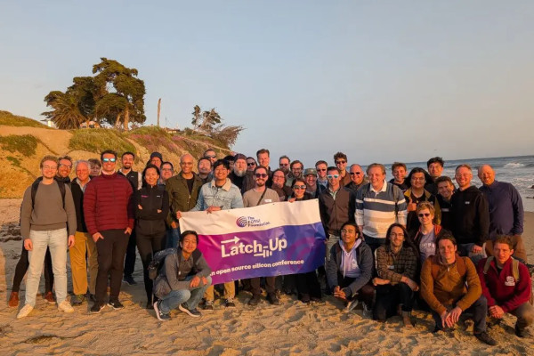

## Celebrating Latch-Up 2025

  
Latch-Up 2025 has now been and gone, and our North American conference has yet again lived up to what we’ve now come to expect from FOSSi Foundation events.

We were hosted by Jonathan Balkind at the beautiful University of California Santa Barbara campus, a welcome redo of the venue for Latch-Up 2023. We were back for more beachside sunsets and campus-adjacent beer and pizza long into the evenings!

We’ve now settled upon a conference format consisting of two full days of talks Friday and Saturday, a social event on the Saturday evening and a free-flowing, ad hoc unconference day on the Sunday. This proved to be the way to go yet again this year at Latch-Up. We had two days full of talks, a great evening watching the sunset from the beach, lightning talks and dinner on Saturday and a constructive, collaborative if relaxed and informal Sunday session. We were back in UCSB’s Henley Hall for all 3 days, a building I quite like for its modern, airy open design.

The event opened with an update on lowRISC’s activities within the Sunburst Project from Hugo McNally, and some further updates on DSP libraries for Julia from David Hossack. Dan Ruelas-Pitresko shared more cool things from UW’s Bespoke Silicon Group, before some eDSL talks, first a Chisel Update from Mr Chisel himself, Jack Koenig of SiFive, and Rachit Nigam’s thought-provoking intro to Hardcaml. Alex Mykyta was back with more SystemRDL tooling he’s developed, before fellow FOSSi Foundation co-founder and director Stefan Wallentowitz shared an update on the activities in Europe regarding open source EDA funding and development. Rounding out day 1 was a novel session for us; remote presentations by Xiaoke Su on a MOOC for open source chip design and Yuchi Miao on cloud-based open source chip design, both of whom were dialling in from China and fielded Q&A.

Day two saw us welcome back Matt Ballance with a talk on some tools supporting Portable Stimulus Specification (PSS) he’s developing, followed by Philipp Wagner presenting the FOSSi Foundation’s community-oriented activities. Lloyd Ramseyer shared a VSCode-based waveform viewer he’s been working on (and thankfully trying to share as much with Surfer as he can for now), Larry Doolittle presented an extremely useful CDC checking tool, and we saw some project updates from folks at Asfigo. Rounding out the full length talk schedule was Joaquin Matres presenting GDSFactory, and then a talk on the critical topic of STA by Akash Levy presenting the OpenSTA tool. Gus Smith finished off the session with a fascinating talk about technology mapping for FPGAs, demonstrating Vivado’s flaws and how the tooling he is developing surpasses it and more.

Lightning talks, as always, allowed folks to jump up and share projects they’re working on, most not small, especially Tim Ansell’s [wafer.space](http://wafer.space).

All talks are now available on YouTube for your viewing pleasure.

Overall we continue to see a steady pace of open source tooling and IP development. Every year I continue to be amazed by how far the domain has come in the past decade. It was excellent to meet so many new faces, it’s great to see the community and networks expand. The point of Latch-Up and its European sibling, ORConf, is more than providing a platform for folks to present their open source EDA or IP projects, it’s to provide a space for folks to meet and talk and hopefully spur collaboration and new ideas. I’m satisfied we achieved that again at this year’s Latch-Up.

The event wouldn’t be possible without the support of our generous sponsors, our main sponsors Jane Street and Hudson River Trading this were a great help in ensuring we were able to provide the catering and venue, so a giant thank you to them. A massive thank you to those who bought professional tickets and donated to the FOSSi Foundation to cover its costs. This also isn’t possible without the help on the ground; Jonathan and Parker and everyone who helped throughout the weekend from UCSB and even the attendees, thank you! Finally thanks to the attendees for travelling and enthusiastically participating across the weekend.

Next up is [ORConf 2025](https://fossi-foundation.org/orconf/2025/) in Valencia, Spain, 12-14th September. All are welcome, and we look forward to seeing you there!

_-Julius Baxter, Director, FOSSi Foundation_

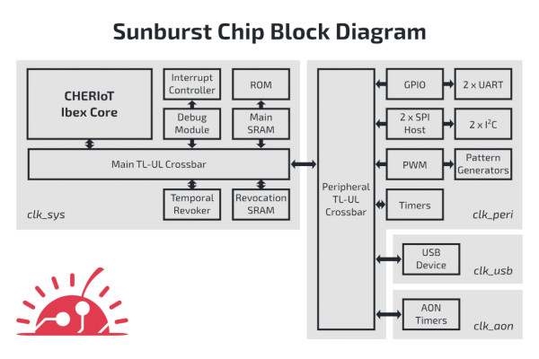

## lowRISC, SCI Semiconductor Open the Sunburst Chip Repo

  
Free and open silicon specialist lowRISC, working in partnership with SCI Semiconductor, has announced the public availability of the Sunburst Chip design repository - a major step towards commercial availability of CHERIoT-Ibex-based secure yet open microcontrollers/

“By addressing security challenges in a ‘by design’ manner, CHERIoT-Ibex has proven its potential as a next-generation secure microcontroller architecture," claims lowRISC chief executive officer Gavin Ferris. “However, to move the needle, CHERIoT-based IP must be both commercial-grade and readily available. Our release, with SCI, of the permissively-licensed open-source Sunburst Chip repository is a significant turning point in bringing CHERI-based security to the embedded systems market, and represents a core deliverable of the Sunburst project.”

“The availability of commercial-grade CHERI technology is a key factor in shaping the future of secure computing,” adds SCI chief executive Haydn Povey of the move. "We are on a mission to ensure that the market has access to robust, open source foundations for secure-by-design microcontrollers enabling a focus on differentiation, just as we have with ICENI.”

CHERIoT is an effort to bring the Capability Hardware Extension for RISC-V (CHERI) to the Internet of Things (IoT), bringing the promise of memory safety and referential integrity to microcontroller platforms. The Sunburst Project aims to get that hardware into the hands of embedded engineers by producing and promoting commercial-grade implementations - such as SCI’s ICENI family, which is due to launch later this year.

The Sunburst Chip repository contains an open-source microcontroller implementation of CHERIoT-Ibex, which places the CHERI technology into the Ibex RISC-V core. At the time of writing, it included both the logical design along with a design verification environment and associated bare-metal test software - all published under the permissive Apache 2.0 licence.

The repository is live now [on GitHub](https://github.com/lowRISC/sunburst-chip).

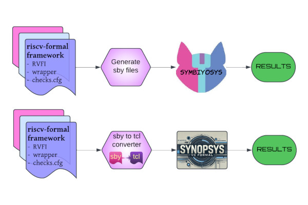

## Rohith V. Extends riscv-formal into Synopsis VC Formal

  
Self-described “VLSI enthusiast” Rohith V. has penned an article which takes a look at an effort to extend riscv-formal to interface with proprietary tools via Synopsis VC Formal - offering, he says, improved accessibility and usability for RISC-V formal verification.

“Imagine deploying a RISC-V processor in an embedded system, only to discover an instruction-level bug after manufacturing - this could be a costly mistake,” Rohith writes. "Formal verification ensures that such issues never make it past the design phase, and tools like riscv-formal help automate this process. However, many engineers rely on proprietary tools like Synopsys VC Formal, making integration with open-source solutions a challenge - until now.

“The riscv-formal framework has been a game-changer, providing an open-source solution for verifying RISC-V cores against the official ISA specification. While powerful, its integration with industry-grade proprietary tools has remained complex. This project bridges that gap by extending riscv-formal to seamlessly interface with Synopsys VC Formal, enabling engineers to harness its advanced capabilities while maintaining a structured and efficient verification approach.”

Built atop the SymbiYosys Formal Verification FLow, risc-formal delivers formal verification for RISC-V designs - but, Rohith argues, its lack of support for proprietary electronic design automation (EDA) tools is holding it back. “This is where our extension comes in,” he explains, "adapting riscv-formal for Synopsys VC Formal, bridging the gap between open-source and commercial verification flows.

“By adapting the riscv-formal framework (originally built for SymbiYosys) to work with Synopsys VC Formal, this project aims to: ensure that riscv-formal works effortlessly with Synopsys VC Formal, simplifying the verification process without requiring extensive modifications; deliver clear documentation and practical examples to help engineers effectively apply the framework; support straightforward translation of .sby configurations into .tcl scripts, even outside the framework. By achieving these goals, the project enhances the efficiency, accessibility, and adoption of formal verification for RISC-V cores, fostering wider collaboration in the verification community.”

The full article is available as a guest post [on the YosysHQ Blog](https://blog.yosyshq.com/p/risc-v-formal-verification-framework-extension-for-synopsys-vc-formal/); the extension itself is published [on GitHub](https://github.com/Chaotic-VRBlue/riscv-formal-vc-formal-extension/) under an unspecified licence.

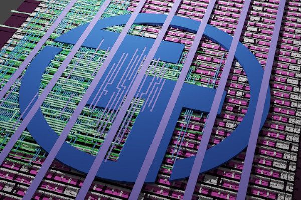

## Tiny Tapeout opens a New Shuttle with IHP

  
Matt Venn has announced that the Tiny Tapeout project, which allows free and open-source chip designers of any experience level to have their hardware produced in silicon at an extremely low cost through a multi-project chip approach, is now accepting applications for a new shuttle with IHP, the Leibniz Institute for High Performance Microelectronics.

“Our fourth open-source chip with IHP is now open for digital design submissions,” Matt explains of shuttle IHP25b. “We’re very happy to have our next shuttle open and we’re already looking forward to seeing another great set of designs manufactured onto custom silicon. Big thanks to SwissChips for funding the work in porting our infrastructure to IHP’s PDK [Process Design Kit]. Also we want to say thanks to the German BMBF project FMD-QNC (16ME0831) for funding the silicon and IHP for manufacturing it.”

As with previous shuttle runs, contributors will receive a development board containing a chip which includes all the projects submitted as part of that shuttle including their own. Each project is selectable from the development board, allowing participants to try out their own designs as well as any others.

There is, however, one big shift from previous runs: the chips are being provided on loan, with new terms and conditions stating that the chips “remain the property of IHP,” are being borrowed “for testing and evaluation purposes only,” and that after a two-year loan period “you might be asked to return the chips” - though the development board itself may be retained. Chips are also restricted to shipping within the European Union and Switzerland, Matt has confirmed.

The shuttle is open to contributors [on the Tiny Tapeout website](https://tinytapeout.com/) now.

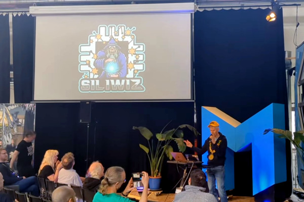

## Matt Venn Talks Efabless’ Closure, Tiny Tapeout’s Future

  
Just prior to opening the IHP25b Tiny Tapeout shuttle, Matt Venn gave a lightning talk on the impact of Efabless’ closure on the project and his plans for recovery - and while the original talk has been lost, bar a rap celebrating free and open source silicon at the end, he has recreated it for those unable to attend the original.

“Efabless, who was a very central part of the open source silicon community, very sadly passed away, end of life, and that affects us and the rest of the open source silicon community very dramatically,” Matt explains in the presentation. "They’ve really made a huge impact and enabled a lot to happen. We used them for all of our tapeouts.

"By being blocked at the foundry level, we’re forced to find more foundries to work with, and once we have more foundries on board we’re going to be able to offer an even better product. So, I think this is an opportunity to actually advance the game. There’s so much momentum and energy in the open source semiconductor community. We can take it even further.

“I’m very happy to say that we’ve already got a new foundry partner, IHP,” Matt continues. “Our team was able to port hundreds of digital designs on Tiny Tapeout [shuttles] 9 and 10 to a different PDK in just a few days - unheard of in the industry. [Also,] we’re soon going to take part in a different kind of shuttle: we’re going to be sending our ASICs into space. SpASICs! If you put your design on a Tiny Tapeout ASIC you’ll soon have the opportunity to test it in space.”

The full talk is available [on the Zero to ASIC Course YouTube channel](https://www.youtube.com/watch?v=EoDauBaAxVM).

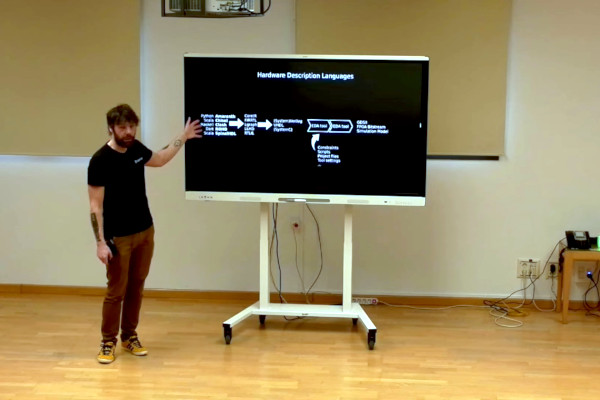

## Olof Kindgren’s UCM Talk Now Available

  
FOSSi Foundation director and award-winning chip designer Olof Kindgren’s talk on open-source silicon at the _Universidad Complutense de Madrid_ (UCM) is now available to stream, offering students a look at “some of the things that have been done and can be done” with free and open-source silicon.

“The guest lecture I gave on open-source silicon at UCM is now online,” Olof says. "I hope it can serve as an introduction to open-source silicon for more people. [I] tried to do shout-outs to lots of FOSSi projects, but there are of course many more that I didn’t have time to talk about.

“The semiconductor industry creates some of the most advanced objects ever made and, and many of the largest companies in the world are increasingly starting to create chips themselves,” Olof’s summary of the lecture explains. "A the same time, it’s a comparatively small and extremely conservative industry, not least when compared to the neighbouring field of software design.

“But just like what happened 20 years ago for software, when the whole field was revitalised from the massive uptake of open source, we see the same thing happening for chip design. The barriers of entry are torn down and chip design is becoming faster, cheaper and more accessible for small companies and individuals.  
  
"As students, you will enter a job market that is bustling with new possibilities if you know where to look. This presentation will guide you through some of the things that have been done and can be done with open source silicon, to give you new tools for a new generation.”

The lecture is available to stream freely [on the UCM YouTube channel](https://www.youtube.com/watch?v=qhKjHicC6d0) now.

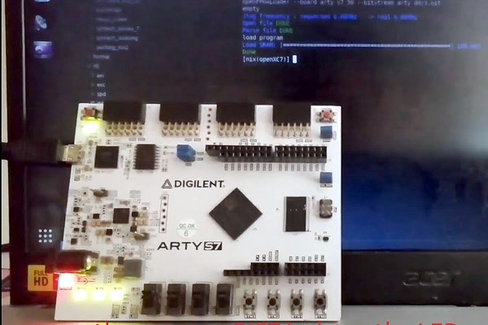

## UberDDR3 Demonstrated with the OpenXC7 Toolchain

  
Angelo Jacobo has shown off a feature new to the UberDDR3 open-source double-data-rate memory controller project: support for OpenXC7, a fully open-source toolchain.

“UberDDR3, the open-source DDR3 controller, now works with OpenXC7, the open-source FPGA toolchain - bringing fully open-source synthesis, place & route, and bitstream generation into the mix,” Angelo explains in a recent project update. "No more [AMD Xilinx] Vivado - just run make and let the open-source magic happen!

“And yes, we put it to the test! The demo runs on real hardware across multiple AMD 7-series FPGAs - from Spartan-7 to Kintex-7—with DDR3 widths ranging from x16 to x64, spanning boards from Digilent, Enclustra, Alinx, and QMTech! With UberDDR3 + OpenXC7, you can now build a fully open-source DDR3-enabled FPGA design without touching Vivado!”

Angelo does, however, highlight a few limitations - including the demos running at just 333MHz, the lowest valid JEDEC-specified frequency, owing to issues in routing higher-frequency designs with nextpnr. “That said, this is likely just a temporary limitation,” he adds. “The open-source FPGA toolchain continues to evolve, with many brilliant minds actively working to improve it over time. It’s exciting to see how far it will progress!”

More details are available [in Angelo’s blog post](https://www.openiphub.com/post/uberddr3-openxc7-open-source-ddr3-controller-meets-open-source-fpga-toolchain), including instructions on trying it out for yourself.

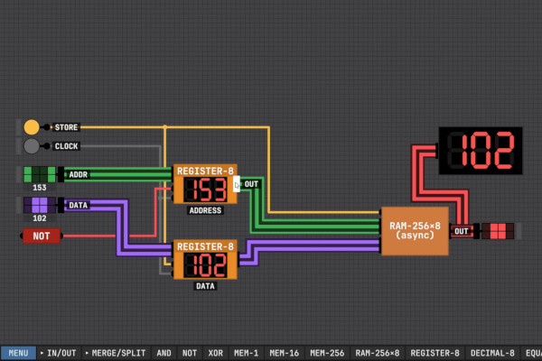

## Making RAM in Sebastian Lague’s Open-Source Logic Sim

  
Developer Sebastian Lague has shown off the capabilities of his open-source game-slash-educational logic simulator - which starts the user off with a single NAND gate - by building 256 bytes of RAM, as part of an ongoing project to demonstrate the inner workings of digital computers.

“While […] individual registers are great for remembering single values that are being worked with right now,” Sebastian explains of the reason for adding RAM to a simple work-in-progress simulated computer system, "we’re going to want something a lot larger where we can store the results of our various calculations and access them later as the need arises.

“Our fundamental building block of memory [is] constructed from a pair of NOR gates where each output feeds back into the input of the other, to keep a single bit of data locked firmly in place. So, I think our plan should essentially be to create a giant grid of these little latches that we can activate individually based on a given memory address.”

The ability to create memory is a new feature of the simulator, which Sebastian describe as being “in a slightly rough and unstable state, as I’m developing it as I go” - with the overall goal of providing something both enjoyable as a sandbox game and of value for educators looking to demonstrate fundamental hardware concepts.

The video walkthrough is available [on YouTube](https://www.youtube.com/watch?v=HGkuRp5HfH8), while binaries for the simulator can be downloaded for Linux, macOS, and Windows [on Itch.io](https://sebastian.itch.io/digital-logic-sim); the source code, meanwhile, is available [on GitHub](https://github.com/SebLague/Digital-Logic-Sim) under the permissive MIT licence.  
  
“Pull requests are welcome,” the developer says, "but please be aware that I’m far more likely to merge performance/ux improvements and bug fixes than new built-in chips or features. I do hope to provide some form of mod support in the future, but don’t have any concrete plans for it right now."

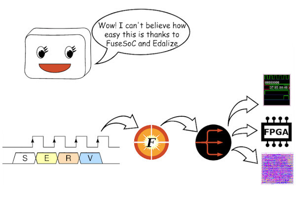

## Edalize 0.6.1 Fixes Bugs, Adds Frontend Support

  
Olof Kindgren has announced a new release of Edalize, version 0.6.1, which comes with all the features of 0.6.0 plus a bunch of bug-fixes - including warnings when the user is using deprecated legacy backends.

“You know what just happened? A new version of Edalize dropped,” Olof announced of the new release. “For those who don’t know, Edalize is a Python library that provides a common interface to 40+ EDA tools. It is used in FuseSoC and other projects as the build backend but can also be used stand-alone.”

The new release builds on Edalize 0.6.0, launched in November last year and adding support for Gowin devices, and concentrates primarily on bug-fixes - including the removal of some no-longer-functional legacy backends, v4pga and vpr, plus the addition of new warnings when the user is choosing a deprecated backend.

Other changes in the new release include fixes for coctb 2.0 compatibility, the porting of vcs to the Flow API, new support for custom build runners, the ability to pass options to created flow Makefiles, and support for frontends in all flows.

The latest release is available [on the Edalize GitHub repository](https://github.com/olofk/edalize/releases), along with the full source code under the permissive BSD two-clause licence.

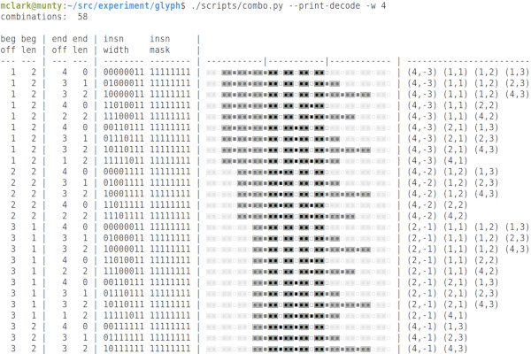

## Michael Clark’s glyph is a Super-Regular RISC ISA

  
Developer Michael Clark has announced a work-in-progress super-regular RISC architecture designed to encode constants in immediate blocks: glyph.

“I have been working on a proof-of-concept simulator for a RISC architecture with an immediate base register next to the program counter to split the front-end stream into independent instruction and constant streams,” Michael explains. of the project. "I named it glyph.

"[glyph] encodes constants in a secondary constant stream accessed via an immediate base register. The immediate base register branches like the program counter and the call instructions sets (pc,ib) together for procedure calls and returns.

"glyph uses relative addresses in its link register which is different to typical RISC architectures. glyph needs to do this for the branch instruction to fit (pc,ib) into the link register for compatibility. glyph achieves this by packing together two 32-bit relative (pc,ib) displacements in an i32x2 vector.

“Immediate blocks can be linked together using relative displacements and switched using the constant branch instruction. Immediate blocks, unlike typical RISC architectures, mean that most relocations are word sized like CISC architectures, and can use C-style structure packing and alignment rules.”

A thread discussing the project is available [on the RISC-V ISA-DEV mailing list](https://groups.google.com/a/groups.riscv.org/g/isa-dev/c/vognIEEVzj4); the source code for the simulator is available [on GitHub](https://github.com/michaeljclark/glyph/) under an unspecified licence.

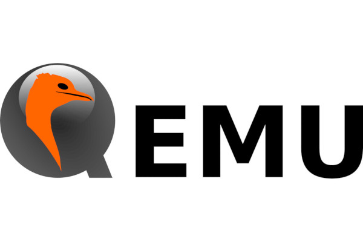

## QEMU 10.0 Launched, Bringing New RISC-V Extensions

The latest version of the QEMU emulator, version 10.0, is out now - and brings with it support for new RISC-V hardware and extensions, including input/output memory management unit (IOMMU) functionality.

“We’d like to announce the availability of the QEMU 10.0.0 release. This release contains 2800+ commits from 211 authors,” the QEMU maintainers say in the project’s release announcement. “Thank you to everybody who contributed to this release, whether that was by writing code, reporting bugs, improving documentation, testing, or providing the project with CI resources. We couldn’t do these without you!”

Among the changes in the release is support for the svukte, ssstateen, smrnmi, smdbltrp/ssdbltrp, and supm/sspm RISC-V extensions, allowing developers to work with them without the need for compatible hardware. The new release also brings support for the riscv-iommu-sys device plus a translation tag for its page table cache, updated pointer masking to match the ratified version of the Zjpm extension, and trace support for exceptions in user mode.

The latest release also brings reduced overhead for RISC-V vector unit-stride loads and stores, fixes a number of bugs, adds AIA userspace irqchip_split support, and introduces support for emulating new commercial RISC-V implementations: the Tenstorrent Ascalon and Xiangshan Nanhu CPUs and the Microblaze V development board.

More information is available [in the project changelog](https://wiki.qemu.org/ChangeLog/10.0); the latest release can be found [on the QEMU download page](https://www.qemu.org/download/), with source code available on GitLab under the GNU General Public License 2.

## News In Brief

-   [The award-winning ultra-tiny SERV goes small in the physical world, too, as it's used to make an atomically-thin chip.](https://bsky.app/profile/olofkindgren.bsky.social/post/3llyuc6fquc2a) ([Paper](https://www.nature.com/articles/s41586-025-08759-9))
-   [Greg Sterling, Carl Perry release a RISC-V development container for project streamlining.](https://riscv.org/blog/2025/03/simplifying-sail-simulations-and-architectural-compatibility-testing/?_hsmi=354376856)
-   [Jeff Scheel announces the ratification of the RISC-V IO Mapping Table (RIMT) extension.](https://wiki.riscv.org/display/HOME/Ratified+Extensions) ([PDF](https://drive.google.com/file/d/1sxQ3iQ1l5Jgq9tukvGMnucRUvY16s8zN/view?usp=sharing))
-   [Leyfoon Tan opens the public review period for the RISC-V Platform Management Interface Specification (RPMI), closes 1st of June 2025.](https://groups.google.com/a/groups.riscv.org/g/isa-dev/c/MEUiWE8u7Mw)
-   [...and Atish Patra opens the public review period for the RISC-V Supervisor Binary Interface (SBI) 3.0, closes 8th of June 2025.](https://groups.google.com/a/groups.riscv.org/g/isa-dev/c/MEUiWE8u7Mw)

**Have feedback or news for inclusion in a future newsletter? Please send this to [ecl@fossi-foundation.org](mailto:ecl@fossi-foundation.org)**.

**Subscribe to [get El Correo Libre direct to your inbox](http://eepurl.com/dnL4v1).**
