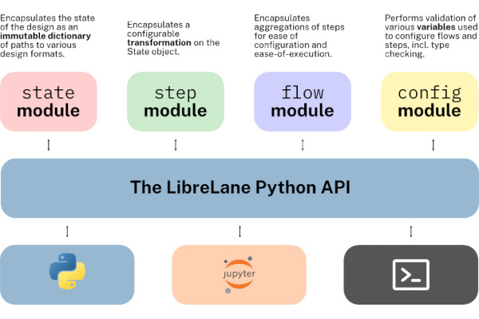
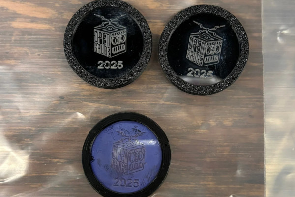
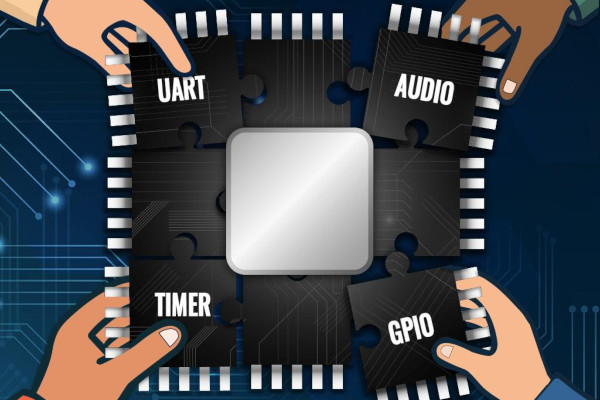
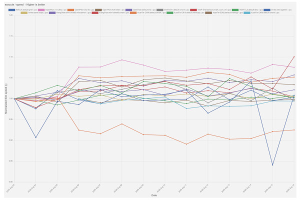
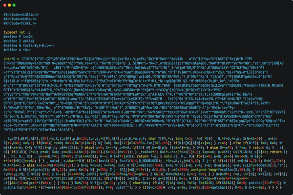
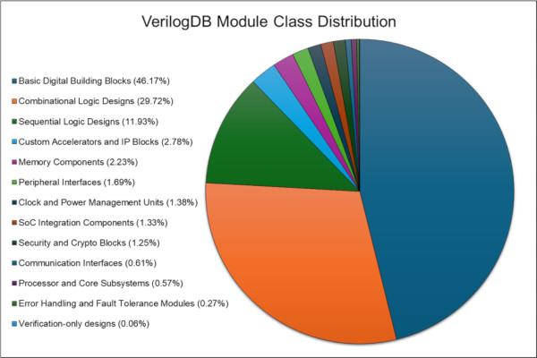
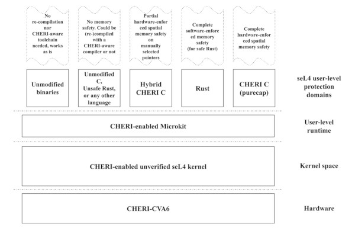
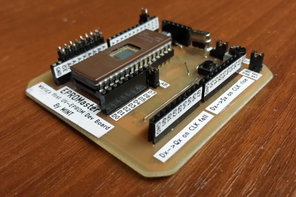
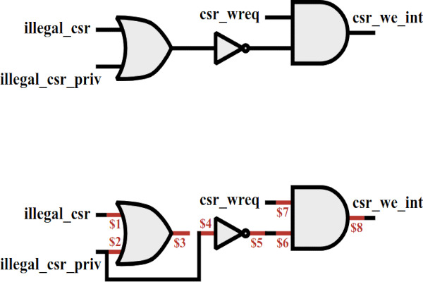

## Announcing the Release of LibreLane

Today, after years of work, and major turbulence from the shuttering of Efabless Corporation, I am delighted to finally announce the release of [LibreLane](https://github.com/librelane/librelane), the successor to OpenLane — a ground-up reimagining which implements OpenLane-compatible flows by providing an infrastructure with which flows can freely be created, customised, and distributed.  
  
LibreLane is a Python-based infrastructure for the implementation of highly customisable and repeatable ASIC flows. The default flow, “Classic,” replicates OpenLane near-perfectly — even supporting the very same configuration files, but also allows unparalleled flexibility by allowing people to write fully-custom advanced data-flows.  
  
Back at Efabless, as early as 2022, my colleagues ([Kareem Farid](http://github.com/kareefardi), [Mohamed Shalan](http://github.com/shalan)) and I started a project to rewrite OpenLane that we simply titled “OpenLane 2.” OpenLane 2 was a ground-up rewrite of OpenLane, with the goal of continuing to support OpenLane configuration files, but providing far more flexibility and consistency than OpenLane ever did. “OpenLane 2” was soft-launched at Efabless in February 2024, but we waited patiently to get silicon with strict timing requirements back to verify STA quality of results until we could officially recommend the new flow to our then-customers. About a year later, we did the tests in question, but due to funding challenges, Efabless shut down just days after.  

Undeterred, at the recommendation of my colleague, [Leo Moser](http://github.com/mole99), I joined the FOSSi Foundation with the intent of continuing to maintain OpenLane 2 myself. Given the complexity of having to acquire the relevant namespaces and such from Efabless, and the fact it was so different from OpenLane 1 anyway — we elected to simply rename the project “LibreLane.”

We designed LibreLane with three goals in mind. The first and most important principle is to retain the ease-of-use for OpenLane: Like OpenLane, LibreLane allows flows to be configured entirely with one Tcl, JSON or YAML file that allows you to get from RTL-to-GDSII. We also wanted to remain “batteries-included”: we continued to pursue methods of bunding flows with their requisite binaries so users would not have to go and build each tool, or be affected by API and or functionality breaks. Last, setting LibreLane apart from OpenLane, we wanted a well-documented API with which users can create their own flows.

We were able to recreate the OpenLane flow in a far, far more robust fashion, and empowered our place-and-route (PnR) engineers back at Efabless to accelerate their workflows by giving them the ability to implement their own steps including those that supported proprietary EDA tools, custom flows (including by [simply modifying the default flow from the configuration file](https://librelane.readthedocs.io/en/latest/usage/writing_custom_flows.html#by-substituting-steps)), and the ability to partially re-run flows to tweak a subset of variables. You can read more about the architecture in the [LibreLane documentation](https://librelane.readthedocs.io/en/latest/reference/architecture.html).  

LibreLane 2.4.0 is available for macOS and Linux (and Windows with WSL2). The [getting started guide](https://librelane.readthedocs.io/en/latest/getting_started/index.html) shows you how to install all requisite dependencies.  

This represents years of hard work by many, many people, my colleagues back at Efabless, my friends at Tiny Tapeout, and my new colleagues at the FOSSi Foundation. It is my sincere hope that LibreLane will make chip design easier and more accessible than ever, and we’re not nearly done. We are hard at work at version 3.0.0, which will add first-class IHP Open PDK support by Leo Moser and the Tiny Tapeout team as well as a number of changes for architectural consistency that will make using LibreLane even simpler.

_-Mohamed Gaber_

## Hannah Thoreson Reports on Open Sauce 2025

  
Developer and technologist Hannah Thoreson has published a report into the presence of free and open source silicon at Open Sauce 2025 - in what has become an ongoing series dubbed “How to Make Your Own Computer Chip.”

“The biggest new development in open source silicon fabrication is easily the development of the [HackerFab blueprint](https://docs.hackerfab.org/home) for creating a working chip fab in a garage, university research lab, or similar,” Hannah writes of her highlights from the event. "The project has some pretty ambitious goals: make integrated circuit prototyping as fast as 3D printing; make DIY version of every nanofabrication tool; get there with collaborative open source hardware.

"Relatively none of the first part has been achieved, but the second two pieces seemed to be in a state of rapid progress at Open Sauce 2025, where my good friend John McMaster had helped to organise a booth under the FOSSF (Free Open Source Silicon … SF?) umbrella. There he had a spherical chicken level approximation of the $200 million ASML TwinScan machine on display, affectionately dubbed the ‘TwimSkan.’

“Meanwhile Tim Ansell was also on hand evangelising a separate initiative, Tiny Tapeout, which HAS NOT SHUT DOWN, and a similar but more commercialised venture called wafer.space. These are less of a DIY project and more of a way for people to be able to purchase access to existing commercial fabs,” Hannah’s report continues.  
  
“TinyTapeout has mainly targeted students and hobbyists looking for a first experience taping out a chip, whereas wafer.space seems to be aimed more at companies that need to be able to manufacture something at a bit higher level of scale. It costs around $200 per person to participate in TinyTapeout as it is right now, though Tim seemed to believe that the price of participation could be brought down to around $70-80 if more people were interested in joining each shuttle.”

The full report is available [on Hannah’s website](https://www.brickstackr.com/posts/how-to-make-your-own-computer-chip-part-3); “overall,” she concludes, “it seems like a pretty promising time to be interested in open source silicon technology.”

## Matt Venn Calls for Contributions to a “Crowdsourced Microcontroller”

  
Tiny Tapeout’s Matt Venn has opened a call for contributors for an unusual project, even in the world of free and open-source silicon: the creation of a crowdsourced microcontroller.

“Want to help build a crowdsourced microcontroller? You’re invited to design peripherals (UARTs, timers, synths, etc.) for a RISC-V chip that will be fabbed for real,” Matt wrote on [Mastodon](https://chaos.social/@matthewvenn/114913517668958383) of the project’s launch. "Take part for free!

"We’re launching a collaborative competition to crowdsource the coolest, weirdest, and most useful peripherals for a RISC-V microcontroller - and we’re taping it out on TTSKY25a with [ChipFoundry.io](http://ChipFoundry.io). Whether you’re a hardware hacker, HDL hobbyist, student, or seasoned silicon wrangler, this is your chance to contribute to an open-source, community-built microcontroller that actually gets manufactured.

You bring the Verilog peripheral: UARTs, timers, graphics engines, musical synths, sensors, or something nobody’s thought of yet, and we’ll handle integration and physical tapeout. It’s collaborative, it’s competitive, and it’s an amazing excuse to learn, teach, and build together."

The project is being run through the Tiny Tapeout platform, which accepts tile-based open designs for fabrication on multi-project chips in order to split the cost of production, and requires that each contributed peripheral takes up two or fewer tiles on the chip. Only digital designs are being accepted, not analogue or mixed-signal, and while contributors can use any language for development the finished design must be in Verilog.

More information is available [on the Tiny Tapeout website](https://tinytapeout.com/competitions/risc-v-peripheral/), along with a list of prizes; submissions should be made before the deadline of the 5th of September 2025.

## RTLMeter Targets Verilator SystemVerilog Evaluation

  
Developer Geza Lore has written in to tell us of a new benchmark suite for Verilator and other open-source electronic design automation tools, providing a standardised set of inputs for easy performance comparisons: RTLMeter.

“RTLMeter [is] a benchmark suite for SystemVerilog that I have put together recently, with the initial aim to help evaluate changes to Verilator, and track performance using a standard set of known real world inputs,” Geza explains. "My hope was that it can be generally useful for anyone who works on any tooling that consumes SystemVerilog as input.

“It is a collection of complete open source designs, but with most external dependencies removed, and the sources imported so the collection is stable, without tracking upstream. The only non-trivial dependency should be the tool you want to evaluate. Currently there are some scripts included to evaluate Verilator performance, but the SV code should be usable for any other tool that consumes SystemVerilog, and I was trying to keep it fairly simple to aid reuse. I’m also happy to take changes to enable benchmarking other tools, and I am planning to add more designs over time.”

For those looking to use the benchmark with Verilator, the only other dependency required is Python 3.10 or higher. A [dashboard](https://verilator.github.io/verilator-rtlmeter-results/) provides a look at runs against nightly builds - while the [documentation](https://verilator.github.io/rtlmeter/)explains how to run it yourself.

The project’s full source code is available [on GitHub](https://github.com/verilator/rtlmeter) under the permissive Apache 2.0 licence, with the designs used as inputs shared under their original licence terms.

## A Gate-Level Intel 4004, in 4004 Bytes of C Code

  
Nicholas Carlini has deservedly walked away from the latest International Obfuscated C Code Contest with a winning place, thanks to a gate-level implementation of Intel’s venerable 4004 microprocessor - in just 4004 bytes of C code.

“The International Obfuscated C Code Contest results were announced this last weekend, and I was thrilled to see that my entry was among the winners,” Nicholas explains. writes. "[It’s] a feature-complete gate-level emulator for the Intel 4004 that’s capable of emulating the original Busicom 141-PF calculator ROM — the application for which the 4004 was originally designed.

"To make things exciting, this program doesn’t emulate the 4004 the ‘normal’ way. Instead, this program is actually just a logic gate simulator, but where I’ve designed an entire 4004 as circuit (microcoded for space!) that’s embedded in the program and then emulated. And because we’re 50 years in the future, this gate-level emulated calculator runs at a few hundred instructions per second which is actually fast enough to be usable, just as long as you’re not in a hurry.

“If one were to rank programs by human-hours-per-byte,” Nicholas concludes, “this program would be certainly top the ranking for the all the code I’ve ever written. I didn’t keep good track of this, but I’d estimate I spent probably a few hundred hours over the last four years working on it. (Honestly I felt kind of empty after submitting the code back in June. I’ve been working on this since almost the start of the pandemic, and whenever I felt like I had to take a break from my large (mostly Python) actual work this was the perfect place to come and fiddle with the bytes of a program that fits comfortably on a single piece of paper.)”

The project is documented in full, complete with its source code, [on Nicholas’s blog](https://nicholas.carlini.com/writing/2025/ioccc-intel-4004-in-4004-bytes-c.html).

## VerilogDB Delivers Data for Gen-AI Training

  
Researchers from the University of Florida have announced VerilogDB, a dataset of deduplicated and curated Verilog code with which they’re hoping to push forward the use of generative artificial intelligence (gen-AI) in chip design.

“Large Language Models (LLMs) are gaining popularity for hardware design automation, particularly through Register Transfer Level (RTL) code generation,” the team explains of the project. "In this work, we examine the current literature on RTL generation using LLMs and identify key requirements for training and fine-tuning datasets.

"We construct a robust Verilog dataset through an automated three-pronged process involving database (DB) creation and management with PostgreSQL, data collection from code hosting sites like OpenCores and GitHub, and data preprocessing to verify the codes’ syntax, run logic synthesis, and extract relevant module metadata. We implement a scalable and efficient DB infrastructure to support analysis and detail our preprocessing pipeline to enforce high-quality data before DB insertion.

“The resulting dataset comprises 20,392 Verilog samples, 751MB of Verilog code data, [and] is the largest high-quality Verilog dataset for LLM fine-tuning to our knowledge,” the researchers conclude. “We further evaluate the dataset, address associated challenges, and explore potential applications for future research and development in LLM-based hardware generation.”

The team’s work has been submitted to the Association of Computing Machinery (ACM), with a preprint available [on Cornell’s arXiv server](https://www.arxiv.org/abs/2507.13369); those interested in accessing the database are advised to contact the researchers.

## CHERI-seL4 and CHERI-Microkit Released

  
Hesham Almatary has announced the release of an “experimental” version of the seL4 microkernel which adds support for the Capability Hardware Enhanced RISC Instructions (CHERI) extensions - alongside a userspace framework dubbed CHERI-Microkit.

“We are happy to release a prototype of CHERI-seL4, an experimental version of the seL4 microkernel with CHERI support,” Hesham writes in the launch announcement. "This comes with CHERI-Microkit, a lightweight userspace framework, and a set of exercises and tutorials designed to help developers explore CHERI’s potential in a real microkernel environment.

"The release is aimed at developers who want to build and experiment with memory-safe C/C++ software on seL4. It supports the draft CHERI-RISC-V architecture and runs on QEMU, Codasip’s x730 processor, CHERI-Toooba and CHERI-CVA6 on FPGA.

“This initial release provides: a prototype implementation of the CHERI-seL4 RFC discussed with the seL4 community; support for the draft CHERI-RISC-V (Zcheri) architecture; compatibility with Codasip’s x730 processor, CHERI-Toooba, and CHERI-CVA6; a minimal kernel extension that supports memory-safe CHERI C in userspace while keeping the kernel unchanged when CHERI is disabled; CHERI-Microkit, a lightweight framework for running CHERI-enabled and unmodified C/C++ or Rust programs side by side; a set of exercises and tutorials to get developers started with CHERI on seL4.”

Full source code for [CHERI-seL4](https://github.com/CHERI-Alliance/CHERI-seL4) and [CHERI-Microkit](https://github.com/CHERI-Alliance/CHERI-Microkit) has been published to GitHub under a mixture of licences including the GNU General Public License 2 and the two-clause BSD licence; exercises are provided [in the project’s documentation](https://cheri-alliance.github.io/CHERI-seL4-Exercises/). For those interested in the project’s history, Hesham can be see talking about seL4 on RISC-V in a presentation at ORCONF 2015, following that year’s Google Summer of Code, [on the FOSSi Foundation YouTube channel](https://www.youtube.com/watch?v=M8tE0seyNzE).

## RFC Opens on Upstreaming CHERI Target Support in LLVM

  
Owen Anderson, Jessica Clarke, Alex Richardson, and David Chisnall have issued a request for comment (RFC) on upstreaming support for CHERI-enabled architecture targets in the LLVM project.

“This RFC is a proposal to gain consensus on upstreaming target support for the CHERI-enabled architectures to the LLVM project,” the developers explain. "This is an ‘entire project’ RFC, as CHERI support touches many parts of the toolchain: primarily LLVM, Clang, and LLD, with other components such as runtime libraries or LLDB potentially being touched as well.

"Upstreaming many of these sub-components of CHERI support will likely merit their own area-specific RFCs. The purpose of this RFC is to seek consensus on the directional goal of upstreaming CHERI support, not to get into the details of the individual parts. One item of note is that we do propose upstreaming support for the RISC-V CHERI platforms as a component of this work, as we believe it is important to have at least one end-to-end functional toolchain for available hardware in upstream LLVM for testing purposes.

“The core of this proposal is to upstream the required elements from CTSRD-CHERI/llvm-project and CHERIoT-Platform/llvm-project into llvm/llvm-project to make targeting RISC-V CHERI platforms with an upstream build of Clang/LLVM possible. By upstreaming the backend components of at least one CHERI-enabled architecture along with general CHERI support, we will be able to ensure that the upstream codebase is tested end-to-end.”

The RFC, which has already gained numerous comments in support of the proposal, is available [on the LLVM forum](https://discourse.llvm.org/t/rfc-upstream-target-support-for-cheri-enabled-architectures/87623/15).

## EPROMINT is an Eight-Bit CPU Built from EPROMs

  
Pseudonymous maker “MINT” has taken inspiration from Zilog’s classic Z80 microprocessor in the design of the EPROMINT, a very-much-not integrated eight-bit CPU made up of discrete EPROM chips.

“It took three months of work, long days with a soldering iron in hand and hundreds of hours of typing on the keyboard,” MINT explains in an overview video, translated from the original Polish. "It started with collecting a large amount of old memory chips. I started experimenting with them, and it quickly turned out that you can make really cool things out of these seemingly useless old things. After adding a few external systems, a development board was created based on a single memory chip would could be programmed to perform any relatively simple task.

“If you connected several boards of this type together, you could create something that could implement really complex functionalities with the help of many simple actions. Adding to this the fact that I had been delving into topics related to retro electronics for a long time, I decided to build something modelled on processors from a previous era, processors that started the computerisation of the world.”

The result was the EPROMINT, an eight-bit CPU inspired by but not a copy of the Zilog Z80 - delivering, its creator claims, a more flexible instruction set and a much more powerful arithmetic and logic unit. “The CPU is little-endian and has [a] 16-bit address bus (64k memory space),” MINT explains. "It has four eight-bit working registers [and] an additional F (Flags) register providing eight flags out of which all can be used to determine conditional branching.

“[The] presented CPU provides significant advantages over [the] [Intel] 8051, [Zilog] Z80, [MOS] 6502 and other CPUs from [the] eight-bit era. There are, however, some disadvantages: EPROMINT weighs 0.5kg, requires dozens of logic chips, and weeks of soldering. But it works, and even has a C compiler development in progress!”

More information is available in MINT’s video [on YouTube](https://www.youtube.com/watch?v=xBB1nAUvuqU); project documentation and source code are available [on GitHub](https://github.com/majsterkowanieinietylko/EPROMINT) under the permissive MIT licence.

## Encarsia Provides Evaluation of CPU Fuzzers

  
A team of researchers from ETH Zurich have released Encarsia, a tool which aims to evaluate CPU fuzzers through the automatic injection of bugs - proving its capabilities on three free and open-source RISC-V CPU designs.

“Encarsia is the first automated framework for injecting realistic hardware bugs,” the team writes. "It derives its injection methodology from a comprehensive survey of 177 real-world bugs in open-source CPUs, identifying recurring structural patterns in how these bugs manifest. By replicating these patterns, Encarsia generates comprehensive bug sets that provide controlled evaluation targets for hardware fuzzers.

"This improves existing evaluation methodologies, which are often based on unproven theories or do not allow for direct comparisons between fuzzers. Our evaluation of CPU fuzzers on Encarsia-injected bugs challenges common assumptions, revealing for example that structural coverage metrics, often advertised as central by many fuzzers, do not enhance bug detection. These findings lay the foundation for more effective fuzzing strategies, making Encarsia a pivotal step toward a standardised, data-driven CPU fuzzing research.

“We evaluated three state-of-the-art CPU fuzzers: DifuzzRTL, ProcessorFuzz, and Cascade,” the researchers continue. “Our results showed that DifuzzRTL and ProcessorFuzz each detected 41.67% of the injected bugs, while Cascade detected 40%. These detection rates indicate that Encarsia effectively injects hard-to-find bugs that can serve as a meaningful benchmark for evaluating CPU fuzzers. Furthermore, the results suggest that fuzzers are still far from exhaustive in their bug-finding capabilities, highlighting the need for further advancements in hardware fuzzing research.”

More information is available [on the project website](https://comsec.ethz.ch/research/hardware-design-security/encarsia/), complete with a link to the paper as presented at the USENIX security conference. Source code is available [on GitHub](https://github.com/comsec-group/encarsia) under the reciprocal GNU General Public Licence 3.

**Have feedback or news for inclusion in a future newsletter? Please send this to [ecl@fossi-foundation.org](mailto:ecl@fossi-foundation.org)**.

**Subscribe to [get El Correo Libre direct to your inbox](http://eepurl.com/dnL4v1).**
