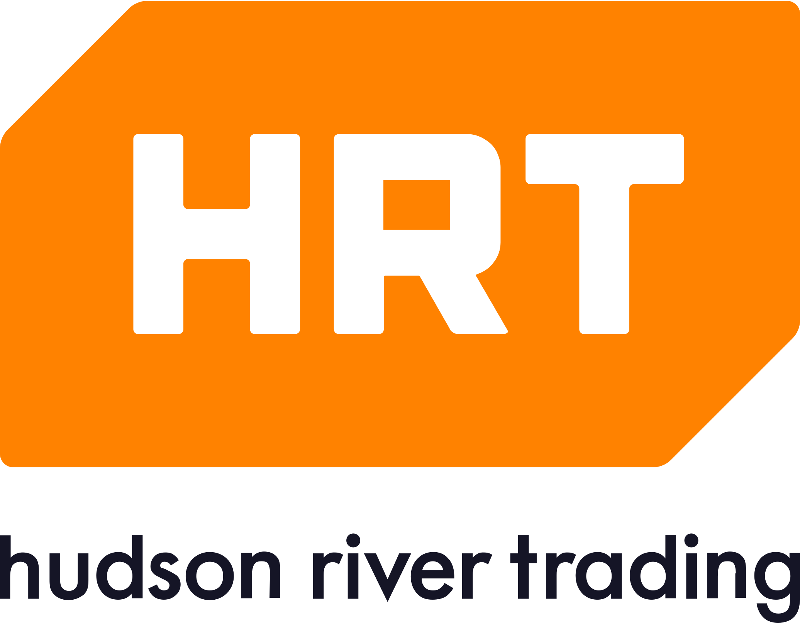

::ff-signpost-banner
---
title: Latch-Up 2024
class: "bg-[url('/images/banner-orconf.jpg')]"
---

Friday to Sunday April 19&ndash;21, 2024 in Cambridge, MA, USA

The Latch-Up conference is a weekend of presentations and networking dedicated to free and open source silicon. It's an event for the open source digital design community, much like its European sister conference ORConf, run by the FOSSi Foundation.
::

::ff-supporting-content
## Latch-Up 2024 is Go!

The FOSSi Foundation is proud to announce Latch-Up, a conference dedicated to free and open source silicon to be held over the weekend of Friday April 19 to Sunday April 21 in Cambridge, MA, USA.

Latch-Up is a weekend of presentations and networking for the open source digital design community, much like its European sister conference [ORConf](https://orconf.org).

Registration has now closed. If you have registered and can no longer attend, please cancel your registration via the link in the email you received upon registering.

Questions? Ping the organizers via [@LatchUpConf](https://twitter.com/LatchUpConf) or send an email to [latch-up@fossi-foundation.org](mailto:latch-up@fossi-foundation.org?subject=Question).

### Quick Links

[Venue](#venue) | [Schedule](#schedule) | [Programme](#programme)
::

::ff-container

## Chat

Chat with fellow Latch-Up attendees in our Matrix chat room at [#latchup2024:fossi-foundation.org](https://matrix.to/#/#latchup2024:fossi-foundation.org).
Any Matrix client works, or just use the Element web chat.

## Submit a talk

Presentation submissions have now closed. There may be lightning talk slots availble, if you'd like to enquire about this, please email the organizers at [latch-up@fossi-foundation.org](mailto:latch-up@fossi-foundation.org?subject=Lightning)

## Code of conduct

We ask all Latch-Up participants to adhere to the the [FOSSi Foundation code of conduct](/code-of-conduct) throughout the event.

## Sponsors

This year's Latch-Up is made possible by our very generous sponsors.

## Venue

[Massachusetts Institute of Technology, Cambridge](https://www.mit.edu/)

[MIT Schwarzman College of Computing](https://maps.app.goo.gl/sysnMzoV7tPuoUAr9)
51 Vassar Street (Building 45), room 230
Cambridge, MA 02139-4307

## Schedule

### Friday

| When  | What                                                                                 |
|-------| -------------------------------------------------------------------------------------|
| 8:00  | Room 230 MIT building 45 open, coffee served                                                             |
| 9:00  | Welcome                                                                              |
| 9:20  | [Caster: An Open-source E-Ink Controller](#caster-an-open-source-e-ink-controller)                                              |
| 9:40  | [Teaching Modern EDA using a Tapeout-Centric University Course](#teaching-modern-eda-using-a-tapeout-centric-university-course)                        |
| 10:00 | [CedarEDA for open source silicon](#cedareda-for-open-source-silicon)                                                     |
| 10:20 | [Cohort: Software-Oriented Acceleration for You, Me, and Our Heterogeneous SoCs](#cohort-software-oriented-acceleration-for-you-me-and-our-heterogeneous-socs)       |
| 10:40 | [Towards xBGAS on CHERI: Examining the Benefits of a Secure Distributed Architecture](#towards-xbgas-on-cheri-examining-the-benefits-of-a-secure-distributed-architecture)  |
| 11:00 | Group photo                                                                                |
| 11:20 | Lunch                                                                                |
| 12:20 | [Towards Cycle-accurate Simulation of xBGAS](#towards-cycle-accurate-simulation-of-xbgas)                                           |
| 12:40 | [Artifact Evaluation for the Field Programmable Gate Array Community](#artifact-evaluation-for-the-field-programmable-gate-array-community)                  |
| 13:00 | [Chisel 6 and beyond](#chisel-6-and-beyond)                                                                  |
| 13:20 | [MRPHS: Enabling Transaction-level Deductive Formal Verification Through PDVL](#mrphs-enabling-transaction-level-deductive-formal-verification-through-pdvl)         |
| 13:40 | Break                                                                                |
| 14:20 | [Architecture 2.0: Toward Open Source Foundation Models and Datasets for Hardware Design](#architecture-20-toward-open-source-foundation-models-and-datasets-for-hardware-design) |
| 14:40 | [Riding The Wave: Building Wave Pipelines in FPGAs](#riding-the-wave-building-wave-pipelines-in-fpgas)				       |
| 15:00 | [Giving Students A Byte of Open-Source: Advancing Hardware Education](#giving-students-a-byte-of-open-source-advancing-hardware-education)		       |
| 15:20 | Break										       |
| 15:40 | [Open-source resources for learning the Bluespec HL-HDLs](#open-source-resources-for-learning-the-bluespec-hl-hdls-along-with-risc-v)			       |
| 16:00 | [PyHDL-IF: An Easy-to-Use Python/HDL Cross-Calling Interface](#pyhdl-if-an-easy-to-use-pythonhdl-cross-calling-interface)			       |
| 16:20 | [Transition to Draper](https://maps.app.goo.gl/KQXrPpPShV2NKB6V7)								       |
| 17:00 | Talks at Draper							       |
| 18:00 | [Transition to VenCaf](https://maps.app.goo.gl/W1upBAuTJR9eL3tEA)                                                        |
| 19:00 | Lightning Talks at VenCaf							       |
| 20:00 | Go home                                                                              |

### Saturday

| When  | What                                                                                          |
|-------| ----------------------------------------------------------------------------------------------|
| 8:00  | Room 230 MIT building 45 open, coffee served                                                             |
| 8:40	| Welcome                                                                                       |
| 9:00	| [Open source RTL verification with Verilator](#open-source-rtl-verification-with-verilator)							|
| 9:20	| [Sonata: A development platform to enable exploring the use of CHERI for embedded applications](#sonata-a-development-platform-to-enable-exploring-the-use-of-cheri-for-embedded-applications)	|
| 9:40	| [Transparent Checkpointing for Fault Tolerance in RISC-V](#leveraging-transparent-checkpointing-for-fault-tolerance-in-risc-v)					|
| 10:00	| Break												|
| 10:20	| [HDLAgent, Enhancing Hardware Language in the age of LLMs](#hdlagent-enhancing-hardware-language-in-the-age-of-llms)					|
| 10:40	| [Spade: An HDL Inspired By Modern Software Languages](#spade-an-hdl-inspired-by-modern-software-languages)						|
| 11:00	| [Switchboard: Calling All Hardware Models](#switchboard-calling-all-hardware-models)							|
| 11:20	| Lunch												|
| 12:20	| [From an Open-Source ISA to Open-Source HW to Open-Source Silicon](#from-an-open-source-isa-to-open-source-hw-to-open-source-silicon)				|
| 12:40	| [Open Source Hardware: Hacking Silicon for Fun (instead of profit)](#open-source-hardware-hacking-silicon-for-fun-instead-of-profit)				|
| 13:00	| [A History of TL-Verilog Google Summer of Code Projects under FOSSi Foundation](#a-history-of-tl-verilog-google-summer-of-code-projects-under-fossi-foundation)			|
| 13:20	| [UMI: Universal Memory Interface](#umi-universal-memory-interface)								|
| 13:40	| Break												|
| 14:20	| [ABC: The Way It Should Have Been Designed](#abc-the-way-it-should-have-been-designed)							|
| 14:40	| [Chip Whisperer](https://www.newae.com/chipwhisperer)							|
| 15:00	| [Beyond EDA lies Edalize](#beyond-eda-lies-edalize)									|
| 15:20	| Break												|
| 15:40	| [RF Front-end receiver design for 2.4GH/5GHz WiFi application](#rf-front-end-receiver-design-for-24gh5ghz-wifi-application)					|
| 16:00	| [CACE Study: Open source analog and mixed-signal design flow](#cace-study-open-source-analog-and-mixed-signal-design-flow)					|
| 16:20	| [IHP Open Source PDK: Announcement, Setup, Current State and Experiences, and look ahead](#ihp-open-source-pdk-announcement-setup-current-state-and-experiences-and-look-ahead)	|
| 16:40	| [Tiny Tapeout: custom silicon open to all](#tiny-tapeout-custom-silicon-open-to-all)							|
| 17:20	| Meet at [Flat Top Johnny's](https://maps.app.goo.gl/9jcuqYBQEuMAhbaF9)                                                                              |

### Sunday

Sunday workshops and BoF meetings will run in parallel

| When        | Who          | What                                                 |
|-------------| ------------ | -----------------------------------------------------|
| 9:00-11:30  | Steve Hoover | A Taste of TL-Verilog in the Context of Tiny Tapeout |
| 9:00-11:00  | Michel Kinsy | BGAS-Zeno: An Open Capability-Based Secure Compartmentalization Architecture |
| 9:00-TBD    | Kaleb Barrett | BoF - Python-based HDL tooling |
| 12:00-14:00 | Tim Edwards  | CACE tutorial |
| 12:00-TBD   | Steve Hoover | BoF - Education |
## Programme

### Beyond EDA lies Edalize

#### Olof Kindgren

Originally a part of the award-winning FuseSoC, Edalize is now a stand-alone Python library for interfacing with EDA (Electronic Design Automation) tools. It allows users to programmatically construct, manage, and run simulations, synthesis, and other EDA workflows for digital design projects. Edalize abstracts the backend tools by providing a common interface for 40+ different EDA tools such as Verilator, Icarus Verilog, Yosys, Vivado, Quartus, OpenROAD and others.

The purpose of Edalize is to make it easier to integrate EDA tools into other systems and frameworks, such as continuous integration setups, by providing a consistent API. It also aims to simplify the process of running EDA tools across different environments and platforms.

This presentation will look at the latest and upcoming changes to Edalize that intends to make it easier to integrate in existing build setups and more flexible to support more complex workflows.

### MRPHS: Enabling Transaction-level Deductive Formal Verification Through PDVL

#### Tobias Strauch

Theorem-Proving is also called “Deductive Formal Verification, DFV”. In this presentation I will give an overview of open source DFV projects as well as introduce my own project. I developed the language PDVL to revolutionize design verification. One of the verification disciplines that PDVL will have a major impact on is DFV. In this presentation, I will show how the aspect-oriented and transaction-level based approach of the Programming Design and Verification Language (PDVL) provides important advantages for transforming your design and verification goals into Gallina code that can be used for assertions and theorem proving by "The Rocq Prover” (formerly known as the Coq Proof Assistant). A regular paper on this work was accepted at the DATE 2024 conference. The open-source files can be found here: PDVL specification: https://github.com/cloudxcc/PDVL PDVL examples: https://github.com/cloudxcc/PDVL_Examples MRPHS compiler: https://github.com/cloudxcc/MRPHS

### Spade: An HDL Inspired By Modern Software Languages

#### Frans Skarman

In the software world, the state of the art of programming languages has evolved continuously over the past three decades. In the hardware description domain however, the development has been much slower with most people still using VHDL or Verilog which originated in the 80s. Spade is a new HDL with the goal of bringing innovations and ideas from software languages into the hardware world. In this talk, I will first briefly introduce the basics of the Spade language. Then I will demonstrate how some stand-out features such as native constructs for pipelining, the rich rust-inspired type system, and ports modelled using affine types can be used to increase developer productivity, especially when refactoring or integrating existing code. Spade is an Open Source project licensed under the EUPL-1.2. You can learn more at https://spade-lang.org/

### CACE Study: Open source analog and mixed-signal design flow

#### Tim Edwards

With the recent introduction of multiple open-source foundry process design kits (PDKs), open source digital flows for custom chip design have largely standardized around yosys and OpenROAD/openlane. Open source design flows for analog and mixed-signal circuits have lagged behind. Most designers use a combination of xschem, ngspice, klayout, and magic. But there is little standardization of project structure, specification, testbench methodology, and datasheet generation. The CACE system, originally designed for the Efabless platform, addresses the need for a system around the specification of circuit performance, with a standard way to simulate circuits over all process, voltage, and temperature corners, and automatically collate results into a datasheet of electrical and physical parameters with maximum/typical/minimum values, pass/fail results, and tables and graphs on demand. This presentation explores the capabilities of CACE and looks at current and future development directions.

### Switchboard: Calling All Hardware Models

#### Steven Herbst

Switchboard is a high-performance and easy-to-use tool for simulating a mixture of digital hardware models, developed by Zero ASIC. Models can be represented with RTL simulation, RTL implemented on FPGAs, C++, or Python, with inter-model communication happening over fixed, unidirectional connections that mimic how a real system would be wired together. Under the hood, Switchboard connections are implemented as shared-memory queues, making them quite fast: up to 1 GB/s bandwidth / 200 ns latency. Because the queues have a simple, standardized memory layout, they are convenient to access from RTL implemented on FPGAs. Switchboard powers the multi-chiplet cloud FPGA emulation system on Zero ASIC's website, where it is fast enough to boot Linux and run ML models on emulated hardware in near realtime. We also use Switchboard on a smaller scale for running Python-based block-level tests; its Universal Memory Interface API, combined with its low setup overhead, makes Switchboard an efficient way to write one-off tests. In other words, Switchboard is fast enough to run big workloads, but easy enough to use that it has become a go-to for daily hardware design tasks.

### From an Open-Source ISA to Open-Source HW to Open-Source Silicon

#### Luca Bertaccini

In this talk, we will provide a comprehensive overview of the PULP platform's open-source activities and roadmap: starting from an open-source instruction set architecture (ISA) to open-source hardware IPs to the employment of open-source EDA tools. In addition, we will cover the benefits we experienced thanks to this open-source model, the challenges we overcame in the past years, and the ones we are currently facing.

### A History of TL-Verilog Google Summer of Code Projects under FOSSi Foundation

#### Steve Hoover

Every summer since 2005, Google has sponsored students to learn about and contribute to open-source projects in Google Summer of Code (GSoC). Since 2016, the Free and Open Source Silicon (FOSSi) Foundation has served as an "umbrella organization" in Google Summer of Code, coordinating projects related to open-source circuit design and EDA. Transaction-Level Verilog (TL-Verilog) is a technology that has evolved over this period of time, and it has been utilized in numerous projects under FOSSi Foundation since 2018 as well as two this past year in CHIPS Alliance. Student contributions in GSoC have been instrumental in advancing the ecosystem for TL-Verilog, the accessibility of hardware design, and the quality of semiconductor education. This talk will provide a very brief overview of TL-Verilog and survey the contributions of the fifteen GSoC projects that utilized it. These include: FPGA-accelerated web applications, block-based circuit design (like scratch.mit.edu), a virtual FPGA lab, formal verification innovation, a transaction-level component library, a tensor core study, simulation visualization, many-core projects, and TL-Verilog support in other open-source infrastructure and Open MPW shuttles. These projects resulted in publications, conference awards, and prominent blog posts.

### HDLAgent, Enhancing Hardware Language in the age of LLMs

#### Jose Renau

Large Language Models (LLMs) are revolutionizing the programming language landscape, enabling beginners and transforming code generation. This work explores the challenges and implications of integrating LLMs with Hardware Description Languages (HDLs).

### Caster: An Open-source E-Ink Controller

#### Wenting Zhang

In this talk I will present the Caster project. Caster is an open-source low-latency electrophoretics display (like E-Ink) controller soft IP design, offering support for wide range of screens, flexible screen update control, and multiple dithering options. An reference implementation of an Eink monitor using the Caster on an FPGA is also provided, with fully open-source RTL, PCB and enclosure design.

### UMI: Universal Memory Interface

#### Andreas Olofsson

Standardized bus architectures like Wishbone and AXI have helped designers construct complex systems from a basic set of interface compliant building blocks ("IPs"). The bus approach has worked well for decades, but requires a large number of wires to implement and does't scale particularly well. For PCB design and System-In-Package design, there are orders of magnitude less wires available and we need to take a fundamentally different approach to communication. The Universal Memory Interface (UMI) is a transaction based communication standard for accessing memory through request-response message exchange patterns, designd to work equally well for complex System-On-Chip designs and chiplet based System-In-Package design. UMI includes a complete open source reference implementation that has been used to design and manufacture four different chiplets in a 12nm CMOS process.

### Open Source Hardware: Hacking Silicon for Fun (instead of profit)

#### Troy Benjegerdes

This is an updated version of a talk I gave at Systems We Love in Minneapolis in 2017 (https://www.youtube.com/watch?v=cyfSgcQeWqc), listing what's happened between then and now, and how far we might be from the future where orbital farmers design and fabricate replacement silicon for space rated robots.

### IHP Open Source PDK: Announcement, Setup, Current State and Experiences, and look ahead

#### Frank Vater

Main focus of this talk is the SG13G2 Open Source PDK for IHP 130nm BiCMOS technology. The current state of our activities will be given for the analogue as well as for the digital PDK including design flow with open source tools. Some more details on first experiences for schematic driven design, simulation, layout, DRC and LVS will be pointed out. Furthermore, already known challenges analogue and digital design flow and open issues on open source tool chain will be addressed. The talk will be closed with a road map for future work.

### Tiny Tapeout: custom silicon open to all

#### Pat Deegan

Tiny Tapeout is an educational project that makes it easier and cheaper than ever to get your digital designs manufactured on a real chip, and it's capabilities have been growing in leaps and bounds: speed, analog support, so many goodies. We'll walk through the process, touch on how it all works and explore the possibilities.

### Clean up your EDA flows with tclint

#### Noah Moroze

The process of realizing a chip design in silicon often requires writing complex EDA flows in Tcl, an old scripting language full of pitfalls and quirks. If not developed carefully, these codebases become hard to read and maintain, and may have subtle bugs. In addition, testing and debugging this code can be very time-consuming due to long EDA tool runtimes. tclint is an open-source utility that helps developers efficiently write and maintain clean and bug-free EDA tool flows. It does so by statically analyzing Tcl code and flagging possible stylistic and functional issues. By adopting tclint, EDA flow developers can apply modern software engineering best practices to flow development, saving time while producing higher-quality and more maintainable code. In this talk, we show how tclint can be used in practice to clean up flows, providing examples of usage in real-world open source projects and bugs it has found in these projects. In addition, we discuss future plans for tclint, including further tailoring it to EDA use-cases via plugins for checking usage of EDA tool-specific commands. Compared to prior work, tclint is designed to be simpler to install and easier to use. If your work entails writing or maintaining Tcl code, then we hope this talk inspires you to try out tclint for yourself and contribute any feedback you may have!

### CedarEDA for open source silicon

#### Keno Fischer

The Cedar EDA suite of tools is a brand-new, commercial-grade suite of tools for analog chip design. Written from the ground up with performance and openness in mind, Cedar uses a library-based design to easily allow users to customize their tools, share there improvements and build fully custom workflows while making use of best practices from the software world including continuous integration and verification and modern package management. Cedar comes with out of the box support for the open source Sky130 and GF180 PDKs and is being made freely available to the open hardware community. In this talk, I will give a brief tour of some of the cool new things Cedar lets you do and why you might want to consider using it for your next open source chip tapeout.

### Application of AI-computer vision based software to rate and manage roads surface condition

#### Max Faramarzi

Application of AI-computer vision based software to rate and manage roads surface condition

### Open-source resources for learning the Bluespec HL-HDLs along with RISC-V

#### Rishiyur Nikhil

We will provide an overview of free and open-source course-material (textbook, slides, working code, etc) that we have recently developed for simultaneously learning the Bluespec HL-HDLs (High-Level Hardware Design Languages), basic principles of RISC-V, and simple pipelined CPUs.

### Chisel 6 and beyond

#### Jack Koenig

Chisel (formerly Chisel 3) is a hardware generator language embedded in the Scala general-purpose programming language. It empowers hardware designers to write reusable hardware generators to improve the productivity of design. At Latch Up last year, we discussed the new MLIR FIRRTL compiler and how that would enable more rapid feature development for Chisel. Today we are proud to discuss several of the new features of Chisel 6 and the coming Chisel 7 which improve verification and other non-design aspects of using the language.

### PyHDL-IF: An Easy-to-Use Python/HDL Cross-Calling Interface

#### Matthew Ballance

Python, through libraries such as cocotb, can be used to interface at the signal level to Verilog and VHDL hardware description language (HDL) simulations, and can offer a very productive alternative to the SystemVerilog/UVM testbench methodology. But, what if you have an existing SystemVerilog or UVM testbench and want to call a reference model implemented in Python? What if you want to write tests in Python and call tasks on an existing protocol verification IP (VIP) implemented in SystemVerilog? Existing approaches often involve complexities of generating C/C++ wrapper code and getting it properly compiled and linked with the simulator. Often, the wrapper-generation process must be performed by the end user, making it more difficult to produce reusable libraries that are easily used by others. In addition, differences between simulator implementations of multithreading and Python’s co-routine implementation impose significant obstacles to implementing time-consuming behavior that spans HDL and Python code. The PyHDL-IF family of Python libraries provides a (very-nearly) pure-Python interface that enables object-oriented cross-calling between Python and HDL environments. PyHDL-IF enables Python to be easily incorporated in SystemVerilog environments and enables cocotb environments to interact with the HDL environment via task calls.

### Riding The Wave: Building Wave Pipelines in FPGAs

#### Rice Shelley

Wave pipelining is an unconventional digital design technique that offers a novel approach to data processing in FPGA designs. Unlike traditional pipelines, wave pipelines allow the fmax of a combinational logic block to be limited not by its maximum delay but by the difference between the maximum and minimum delays. This approach involves applying a new set of operands to the input of a combinational logic block before the current set of operands appears at its output, enabling multiple ""waves"" of data to travel through the circuit simultaneously.

This talk will explore the construction and optimization of wave pipelines in FPGAs, focusing on leveraging SpinalHDL and manual placement techniques. We will begin by summarizing existing research and comparing our results to a classical pipeline, highlighting the advantages of wave pipelines. We will then delve into the specifics of our construction, detailing how manual placement techniques were used to fine-tune the design. A project for testing wave pipelines will be provided along with an example multiplier wave pipeline.

Designing wave pipelines in FPGAs offers the opportunity to gain familiarity with a specific FPGAs architecture, timing analysis, and outside the box thinking in FPGA development. Whether you're new to FPGA development or an experienced designer, this talk will provide valuable insights into building efficient and high-performance wave pipelines in FPGAs.

### ABC: The Way It Should Have Been Designed

#### Alan Mishchenko

Almost two decades ago, in September 2005, the first public version of ABC was released. It featured technology-independent synthesis using DAG-aware rewriting, technology mapping for standard cells and lookup tables, and simple combinational equivalence checking, all based on the And-Inverter Graphs (AIG) data-structure used to unify the computation flow. In the coming years ABC has been adopted as an optimization engine and a research environment by a number of academic and industrial users. The use that followed exposed a number of shortcomings in the original design of ABC. This talk focuses on what is present and, more importantly, what is missing in ABC, and how ABC could be improved to make it more versatile and user-friendly. The motivation for this talk is to help academic researchers maximize the usefulness of their tools and to set a new standard for future versions of ABC.

### Cohort: Software-Oriented Acceleration for You, Me, and Our Heterogeneous SoCs

#### Nazerke Turtayeva

Accelerator communication is a hot topic today, and things get especially “interesting” when connecting various accelerators into highly heterogeneous SoCs. A major problem comes from mismatches between non-standard custom accelerator interfaces, differing coherency, addressing and memory alignment requirements that software developers have to fix. Hence, these hinder scaling of core to accelerator and inter-accelerator communication. To solve this problem, we built the Cohort platform that lets developers orchestrate their accelerators in a software oriented manner. In particular, we provide a user-friendly and scalable software API based on high-performance shared memory queues and a hardware wrapper around each accelerator. Our prototype, built on top of OpenPiton, improves over the performance of MMIO and coherent DMA and is accessible open source! So, please attend our talk and explore what fun things you can do with your next super heterogeneous SoC!

### Giving Students A Byte of Open-Source: Advancing Hardware Education

#### Ethan Sifferman

In the rapidly expanding semiconductor industry, there is an increasing demand for skilled chip developers. Yet, the steep learning curve associated with Hardware Description Languages often acts as a significant barrier for students hoping to pursue a career in digital design. As a UC Santa Cruz Lecturer, I will demonstrate how SystemVerilog has become more accessible through open-source resources such as FuseSoC, Verilator, Yosys, DigitalJS, CVA6, Ibex, Sky130, and more. Key points include the superior pedagogical features of open-source tools compared to commercial alternatives, the availability of open-source designs as references for writing scalable RTL, and the effectiveness of open-source PDKs and netlist viewers for deeper synthesis comprehension. Throughout the presentation, I will present applied case studies originating from esteemed institutions like UC Santa Barbara and UC Santa Cruz, alongside supplementary content available on my educational YouTube channel.

### Artifact Evaluation for the Field Programmable Gate Array Community

#### Miriam Leeser

Field Programmable Gate Arrays (FPGAs) are on the border between hardware and software. The software community has adopted Artifact Evaluation (AE) for publications, where authors can have their code and data evaluated by a third party and receive badges based on the evaluator's results. I introduced AE to the FPGA commmunity five years ago, and it has been adopted by the major FPGA conferences and publications. I will discuss badges available for artifacts (for hardware and software as well as data) from ACM and IEEE. I will highlight the benefits as well as the unique challenges in evaluating artifacts for FPGAs. AE promotes reproducible results in our community.

### BYOL (Build Your Own Linter) – UVMLint for IEEE-UVM core code development

#### Ajeetha Kumari Venkatesan

UVM is the most adopted design verification methodology in the field of ASIC and FPGA designs. Lint and static checking of code has proven to be very effective in projects that have a wide user base, longer lifetime, and distributed developers. During the recent UVM IEEE 1800.2-2023 release cycle, an observation was made regarding the potential application of a custom UVMLint solution to lint the UVM Base Class Library (BCL) as it gets developed, updated etc. We at AsFigo have developed custom rules for linting UVM BCL code on top of PySlint, an open-source SystemVerilog testbench linter. We intend to offer this as an opensource lint package to the UVM IEEE committee and to the general audience via public GitHub repository. The eventual goal is to have these rules as gatekeepers via GitHub actions so that any future code addition to the UVM BCL is free from common pitfalls. Based on early brainstorming, below are some of the sample lint rules that are relevant to the UVM BCL codebase: • Avoid race condition around "static const" (use localparam instead) • Avoid one-liner conditional statements: `if (cond) $display ("cond");` `if (cond) .. else $display ("Else cond as single line");` `case..endcase`  Avoid one-liner code in loops: o for, repeat, while, do..while, foreach • Use enadlabels for elements such as endclass, endfunction, endtask etc. • Flag non-virtual methods Typical UVMLint rules for a VIP user would be quite different from the requirements of UVM BCL. These rules are tailored for UVM BCL codebase. As an example, a typical UVMLint rule for a VIP would be: • Check that agent is reusable by ensuring that active components are guarded with a conditional check to `is_active == UVM_ACTIVE` Such a rule is not quite useful for UVM BCL as it provides the base class library for tens of thousands of engineers around the globe using this library to build VIPs, verify their IPs, Systems etc. which ends up in your hardware using open-source initiatives. In this talk we show this cusotm approach for UVMLint development with sample Python code, tests, and results. A snapshot of UVMLint findings on latest IEEE 1800.2-2023 codebase using open source is below: ** Violation count by Rule-IDs ** DBG_CL_MISSING_ENDLABEL : 286 DBG_METHOD_MISSING_ENDLABEL : 1899 DBG_FN_MISSING_ENDLABEL : 752 DBG_AVOID_ONE_LINER_IF : 73 DBG_AVOID_ONE_LINER_ELSE : 88 RACE_NO_STATIC_CONST : 8 REUSE_NON_VIRTUAL_METHOD : 1407 --- UVMLint Concise Report --- Total number of rules violated: 7

### Towards Cycle-accurate Simulation of xBGAS

#### Jie Li

High-performance computing (HPC) systems are evolving to address data-intensive workloads, shifting from monolithic architectures to integrated setups with microprocessors, accelerators, and advanced interconnects. However, this transition introduces complexities, latency challenges, and performance bottlenecks in large-scale parallel applications. To tackle these issues, the Extended Base Global Address Space (xBGAS) project enhances memory addressing through innovations in Instruction Set Architecture (ISA) and microarchitecture. Leveraging RISCV’s extensibility, xBGAS integrates an extended register file and new instructions, enabling efficient global memory access. In this presentation, we introduce REV-xBGAS, a cycle-based simulator using the Structural Simulation Toolkit (SST) to model xBGAS-enabled processors. With SST’s modularity, REV-xBGAS allows easy configuration of network latencies, bandwidths, and topologies, enabling performance evaluations under varied conditions.

### Towards xBGAS on CHERI: Examining the Benefits of a Secure Distributed Architecture

#### Mert Side

The exploration of bringing the Extended Base Global Address Space (xBGAS) Runtime to CHERI-enabled ARM Morello platforms presents a novel intersection of capabilities-based security and the conveniences of a global address space programming model. This poster details our work retrofitting the xBGAS Runtime for compatibility with CHERI's hardware-enforced bounds and capabilities, ensuring seamless yet secure access to the extended memory spaces. Central to our approach is the transition from platform-specific mechanisms to a more universally applicable threading model. We harness the power of pthreads combined with advanced thread pooling techniques, providing an architecture-independent foundation for simulating the runtime library. This transformation facilitates xBGAS's integration with Morello and o]ers scalability advantages, potentially benefiting a broader range of platforms. Preliminary evaluations indicate performance gains and potential reductions in the overhead typically associated with such cross-platform adaptions. Our work lays the groundwork for future research in hybrid memory systems on capability hardware and offers a blueprint to diverse architectures.

### Sonata: A development platform to enable exploring the use of CHERI for embedded applications

#### Hugo McNally

A huge number of security vulnerabilities can be mitigated by enforcing memory safety. In tandem to writing new code in memory safe languages, CHERI technologies can be used in hardware to enforce memory safety in existing codebases written in unsafe languages such as C and C++. Sonata provides a development platform designed to bring CHERI technology into the hands of embedded systems engineers, for them to easily explore using it in their applications. The Sonata platform consists of an open source and low cost FPGA development board as well as a user-friendly open source reference SoC design and demo applications. The platform builds on the work of the CHERIoT project originally developed by Microsoft, and is being worked on in the open so that stakeholders can follow and influence it's development. The Sunburst / CHERIoT Hardware Enablement Project has been funded by DSbD / UKRI - Grant Number: 107540 https://www.sunburst-project.org/

### Open source RTL verification with Verilator

#### Karol Gugala

This presentation follows up on the [ORConf 2023](https://orconf.org/) [UVM support overview talk](https://orconf.org/#open-source-design-testing-and-verification-with-uvm-and-verilator) and discusses Antmicro's work towards enabling constrained randomization in Verilator, another important milestone on the road towards full open source UVM support. Ultimately, the work is meant to enable cloud scaling of production-grade ASIC verification workloads. With the new implementation, Verilator generates expressions in the smtlib2 language, letting users pick between multiple solvers, and introduces no build time dependencies. This presentation will cover the details of the implementation, provide open source samples and discuss future considerations for open source RTL verification.

### Attempts to design hardware using dafny

#### Ben Reynwar

I'm currently trying to use dafny (a proof assistant backed by a SAT solver) to try to design hardware and prove properties about it. It's hard and I haven't made much progress but I'd be happy to talk about it for 3 minutes!

### RF Front-end receiver design for 2.4GH/5GHz WiFi application

#### Jabeom Koo

The presentation talks about two tape-outs through efabless open source tools and Skywater PDK. Two groups of my students participated in these tape-outs. One group prepared RF front-end Receiver circuits (LNA+Mixer+VCO) for both 2.4GHz and 5GHz WiFi application. The design achieved dual gain mode of 5dB/30dB. The noise figure is 4.7dB/5.1dB respectively. IIP3 performance achieved -1dBm at low gain mode, and consumed 25mA/27mA with 1.8V supply. The estimated timeline to receive a chip is June. Another team focus on designing digital circuit, Video codec in specific. It is for JPEG format, and motion compensation is implemented through the tape-out. 6x6 frame size of input is assumed and It is in progress right now. We are targeting on April shuttle.

### Surfer - An Extensible and Snappy Waveform Viewer

#### Frans Skarman

Surfer is a new waveform viewer that aims to be snappy and extensible to support new workflows such as
- Visualising types in modern HDLs
- Analyzing and visualising transactions
- Advanced translation, for example to show risc-v instructions directly in the waveform
- Interactive debugging with simulators that support it

In addition, Surfer is intended to be a general purpose waveform viewer which feels snappy and comfortable to use for keyboard and mouse users alike. It also runs anywhere, including on the web which enables easy integration with other tools.

In this lightning talk, we will give a brief demonstration of some of these features

### Leveraging Transparent Checkpointing for Fault Tolerance in RISC-V

#### Aayushi Gautam

DMTCP (Distributed MultiThreaded Checkpointing) is a powerful open-source tool designed to facilitate the checkpointing and restart of parallel and distributed applications. It operates by intercepting system calls, capturing the entire process state, and creating a restorable checkpoint. This enables users to save and restore the execution state of a program, crucial for fault tolerance, debugging, and resource management in large-scale computing environments.

In the context of the RISC-V architecture, DMTCP can be seamlessly integrated to enhance the reliability and resilience of parallel applications running on RISC-V based systems. RISC-V, being an open and extensible instruction set architecture, provides a versatile platform for diverse computing applications. DMTCP complements this by offering a transparent and efficient checkpointing mechanism for parallel RISC-V programs. By incorporating DMTCP into the RISC-V software stack, developers can easily achieve fault tolerance and
recoverability in sequential and parallel computing scenarios, thereby ensuring the robustness of applications in the face of potential failures or interruptions. This integration underscores the adaptability of DMTCP across various
architectures, making it a valuable tool for advancing the reliability of parallel computing on RISC-V platforms.
This is joint work with Prof. Gene Cooperman and HPC Lab Northeastern University.

### Accelerating Hardware Design with Custom GPTs

#### Shvetank Prakash

The stagnation of Moore's Law and Dennard scaling threatens the pace of technological innovation while also escalating the cost of hardware design and development. Artificial Intelligence (AI) emerges as a pivotal solution to transcend these limitations. This talk proposes and demonstrates interfacing CFU Playground, a full-stack open-source framework for ultra-low power ML accelerator design, with CustomGPTs from OpenAI. By leveraging GenAI to accelerate hardware design, we can reduce development costs and introduce a new era of efficiency and innovation in chip design.

### OSHHISS Open Source for Hybrid Hetrogenous Integrated Semiconductor Systems

#### John Goodenough

CTA for collaboration for Open source hardware design patterns and tools for Low Cost Hybrid Heterogeneous Systems: integration of sensor, power switch power amp

### Teaching Modern EDA using a Tapeout-Centric University Course

#### Anish Singhani

In this presentation, we will discuss our progress in developing and operating (for the past four semesters) a tapeout-centric course at Carnegie Mellon University to teach students about the open-source EDA landscape and give them hands-on experience working with open-source tooling. The access to high-quality visualization tools, open standards, fast feedback loops, and ease of automation allow students to gain an intuition for how each step within the VLSI flow works. Students also get a chance to write their own "tiny" versions of certain EDA tools (such as STA and DFT) and then integrate them with existing flows, to further supplement their understanding. Additionally, by operating a low-stakes multi-project chip (MPC) tapeout, we're able to provide all students the ability to receive manufactured silicon of their own self-chosen project. We'll discuss the origin of the course, design of lab assignments, structure of the tapeout project, successful student projects, and challenges we've faced through this process.

### Architecture 2.0: Toward Open Source Foundation Models and Datasets for Hardware Design

#### Shvetank Prakash

Designing specialized hardware is challenging due to high costs, long development cycles, and error risks. Architecture 2.0 aims to address these challenges and democratize hardware design by leveraging open source foundation models, hardware-oriented datasets, and generative AI. This talk explores the challenges and opportunities surrounding Architecture 2.0, discussing the importance of developing and sharing open source hardware-oriented datasets to train and fine-tune foundation models for hardware design tasks. These datasets can include RTL code, netlists, layouts, and performance metrics, enabling the creation of powerful, domain-specific foundation models. However, realizing the full potential of Architecture 2.0 requires collaboration. Cross-disciplinary partnerships in the open source domain will drive the development of open source model architectures, datasets, and tools tailored for hardware design. Adopting open source practices in developing foundation models and datasets will accelerate progress, foster collaboration, and ensure the benefits of this approach are accessible to all. Together, the open source hardware community can work towards realizing Architecture 2.0, empowering designers with open source tools, datasets, and methodologies to create accessible, efficient, and innovative hardware solutions.

### ChipWhisperer: Past & Future of a FPGA-based Research Tool

#### Jean-Pierre Thibault

ChipWhisperer is a mature open-source project for hardware security research. It is a specialized oscilloscope with some additional capabilities; all of its source code is completely open-source.  This talk will give an overview of some of ChipWhisperer's most interesting FPGA components: some which are quite specific to its intended application (e.g.  glitch generation), and others which have potentially broader usefulness (e.g. trace debug, waveform-based triggering).  This talk will also discuss the evolution of ChipWhisperer's test infrastructure, which we have been working to improve in order to facilitate contributions, experimentation, and re-use (and eliminate bugs).  Finally, as ChipWhisperer is something that we aim to continuously evolve and improve, we'll go over some of the ideas we have been brewing, including the challenges of moving ChipWhisperer to a fully open-source development toolchain.

### BGAS-Zeno: An Open Capability-Based Secure Compartmentalization Architecture Design

#### Michel Kinsy

Memory vulnerabilities remain a top issue for modern computing systems. Capability-based solutions aim to solve memory vulnerabilities at the hardware level by encoding access permissions with each memory reference, but so far little work has been done to apply a capability model to datacenter-scale systems. Shared memory across nodes presents a challenge for existing capability models, as capabilities must be valid and enforceable on multiple systems. To address these challenges, we introduce BGAS-Zeno, a new capability-based architecture with a Namespace-based capability model to support globally shareable capabilities in a multi-node system. A key advantage of the capability model is compatibility with existing code-bases. Capabilities can be implemented transparently to the programmer, i.e., without source-code changes. Capabilities leverage semantics in source-code to describe access  permissions but require customized compilers to translate the semantics to their binary equivalent. During the talk, we will introduce the micro-architecture, the physical board design, compilation techniques, supporting operating system, and a suite of high-performance and memory safety benchmark applications for the testing and validation of the system.

### Zeno: An Open-Source Scalable Capability-Based Secure Architecture

#### Alan Ehret

With memory safety and security issues continuing to plague modern systems, security is rapidly becoming a first class priority in new architectures and competes directly with performance and power efficiency. The capability-based architecture model provides a promising solution to many memory vulnerabilities by replacing plain addresses with capabilities, i.e., addresses and related metadata. In this talk, we will introduce Zeno, an open-source, fast, and comprehensive, software/hardware co-design infrastructure for running applications under a formally-verifiable capability-based security model. Such an infrastructure would equip application programmers with a readily available and deployable architecture to evaluate potential performance gains, and enable researchers and users to quickly instantiate full working capability-based systems.

::
