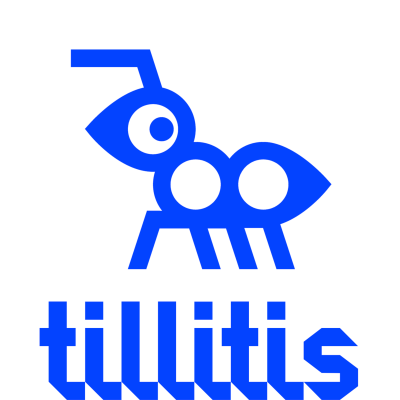

::ff-signpost-banner
---
title: ORConf 2024
class: "bg-[url('/images/banner-orconf.jpg')]"
---

Friday to Sunday September 13&ndash;15, 2024 in Gothenburg, Sweden

The ORConf conference is a weekend of presentations and networking dedicated to free and open source silicon. It's an event for the open source silicon community, and is run by the FOSSi Foundation and its volunteers.
::

::ff-supporting-content
## Our 10th ORConf!

The FOSSi Foundation is proud to announce the 10th installment of ORConf, a conference dedicated to free and open source silicon to be held over the weekend of Friday September 13 to Sunday September 15 in Gothenburg, Sweden.

ORConf is a weekend of presentations and networking for the open source silicon community. Browse through previous installments of ORConf [here](https://fossi-foundation.org/events/archive).

Registration is now open and [available via Eventbrite](https://www.eventbrite.com/e/orconf-2024-tickets-912195410027).

Questions? Ping the organizers via email at [orconf@fossi-foundation.org](mailto:orconf@fossi-foundation.org?subject=Question).

### Quick Links

[Venue](#venue) | [Schedule](#schedule) | [Programme](#programme)
::

::ff-container

## Chat

Chat with fellow ORConf attendees in our Matrix chat room at [#orconf2024:fossi-foundation.org](https://matrix.to/#/#orconf2024:fossi-foundation.org).
Any Matrix client works, or just use the Element web chat.

## Submit a talk

Presentation submissions are made through [the Eventbrite registration interface](https://www.eventbrite.com/e/orconf-2024-tickets-912195410027).

Please make your submissions as early as you can, as the presentation slots are likely to fill up at ORConf this year.

## Code of conduct

We ask all ORConf participants to adhere to the the [FOSSi Foundation code of conduct](/code-of-conduct) throughout the event.

## Sponsors

This year's Latch-Up is made possible by our very generous sponsors.

{style="display: inline-block; width: 33%"}
{style="display: inline-block; width: 33%"}
{style="display: inline-block; width: 33%"}

A variety of sponsorship packages are available for this year's ORConf. You'll find all of the details in our [sponsorship prospectus](ORConf-2024-Sponsorship-Prospectus.pdf).

Please get in touch via email to explore the opportunities: [orconf@fossi-foundation.org](mailto:orconf@fossi-foundation.org?subject=Sponsorship).

## Venue

Gothenburg, Sweden.

Two different venues will host ORConf this year; The Lindholmen Conference Centre on Friday and Chalmers University main campus in Johanneberg on Saturday and Sunday.

### Friday, September 13

Time: 10AM - 6PM

The venue is the Pascal room at the Chalmers Lindholmen Conferene Centre on the Lindholmen Science Park.

[Google maps link](https://maps.app.goo.gl/pdo2GveTnSBo7VrT9) | [Conference centre room site](https://chalmerskonferens.se/en/konferens/lindholmen-conference-centre/konferenslokal-pascal/)

### Saturday, September 14

Time: 9AM - 6PM

The venue is auditorium HA1 at the main Chalmers University of Technology campus in Johanneberg.

[Google maps link](https://maps.app.goo.gl/4RtQDMTSQJRd5kFL6) | [Chalmers University map](https://maps.chalmers.se/#971e00c6-6f9a-46ce-9894-687adb1fa8ea)

Following the day's proceedings we will arrange a social event. Details of the venue will be announced soon.

### Sunday, September 15

Time: 10AM - afternoon

The venue is rooms ES51, ES52 and ES53 at the main Chalmers University of Technology campus in Johanneberg.

[Google maps link](https://www.google.com/maps/@57.6877865,11.979491,18.37z?entry=ttu) | [Chalmers University map](http://maps.chalmers.se/#abb49f72-9df3-42c4-9298-788edba3090c)

## Schedule

The conference will run over 3 days, Friday to Sunday September 13 to 15, beginning Friday at 10AM, Saturday at 9AM and Sunday at 10AM. When planning travel, we suggest you arrive Thursday evening or first thing Friday, and plan to leave Sunday afternoon or evening.

A conference social event will be arranged for Saturday evening (venue TBD). Friday evening will not be planned but often folks arrange their own informal dinner and drinks plans, which we encourage.

The detailed schedule of presentations will be available once we have all of the presentation submissions.

### Friday

Conference from 10AM - 6PM.

### Saturday

Conference from 9AM - 6PM.

### Sunday

Conference and workshops from 10AM to early afternoon.

## Programme

Please submit your presentation proposals when registering via [the Eventbrite page](https://www.eventbrite.com/e/orconf-2024-tickets-912195410027).

Preliminary programme. More to come later.

### Accelerating software development for emerging ISA extensions with cloud-based FPGAs: RVV case study

#### Marek Pikuła

The RISC-V Vector Extension (RVV) promises an enhanced performance and power efficiency across various complex computational tasks. However, the efficient utilization of RVV demands careful consideration of the optimization approach. This article examines strategies for accelerating this process. Key challenges include assessing performance differences among algorithmic approaches and overcoming initial hardware constraints. FireSim provides a comprehensive solution by offering advanced software and hardware simulation capabilities. Utilizing FireSim, we started the process of enhancing source code with RVV instructions (called vectorization) for the pixman project. Our experience outlines the efficacy of a cloud-based FPGA simulation in expediting software development for emerging ISA extensions. Overall, FireSim facilitates faster iteration cycles and informed design decisions, benefiting individual developers and fostering collaboration in remote teams.

### FazyRV: A RISC-V Core that Scales to Your Needs

#### Meinhard Kissich

FazyRV is a scalable RISC-V core that can be synthesized into a (1-)bit-serial, 2-, 4-, or 8-bit-serial implementation to fulfill your performance requirements with the least area (resp. resources) demand. FazyRV provides manifold variants to adapt to the target technology by, e.g., avoiding dual-port BRAM at the cost of an additional clock cycle. Contradictory to hand-optimized cores at the gate level, FazyRV tries to avoid manual low-level optimizations to increase readability and simplify adaptations. This talk gives an insight into the open-source FazyRV core and its design objectives. We show how the area demand scales, answer why there is no 16-bit variant, discuss how the performance can be improved, and outline possible extensions to improve the current FazyRV design.

### Understanding and Supporting Open Source Silicon Communities

#### Stefan Wallentowitz

TBD

### Debug your Design with a Tiny Interpreter

#### Christopher Lozinski

Interpreters are very helpful tools for hardware development, but the existing tools require slow interprocess communication, and lots of memory. Best to use a tiny interpreter that runs on both the FPGA, and in the simulator. . Less than 2KBytes of memory required and there is no slow interprocess communication. There are even two ASICs that run similar interpreters. .

### VexiiRiscv : A Debian demonstration

#### Charles Papon

The VexiiRiscv (Vex2Risc5) project aim at remplacing VexRiscv and extends its scope with features such as multi-issue, hardware prefetcher, 64 bits support, ... This presentation will mainly be a live demonstration of the project running Debian on FPGA, exposing the level of performance achievable on such system including boot, userland, some demos and finaly a few slides.

### Project Arrakeen: One API to rule all PDKs

#### Staf Verhaegen

Project Arrakeen is an umbrella project for providing a python framework for portable and scalable digital and analog circuits. It is based on the PDKMaster base project which provide a uniform API to PDK data and generation of circuit and layouts. On this base project other projects are being built that provide standard cells, IO cells, SRAM compiler and analog blocks. In this talk the state of the Arrakeen project and it's subprojects for the three supported open source PDKs, e.g. Sky130, IHP SG13G2 and GF180MCU will be presented.

### naja_edit: An Open Source Tool for Gate-Level Netlist editing and optimization

#### Christophe Alexandre

naja_edit is an open source tool designed to optimize and edit gate-level netlists. It features algorithms for Dead Logic Elimination, Constant Propagation, and Primitives Optimization, all performed with minimal changes to the hierarchical netlist structure. This tool can be interleaved with Yosys and OpenROAD, making it particularly useful for large designs requiring hierarchical synthesis. naja_edit also features a Python interface for power users to inspect and edit the netlist using simple scripts. This talk will present optimization results on a set of open source designs.

### Forastero: cocotb testbenches with batteries included

#### Peter Birch

Forastero is a Python library that builds on top of cocotb adding standard components like drivers, monitors, and scoreboards but without bringing the full weight of a UVM environment. While in some ways a spiritual successor to cocotb-bus, Forastero goes further and provides mechanisms for generating complex random stimulus. In this talk I'll present how you can use Forastero to quickly construct a testbench around a DUT, driving and monitoring multiple interfaces, and producing complex stimulus patterns. Forastero is fully open source and comes with both documentation and examples. It can be found on GitHub at github.com/Intuity/forastero

### DFHDL: The 3-in-1 Abstraction Approach to Hardware Design

#### Oron Port

Join us for a dive into DFHDL (DFiant Hardware Description Language), where we break down a fresh approach to hardware design. This talk introduces a unique three-layer abstraction method that blends Dataflow (DF), Register-Transfer (RT), and Event-Driven (ED) models into one streamlined framework. We’ll explore how DFHDL simplifies and speeds up the logic design processes and our goals to do the same for verification. Expect a straightforward discussion on how each layer of DFHDL works, why it matters, and what it means for the future of hardware design. We’ll share real-life examples and insights that show DFHDL in action. Whether you’re deep into hardware design or just curious about how chips come to life, this talk has something for you. DFHDL is an opensource framework available at https://dfianthdl.github.io/ (WIP)

### BYOL (Build Your Own Linter) - UVMLint for IEEE-UVM core code development

#### Ajeetha Kumari Venkatesan

UVM is the most adopted design verification methodology in the field of ASIC and FPGA designs. Lint and static checking of code has proven to be very effective in projects that have wide user base, longer lifetime and distributed developers. During the recent UVM IEEE 1800.2-2023 release cycle, an observation was made regarding the potential application of a custom UVMLint solution to lint the UVM Base Class Library (BCL) as it gets developed, updated etc. We at AsFigo have developed custom rules for linting UVM BCL code on top of PySlint, an open-source SystemVerilog testbench linter. We intend to offer this as an opensource lint package to the UVM IEEE committee and to the general audience via GitHub. The eventual goal is to have these rules as gatekeepers via GitHub actions so that any future code addition to the UVM BCL is free from common pitfalls. Based on early brainstorming, below are some of the sample lint rules that are relevant to the UVM BCL codebase: • Avoid race condition around "static const" (use localparam instead) • Avoid one-liner conditional statements: o if (cond) $display ("cond"); o if (cond) .. else $display ("Else cond as single line"); o case..endcase • Avoid one-liner code in loops: o for, repeat, while, do..while, foreach • Use enadlabels for elements such as endclass, endfunction, endtask etc. • Flag non-virtual methods Typical UVMLint rules for a VIP user would be quite different from the requirements of UVM BCL. These rules are tailored for UVM BCL codebase. As an example, a typical UVMLint rule for a VIP would be: • Check that agent is reusable by ensuring that active components are guarded with a conditional check to is_active == UVM_ACTIVE Such a rule is quite useless for UVM BCL as it provides the base class library for tens of thousands of engineers around the globe using this library to build VIPs, verify their IPs, systems etc. In this talk we show how we approach this cusotm UVMLint development with sample Python code, tests and results. A snapshot of UVMLint findings on latest IEEE 1800.2-2023 codebase is below: ** Violation count by Rule-IDs ** DBG_CL_MISSING_ENDLABEL : 286 DBG_METHOD_MISSING_ENDLABEL : 1899 DBG_FN_MISSING_ENDLABEL : 752 DBG_AVOID_ONE_LINER_IF : 73 DBG_AVOID_ONE_LINER_ELSE : 88 RACE_NO_STATIC_CONST : 8 REUSE_NON_VIRTUAL_METHOD : 1407 --- UVMLint Concise Report --- Total number of rules violated: 7

### My open source analog microelectronics journey

#### Matt Venn

Analog microelectronics is a crucial but often overlooked part of ASIC design. In this talk I will share my experience getting started with analog microelectronics, and taping out my first few designs. I will cover motivation, tools, my designs, and my success and failures so far. The presentation will end with a discussion on how this fascinating topic fits into the wider picture of open source silicon and the next steps needed to enable radio transmitters and receivers.

### OSVVM in a NutShell, VHDL’s #1 Verification Methodology

#### Jim Lewis

OSVVM is a suite of libraries designed to streamline your VHDL entire verification process, boosting productivity and reducing development time. Each library provides independent capabilities, allowing selective adoption and a learn-as-you-go approach. Whether using directed or random testing, OSVVM facilitates writing concise and readable test cases for both simple unit/RTL tests and complex, full-chip or system-level FPGA and ASIC tests. OSVVM provides VHDL with verification capabilities that rival SystemVerilog + UVM. These include transaction-level modeling, verification components, co-simulation with software, randomized test generation, self-checking test support, verification data structures, comprehensive test reporting in HTML and text, and synchronization primitives. With OSVVM and a good team lead, any VHDL engineer can do verification – and have fun doing it. OSVVM grew rapidly during the COVID years, giving us better capability, better data structures, better test reporting (HTML and Junit), and scripting that is simple to use (and works with most VHDL simulators). This presentation will show how these advances fit into the overall OSVVM Methodology.

### Open Source Standard Cell Library Design

#### Antoine Sirianni

With the avenue of AI as a game changer, what would Open Source Standard Cell Library Design consist in to date? Where to start ? Let's focus on combinatorics to provide with an unexpected contribution.

### cocotb as a way towards a new verification methodology

#### Marek Cieplucha

TBD

### A very small cross compiler for OpenRISC and maybe your homebrew processor

#### Jörg Mische

PunyCC is a cross compiler for a very small subset of C. Only one source file, no preprocessor, no structs, no floating point and only one datatype that can be used as unsigend int or pointer to char. Due to these simplifications the compiler source code is very small and can easily be adopted to a new target instruction set. So far PunyCC supported 4 architectures: ARM Thumb-2, RISC-V, x86-32 and WebAssembly. It can compile itself and thus provides cross compilers from any of the instruction sets to any other. This talk presents how easy it is to add OpenRISC support to PunyCC. Use it as a blueprint for porting PunyCC to your own special instruction set.

### The Saturn Vector Unit: Design of a Fully Compliant Open-Source RISC-V Vector Unit

#### Jerry Zhao

TBD

### OS-EDA: An open-source course about open-source EDA

#### Thorsten Knoll / Christian Wittke

This talk will present the ongoing effort and progress in creating the OS-EDA course. An overview of the available materials, lectures, and hands-on components will be included. Additionally, we will explain how to participate and use the materials independently. A first test run of the course, planned to be held in-house at IHP, will be announced during this talk at ORConf. The course's overall goal is to help participants understand and use open-source EDA tools to create an open-source tapeout, with IHP as the default target chip factory and the usage of OPENROAD. The course will be available in English, with all materials hosted in a public Git repository under an open-source license. This work is funded by the German Federal Ministry of Education and Research in the Project FMD-QNC (16ME0831).

### Synthesizing Music Synthesizers

#### Sebastian Holzapfel

Tiliqua is an open hardware development platform, DSP library and collection of examples (built in Amaranth HDL) that aims to make FPGA-based audio and video synthesis more accessible. The hardware itself is designed to integrate into the Eurorack ecosystem, or can be easily taken apart and used in custom instrument designs. This presentation will go through the Tiliqua hardware design, the RTL framework provided and some of the included example projects. The project is distributed under CERN-OHL-S-V2 and is under active development here: https://github.com/apfelaudio/tiliqua

### cocotb Gets A Glow Up: Fixes and Features of 2.0

#### Kaleb Barrett

Since it's inception and the minting of 1.0, cocotb has carried with it several design issues that only API-breaking changes could fix. 2024 is the year those issues finally get fixed. cocotb 2.0 includes changes to how tests are parameterized and selected, how tasks are managed, how HDL values are represented in Python, and how simulations are run. Tune in to this talk to learn how to leverage these new features and how to make your code 2.0 compliant.

### The future of FuseSoC

#### Olof Kindgren

While individual projects like Linux and GCC paved the road for open source software success, it can be argued that the thing that really enabled scaling up development of Linux-based solutions was the idea of package management. Having a common way to install software and describe their relations made it possible to rapidly create custom systems. The same can be said for language-specific package managers like pip for Python or Cargo for Rust.

On the chip design side, FuseSoC has been doing the same thing since its inception 2011. It is by now likely the world's most widely used package manager, both for open source projects and for proprietary code.

The background of FuseSoC has been presented several times over the years, so this presentation aims to instead look ahead and see what new features that are in store for FuseSoC and its sister project Edalize.

## Contact

Please feel free to reach out to the event organizers via [orconf@fossi-foundation.org](mailto:orconf@fossi-foundation.org) at any point. Or send a message on the Matrix channel: [#orconf2024:fossi-foundation.org](https://matrix.to/#/#orconf2024:fossi-foundation.org).

::
